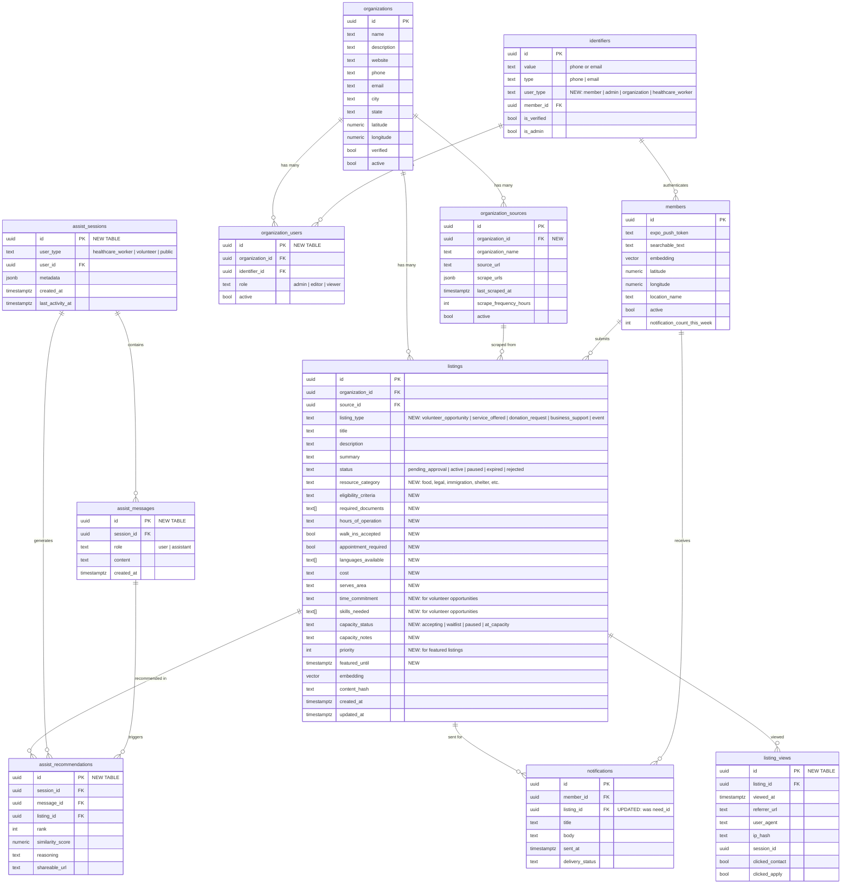

# Multi-Sided Resource Platform Expansion

## Overview

Expand the existing volunteer matching platform into a comprehensive four-sided marketplace that connects:

1. **People in need** → Find resources (food, shelter, legal, immigration)
2. **Healthcare workers** → Direct patients via AI-powered matching
3. **Volunteers/donors** → Discover opportunities to help (existing)
4. **Organizations** → Manage listings and communicate capacity

**Core Problem**: Healthcare workers (OTs, social workers) encounter patients with needs outside their scope (immigration status, food assistance, shelter) but don't know where to refer them. Meanwhile, organizations offering these services lack visibility, and some are overwhelmed while others need help.

**Solution**: One unified platform where everyone connects through AI-powered semantic search, with healthcare workers getting an AI agent to generate customized resource lists they can share with patients.

## Problem Statement

### Current Pain Points

**Healthcare Workers (Primary User - Sister's Experience)**
- Encounter patients needing immigration help, food, shelter, legal services
- Know resources exist but can't keep mental map of all services
- Need to quickly generate referral lists filtered by: community (Somali, Latino), language, service type
- Want shareable links patients can access without explanation
- Example: "Somali patient, visa expired, needs food + legal help" → should get instant filtered list

**People in Need**
- Immigration status issues (visa expired, uncertain status, in hiding)
- Can't navigate complex systems while in crisis
- Language barriers prevent accessing help
- Don't know which organizations serve their community

**Volunteers/Donors**
- Want to help but don't know where opportunities are
- Donors outside Minnesota want to support from afar
- Want to support immigrant-owned businesses specifically
- Don't know which businesses struggling (e.g., Ethiopian restaurant closed, owners in hiding)

**Organizations**
- Some drowning in donations/volunteers ("please stop")
- Others desperate for help but invisible
- No way to communicate real-time capacity
- Individual professionals (lawyers) wanting to offer pro-bono have no platform
- Immigrant-owned businesses need support but aren't discoverable

## Proposed Solution

### Unified Listing Architecture

**Core Concept**: Extend `organization_needs` table with `listing_type` enum to support multiple content types under one approval workflow, search index, and matching system.

```sql
ALTER TABLE organization_needs
  RENAME TO listings;  -- More generic name

ALTER TABLE listings
  ADD COLUMN listing_type TEXT NOT NULL DEFAULT 'volunteer_opportunity'
    CHECK (listing_type IN (
      'volunteer_opportunity',  -- Org needs volunteers (existing)
      'service_offered',        -- Org provides help to people in need (NEW)
      'donation_request',       -- Org needs funds/supplies (NEW)
      'business_support',       -- Business needs customers/support (NEW)
      'event'                   -- Community event (NEW)
    )),

  -- Service-specific fields (NULL for non-service listings)
  ADD COLUMN resource_category TEXT,  -- 'food', 'legal', 'immigration', 'shelter', etc.
  ADD COLUMN eligibility_criteria TEXT,
  ADD COLUMN required_documents TEXT[],
  ADD COLUMN hours_of_operation TEXT,
  ADD COLUMN walk_ins_accepted BOOL,
  ADD COLUMN appointment_required BOOL,
  ADD COLUMN languages_available TEXT[],
  ADD COLUMN cost TEXT,  -- 'free', 'sliding_scale', '$50-100'
  ADD COLUMN serves_area TEXT,  -- "North Minneapolis", "Statewide"

  -- Volunteer opportunity fields (existing, NULL for services)
  ADD COLUMN time_commitment TEXT,  -- 'one_time', 'weekly', 'flexible'
  ADD COLUMN skills_needed TEXT[],

  -- Real-time capacity (for all listing types)
  ADD COLUMN capacity_status TEXT DEFAULT 'accepting'
    CHECK (capacity_status IN (
      'accepting',        -- ✅ Currently accepting
      'waitlist',         -- ⏸️ Waitlist available
      'paused',          -- 🚫 Temporarily closed
      'at_capacity'      -- ⚠️ Not accepting new
    )),
  ADD COLUMN capacity_notes TEXT,  -- "2-week waitlist", "Cash only, no clothing"

  -- Priority/featured
  ADD COLUMN priority INT DEFAULT 0,  -- Higher = featured
  ADD COLUMN featured_until TIMESTAMPTZ;

-- Indexes
CREATE INDEX idx_listings_type_status ON listings(listing_type, status);
CREATE INDEX idx_listings_category ON listings(resource_category)
  WHERE listing_type = 'service_offered';
CREATE INDEX idx_listings_capacity ON listings(capacity_status)
  WHERE listing_type IN ('service_offered', 'volunteer_opportunity');
```

### Four User Journeys

#### 1. Person in Need (Public, No Auth)

**URL**: `mndigitalaid.org/resources`

**Features**:
- Browse/search services by category (food, legal, immigration, shelter, healthcare)
- Filter by: location (30km radius), language, community, cost, eligibility
- See real-time status: "✅ Accepting clients" vs "⏸️ Waitlist: 2 weeks"
- No login required (fully public)
- Mobile-first responsive design
- Shareable URLs (for healthcare workers to send)

**GraphQL Queries**:
```graphql
query PublicServices(
  $category: String,
  $location: LocationInput,
  $language: String,
  $community: String
) {
  listings(
    type: SERVICE_OFFERED,
    status: ACTIVE,
    category: $category,
    within: $location,
    language: $language,
    community: $community
  ) {
    id
    title
    summary
    description
    resourceCategory
    eligibilityC riteria
    hoursOfOperation
    cost
    languagesAvailable
    capacityStatus
    capacityNotes
    organization {
      name
      website
      phone
      address
    }
    distance  # km from query location
  }
}
```

#### 2. Healthcare Worker (AI Chat + Link Generator)

**URL**: `mndigitalaid.org/assist`

**Features**:
- Conversational AI interface powered by GPT-4o
- Input: Natural language description of patient needs
- Output:
  1. Ranked list of relevant services with explanations
  2. Auto-generated shareable link with filters baked in
- No patient PII stored (healthcare worker just describes needs)

**Example Interaction**:
```
Worker: "I have a Somali patient, immigration status unclear,
         needs food assistance and shelter"

AI Agent: Based on your description, I recommend:

1. **Somali Law Center** (Immigration)
   - Why: Specializes in visa issues, Somali-speaking staff
   - Contact: (612) 555-0123
   - Status: ✅ Accepting new clients
   - Cost: Free initial consultation

2. **Islamic Resource Group** (Food + Immigration)
   - Why: Serves Somali community, holistic support
   - Contact: (612) 555-0456
   - Status: ✅ Walk-ins welcome Mon-Fri 9am-4pm

3. **People Serving People** (Shelter)
   - Why: Multilingual staff, no immigration questions
   - Contact: (612) 555-0789
   - Status: ⏸️ Waitlist: 1-2 weeks

📎 Shareable Link (copy to send to patient):
https://mndigitalaid.org/resources?needs=immigration,food,shelter
  &lang=somali&city=minneapolis
```

**Implementation**:
```rust
// New domain: /domains/assist/
// Events
AssistEvent::GenerateRecommendationsRequested {
  session_id: Uuid,
  needs_description: String,
  location: Option<Location>,
}

AssistEvent::RecommendationsGenerated {
  session_id: Uuid,
  listings: Vec<RankedListing>,
  shareable_url: String,
  reasoning: HashMap<Uuid, String>,  // listing_id → explanation
}

// Effect: AIRecommendationEffect
// 1. Parse needs description with GPT-4o (extract: categories, languages, communities)
// 2. Semantic search: vector similarity on parsed needs
// 3. Filter by location, language, capacity
// 4. Rank top 10 by similarity
// 5. Generate explanations for each match (why recommended)
// 6. Build shareable URL with query params
```

#### 3. Volunteer/Donor (Enhanced Existing)

**Features** (already implemented):
- ✅ Browse volunteer opportunities
- ✅ Location-based matching (30km)
- ✅ Push notifications for new opportunities
- ✅ SMS auth + privacy-first profiles

**Additions**:
- View donation requests (new listing type)
- Browse immigrant businesses to support (new listing type)
- See community events (new listing type)
- Filter by urgency, time commitment

#### 4. Organization Self-Service Portal

**URL**: `mndigitalaid.org/org`

**Features**:
- Organizations can sign up and manage their own listings
- Real-time capacity updates (accepting → paused → at_capacity)
- Post multiple listing types (services, volunteer needs, donation requests)
- Analytics: views, clicks, contact attempts
- Not limited to 501(c)3s (individual lawyers, mutual aid, businesses)

**Authentication**:
- Extend existing phone/email OTP to support `user_type` enum
- JWT claims: `{ user_id, user_type, organization_id, permissions }`
- Authorization: Organizations can only edit their own listings

**GraphQL Mutations**:
```graphql
mutation CreateListing($input: CreateListingInput!) {
  createListing(input: $input) {
    id
    status  # Always 'pending_approval' initially
    submittedAt
  }
}

mutation UpdateListingCapacity(
  $listingId: ID!,
  $status: CapacityStatus!,
  $notes: String
) {
  updateListingCapacity(
    listingId: $listingId,
    status: $status,
    notes: $notes
  ) {
    id
    capacityStatus
    capacityNotes
    updatedAt
  }
}

mutation ToggleListingActive($listingId: ID!, $active: Boolean!) {
  toggleListingActive(listingId: $listingId, active: $active) {
    id
    status
  }
}
```

**Implementation**:
```rust
// Extend /domains/organization/ with new commands

OrganizationCommand::UpdateListingCapacity {
  listing_id: Uuid,
  capacity_status: String,
  capacity_notes: Option<String>,
  updated_by_org_id: Uuid,
}

// Effect checks:
// 1. Verify updated_by_org_id owns this listing
// 2. Update DB
// 3. Emit ListingCapacityUpdated event
// 4. Event tap → notify subscribers (webhook, real-time UI)
```

## Technical Approach

### Phase 1: Database Schema Evolution

**Goal**: Extend existing `organization_needs` to support all listing types without breaking changes.

**Tasks**:
- [ ] Create migration: `000031_extend_needs_to_listings.sql`
- [ ] Rename table: `organization_needs` → `listings` (with cascade updates)
- [ ] Add `listing_type` column (default: `'volunteer_opportunity'` for backward compat)
- [ ] Add service-specific columns (all nullable)
- [ ] Add capacity management columns (`capacity_status`, `capacity_notes`)
- [ ] Update indexes for new query patterns
- [ ] Update Rust model: `OrganizationNeed` → `Listing`
- [ ] Update all references in effects, machines, edges
- [ ] Run migration on dev DB, verify existing data intact
- [ ] Update GraphQL schema with new types and filters

**Success Criteria**:
- ✅ Existing volunteer opportunities still work (listing_type auto-set)
- ✅ Can insert service listings with new fields
- ✅ Indexes support efficient filtering by type + category
- ✅ All tests pass

**Files to Modify**:
```
packages/server/
├── migrations/000031_extend_needs_to_listings.sql (NEW)
├── src/domains/organization/
│   ├── models/need.rs → models/listing.rs
│   ├── data/listing.rs (update GraphQL types)
│   ├── events/mod.rs (add ListingCapacityUpdated)
│   ├── commands/mod.rs (add UpdateListingCapacity)
│   ├── effects/*.rs (update to use Listing model)
│   └── edges/*.rs (update mutations/queries)
└── src/common/mod.rs (update type aliases)
```

### Phase 2: AI Assistant Domain (Healthcare Worker Tool)

**Goal**: Build conversational AI interface that generates resource recommendations.

**Architecture**:
```
/domains/assist/
├── models/
│   ├── assist_session.rs   # Chat session tracking
│   └── recommendation.rs    # Generated recommendations log
├── data/
│   └── assist.rs           # GraphQL types
├── events/
│   └── mod.rs              # AssistEvent enum
├── commands/
│   └── mod.rs              # AssistCommand enum
├── machines/
│   └── coordinator.rs      # Session state machine
├── effects/
│   ├── ai_recommendation.rs  # GPT-4o recommendation generation
│   ├── semantic_search.rs    # Vector search + filtering
│   └── link_generator.rs     # Build shareable URLs
└── edges/
    ├── query.rs            # getSession, getRecommendations
    └── mutation.rs         # generateRecommendations
```

**Database Tables**:
```sql
CREATE TABLE assist_sessions (
  id UUID PRIMARY KEY,
  user_type TEXT NOT NULL,  -- 'healthcare_worker', 'volunteer', 'public'
  created_at TIMESTAMPTZ DEFAULT NOW(),
  last_activity_at TIMESTAMPTZ DEFAULT NOW()
);

CREATE TABLE assist_messages (
  id UUID PRIMARY KEY,
  session_id UUID NOT NULL REFERENCES assist_sessions(id),
  role TEXT NOT NULL,  -- 'user' | 'assistant'
  content TEXT NOT NULL,
  created_at TIMESTAMPTZ DEFAULT NOW()
);

CREATE TABLE assist_recommendations (
  id UUID PRIMARY KEY,
  session_id UUID NOT NULL REFERENCES assist_sessions(id),
  message_id UUID NOT NULL REFERENCES assist_messages(id),
  listing_id UUID NOT NULL REFERENCES listings(id),
  rank INT NOT NULL,  -- 1, 2, 3, ...
  similarity_score NUMERIC,
  reasoning TEXT,  -- AI-generated explanation
  shareable_url TEXT,
  created_at TIMESTAMPTZ DEFAULT NOW()
);
```

**AI Prompt Template**:
```rust
const RECOMMENDATION_SYSTEM_PROMPT: &str = r#"
You are an AI assistant helping healthcare workers find resources for their patients.

Your role:
1. Parse the healthcare worker's description to extract:
   - Service categories needed (food, legal, immigration, shelter, healthcare, etc.)
   - Languages required (English, Spanish, Somali, Hmong, etc.)
   - Communities served (Latino, Somali, East African, etc.)
   - Urgency level (immediate, within week, general)
   - Location constraints (city, neighborhood)

2. You will receive a list of matching services with similarity scores.
   For each service, generate a brief explanation (1-2 sentences) of why
   it's a good match for the patient's needs.

3. Output format (JSON):
{
  "parsed_needs": {
    "categories": ["immigration", "food"],
    "languages": ["somali"],
    "communities": ["somali", "east_african"],
    "urgency": "immediate",
    "location": "Minneapolis"
  },
  "recommendations": [
    {
      "listing_id": "uuid",
      "reasoning": "Specializes in Somali immigration cases with free consultations"
    }
  ]
}

Be concise, actionable, and empathetic. Prioritize services that:
- Match the patient's language and community
- Are currently accepting clients (check capacity_status)
- Are free or low-cost (check cost field)
- Are nearby (check location)
"#;
```

**GraphQL API**:
```graphql
type AssistSession {
  id: ID!
  messages: [AssistMessage!]!
  recommendations: [Recommendation!]!
  createdAt: DateTime!
}

type AssistMessage {
  id: ID!
  role: String!  # 'user' | 'assistant'
  content: String!
  createdAt: DateTime!
}

type Recommendation {
  id: ID!
  listing: Listing!
  rank: Int!
  reasoning: String!
  similarityScore: Float
  shareableUrl: String!
}

type Mutation {
  createAssistSession: AssistSession!

  generateRecommendations(
    sessionId: ID!,
    needsDescription: String!,
    location: LocationInput
  ): [Recommendation!]!
}

type Query {
  assistSession(id: ID!): AssistSession
  assistSessions(limit: Int): [AssistSession!]!
}
```

**Tasks**:
- [ ] Create assist domain structure
- [ ] Create migrations for assist tables
- [ ] Implement semantic search effect (reuse matching domain patterns)
- [ ] Build AI recommendation effect with GPT-4o
- [ ] Create shareable URL generator (query param builder)
- [ ] Implement GraphQL resolvers
- [ ] Build React UI for chat interface
- [ ] Add session persistence (store in DB, not just memory)
- [ ] Test with real patient scenarios from sister's feedback

**Success Criteria**:
- ✅ Healthcare worker can describe patient needs conversationally
- ✅ AI returns 3-5 relevant services with explanations
- ✅ Shareable URL loads filtered resource list
- ✅ No patient PII stored (only needs description)
- ✅ Response time < 3 seconds (vector search + AI completion)

### Phase 3: Public Resource Directory UI

**Goal**: Build mobile-first public web app for browsing services.

**Routes**:
```
/resources                 # Browse all services
/resources?category=food   # Filter by category
/resources?lang=somali     # Filter by language
/resources/search?q=immigration+help  # Full-text search
/resources/:id             # Service detail page
```

**Tech Stack**:
- React + Vite (consistent with existing admin-spa)
- TanStack Router for client-side routing
- Apollo Client for GraphQL
- Tailwind CSS for styling

**Key Components**:
```typescript
// src/pages/Resources.tsx
export function ResourcesPage() {
  const [filters, setFilters] = useState<ResourceFilters>({
    category: null,
    location: null,
    language: null,
    community: null,
  });

  const { data, loading } = useQuery(GET_LISTINGS, {
    variables: {
      type: 'SERVICE_OFFERED',
      status: 'ACTIVE',
      ...filters,
    },
  });

  return (
    <div>
      <FilterBar filters={filters} onChange={setFilters} />
      <ResourceGrid listings={data?.listings} />
    </div>
  );
}

// src/components/ResourceCard.tsx
export function ResourceCard({ listing }: { listing: Listing }) {
  return (
    <div className="card">
      <h3>{listing.title}</h3>
      <p>{listing.summary}</p>

      <CapacityBadge status={listing.capacityStatus} />

      <div className="metadata">
        <span>📍 {listing.organization.city}</span>
        {listing.languagesAvailable && (
          <span>🌐 {listing.languagesAvailable.join(', ')}</span>
        )}
        <span>💵 {listing.cost}</span>
      </div>

      <Button onClick={() => navigate(`/resources/${listing.id}`)}>
        View Details
      </Button>
    </div>
  );
}

// src/components/CapacityBadge.tsx
export function CapacityBadge({ status }: { status: CapacityStatus }) {
  const badges = {
    accepting: { icon: '✅', text: 'Accepting clients', color: 'green' },
    waitlist: { icon: '⏸️', text: 'Waitlist available', color: 'yellow' },
    paused: { icon: '🚫', text: 'Temporarily closed', color: 'red' },
    at_capacity: { icon: '⚠️', text: 'At capacity', color: 'orange' },
  };

  const badge = badges[status];
  return (
    <span className={`badge badge-${badge.color}`}>
      {badge.icon} {badge.text}
    </span>
  );
}
```

**Tasks**:
- [ ] Set up new web-app package (similar to admin-spa)
- [ ] Configure Vite, Apollo Client, TanStack Router
- [ ] Implement resource browsing UI (list + grid views)
- [ ] Build filter sidebar (category, location, language, cost)
- [ ] Create resource detail page
- [ ] Add full-text search (use PostgreSQL GIN index)
- [ ] Implement shareable URL handling (parse query params → set filters)
- [ ] Mobile-responsive design (primary use case)
- [ ] Deploy to Vercel/Netlify

**Success Criteria**:
- ✅ Users can browse services without account
- ✅ Filters work (category, location, language, cost)
- ✅ Detail pages show contact info, hours, eligibility
- ✅ Shareable URLs from AI assistant work correctly
- ✅ Mobile-first responsive design
- ✅ Fast performance (< 2s page load)

### Phase 4: Organization Portal (Self-Service)

**Goal**: Organizations can manage their own listings.

**Authentication Flow**:
```
1. Organization enters phone/email
2. Backend sends OTP via Twilio
3. Organization verifies code
4. Backend checks if org exists, creates if new
5. Backend issues JWT with { user_id, user_type: 'organization', org_id }
6. Organization can now CRUD their own listings
```

**Database Schema**:
```sql
CREATE TABLE organization_users (
  id UUID PRIMARY KEY,
  organization_id UUID NOT NULL REFERENCES organizations(id),
  identifier_id UUID NOT NULL REFERENCES identifiers(id),
  role TEXT DEFAULT 'admin',  -- 'admin' | 'editor' | 'viewer'
  active BOOL DEFAULT true,
  created_at TIMESTAMPTZ DEFAULT NOW()
);

-- Update identifiers table
ALTER TABLE identifiers
  ADD COLUMN user_type TEXT DEFAULT 'member'
    CHECK (user_type IN ('member', 'admin', 'organization', 'healthcare_worker'));
```

**Authorization Pattern**:
```rust
// In effect layer (before executing command)
fn check_org_ownership(
  listing_id: Uuid,
  org_id: Uuid,
  pool: &PgPool,
) -> Result<()> {
  let listing = Listing::find_by_id(listing_id, pool).await?;

  if listing.organization_id != org_id {
    anyhow::bail!("You don't own this listing");
  }

  Ok(())
}

// In UpdateListingCapacity effect
async fn execute(cmd: OrganizationCommand, ctx: EffectContext) -> Result<Event> {
  match cmd {
    OrganizationCommand::UpdateListingCapacity { listing_id, org_id, ... } => {
      check_org_ownership(listing_id, org_id, &ctx.deps().db)?;

      // Update capacity
      Listing::update_capacity(listing_id, status, notes, &ctx.deps().db).await?;

      Ok(OrganizationEvent::ListingCapacityUpdated { listing_id, status })
    }
  }
}
```

**Portal UI Routes**:
```
/org/login                # OTP authentication
/org/dashboard            # Overview: views, clicks, active listings
/org/listings             # List all org listings
/org/listings/new         # Create new listing (form)
/org/listings/:id         # Edit existing listing
/org/profile              # Org profile settings
```

**Key Features**:
- [ ] OTP login flow for organizations
- [ ] Dashboard with analytics (views, clicks, contact attempts)
- [ ] CRUD interface for listings (create, edit, toggle active)
- [ ] Real-time capacity updates (toggle accepting/paused/at_capacity)
- [ ] Support multiple listing types (services, volunteer needs, donation requests)
- [ ] Approval status tracking (pending → active → expired)

**Tasks**:
- [ ] Extend auth domain to support organization user_type
- [ ] Create organization_users table
- [ ] Build organization portal UI (React + Vite)
- [ ] Implement listing CRUD mutations
- [ ] Add authorization checks in effects
- [ ] Build analytics dashboard (SQL queries for views/clicks)
- [ ] Test with real organization (pilot with one org first)

**Success Criteria**:
- ✅ Organizations can sign up and verify via OTP
- ✅ Organizations can create/edit their own listings
- ✅ Authorization prevents editing others' listings
- ✅ Real-time capacity updates work
- ✅ Analytics show views and clicks per listing
- ✅ All new listings go to pending_approval (admin reviews first)

## Implementation Phases

### Phase 1: Foundation (Weeks 1-2)
- Database schema evolution (listings table)
- Update Rust models, events, commands
- Extend GraphQL schema
- Migrate existing data (organization_needs → listings)
- Test backward compatibility

**Deliverable**: Existing volunteer matching still works, new listing types supported

### Phase 2: AI Assistant (Weeks 3-4)
- Create assist domain (models, events, commands, effects, edges)
- Build AI recommendation engine (GPT-4o + semantic search)
- Implement shareable URL generation
- Build React chat UI
- Test with healthcare workers

**Deliverable**: Healthcare workers can generate resource recommendations via AI chat

### Phase 3: Public Directory (Weeks 5-6)
- Build public web app (React + Vite)
- Implement browsing, filtering, search
- Create resource detail pages
- Mobile-responsive design
- Deploy to production

**Deliverable**: Public can browse services without account, shareable URLs work

### Phase 4: Organization Portal (Weeks 7-8)
- Extend auth for organizations
- Build organization portal UI
- Implement listing CRUD + capacity management
- Add analytics dashboard
- Pilot with 1-2 organizations

**Deliverable**: Organizations can self-manage listings

## Acceptance Criteria

### Functional Requirements

**People in Need**:
- [ ] Can browse services by category without account
- [ ] Can filter by location, language, cost, eligibility
- [ ] Can see real-time capacity status (accepting/waitlist/paused)
- [ ] Can view contact info, hours, required documents
- [ ] Can access via shareable link from healthcare worker

**Healthcare Workers**:
- [ ] Can describe patient needs conversationally to AI
- [ ] Receive 3-5 ranked recommendations with explanations
- [ ] Get auto-generated shareable link to send to patient
- [ ] No patient PII stored in system
- [ ] Response time < 3 seconds

**Volunteers/Donors** (Existing):
- [ ] Can browse volunteer opportunities (existing)
- [ ] Can view donation requests (new)
- [ ] Can discover immigrant businesses to support (new)
- [ ] Receive push notifications for matches (existing)

**Organizations**:
- [ ] Can sign up and authenticate via OTP
- [ ] Can create/edit listings (services, volunteer needs, donations)
- [ ] Can update capacity status in real-time
- [ ] Can view analytics (views, clicks)
- [ ] All new listings go to pending_approval

**Admins**:
- [ ] Review all listing types in unified approval queue
- [ ] Can approve, edit+approve, or reject
- [ ] Can manage organization accounts
- [ ] Can feature/prioritize listings

### Non-Functional Requirements

**Performance**:
- [ ] Resource search: < 500ms (vector search + filters)
- [ ] AI recommendations: < 3 seconds (semantic search + GPT-4o)
- [ ] Page load (public directory): < 2 seconds
- [ ] Support 10K+ listings without degradation

**Security**:
- [ ] No PII stored for people seeking help (fully anonymous)
- [ ] Healthcare worker sessions don't log patient info
- [ ] Organizations can only edit their own listings
- [ ] Admin approval required for all new listings
- [ ] Rate limiting on public API endpoints

**Scalability**:
- [ ] Database indexes support 100K+ listings
- [ ] Vector search scales with pgvector IVFFlat indexes
- [ ] Background job queue handles scraping bursts
- [ ] Horizontal scaling via stateless API servers

**Usability**:
- [ ] Mobile-first responsive design
- [ ] Accessible (WCAG 2.1 AA compliance)
- [ ] Multi-language support (English, Spanish, Somali initially)
- [ ] Clear capacity indicators (emojis + text)

## Success Metrics

### Engagement (Week 1 Post-Launch)
- 100+ unique visitors to public directory
- 10+ healthcare workers using AI assistant
- 5+ organizations signing up for portal
- 20+ resources viewed per day

### Quality (Week 2-4)
- AI recommendation accuracy > 80% (healthcare worker feedback)
- Admin approval rate > 70% (listings created → approved)
- Capacity updates per org per week > 2 (real-time usage)
- Public search conversion > 50% (searches → detail page views)

### Impact (Month 1-3)
- 50+ services listed
- 500+ people browsing resources
- 20+ healthcare workers active monthly
- 10+ organizations self-managing listings
- Volunteer matches increase 2x (from expanded opportunity types)

## Dependencies & Risks

### Dependencies
- ✅ Existing event-driven architecture (seesaw-rs)
- ✅ PostgreSQL with pgvector extension
- ✅ OpenAI API (GPT-4o, text-embedding-3-small)
- ✅ Twilio Verify (OTP for org auth)
- ✅ Current admin approval workflow
- React + Vite (new public web app)
- Hosting for public directory (Vercel/Netlify)

### Risks

**High Priority**:
1. **AI Recommendation Quality**: GPT-4o may generate poor matches
   - **Mitigation**: Two-stage matching (vector search → AI reranking), track accuracy metrics, A/B test prompts

2. **Organization Adoption**: Orgs may not self-manage listings
   - **Mitigation**: Start with 1-2 pilot orgs, offer white-glove onboarding, admin can manage on their behalf

3. **Spam/Low-Quality Submissions**: Public-facing may attract spam
   - **Mitigation**: All listings go to pending_approval, implement rate limiting, add captcha if needed

**Medium Priority**:
4. **Healthcare Worker Privacy**: Concerned about logging patient info
   - **Mitigation**: Clear messaging that no PII stored, open-source transparency, sister provides feedback

5. **Search Relevance**: Vector search may return irrelevant results
   - **Mitigation**: Tune similarity thresholds, use metadata filters (language, category), add full-text search fallback

**Low Priority**:
6. **Multi-Language Content**: Services in non-English languages
   - **Mitigation**: Store language tags, use multilingual embedding models (already using text-embedding-3-small which supports 100+ languages)

## Database Schema Changes

### Migration: 000031_extend_needs_to_listings.sql

```sql
-- Rename table for clarity
ALTER TABLE organization_needs RENAME TO listings;

-- Rename indexes
ALTER INDEX idx_organization_needs_status RENAME TO idx_listings_status;
ALTER INDEX idx_organization_needs_content_hash RENAME TO idx_listings_content_hash;
ALTER INDEX idx_organization_needs_source_id RENAME TO idx_listings_source_id;
ALTER INDEX idx_organization_needs_last_seen RENAME TO idx_listings_last_seen;
ALTER INDEX idx_organization_needs_submitted_by RENAME TO idx_listings_submitted_by;
ALTER INDEX idx_organization_needs_source_url RENAME TO idx_listings_source_url;
ALTER INDEX idx_needs_embedding RENAME TO idx_listings_embedding;

-- Add listing type (default to existing type)
ALTER TABLE listings
  ADD COLUMN listing_type TEXT NOT NULL DEFAULT 'volunteer_opportunity'
    CHECK (listing_type IN (
      'volunteer_opportunity',
      'service_offered',
      'donation_request',
      'business_support',
      'event'
    ));

-- Service-specific fields
ALTER TABLE listings
  ADD COLUMN resource_category TEXT,
  ADD COLUMN eligibility_criteria TEXT,
  ADD COLUMN required_documents TEXT[],
  ADD COLUMN hours_of_operation TEXT,
  ADD COLUMN walk_ins_accepted BOOL,
  ADD COLUMN appointment_required BOOL,
  ADD COLUMN languages_available TEXT[],
  ADD COLUMN cost TEXT,
  ADD COLUMN serves_area TEXT;

-- Volunteer opportunity fields (make existing field explicit)
ALTER TABLE listings
  ADD COLUMN time_commitment TEXT,
  ADD COLUMN skills_needed TEXT[];

-- Capacity management
ALTER TABLE listings
  ADD COLUMN capacity_status TEXT DEFAULT 'accepting'
    CHECK (capacity_status IN ('accepting', 'waitlist', 'paused', 'at_capacity')),
  ADD COLUMN capacity_notes TEXT,
  ADD COLUMN capacity_updated_at TIMESTAMPTZ;

-- Featured/priority
ALTER TABLE listings
  ADD COLUMN priority INT DEFAULT 0,
  ADD COLUMN featured_until TIMESTAMPTZ;

-- New indexes for query patterns
CREATE INDEX idx_listings_type_status ON listings(listing_type, status);
CREATE INDEX idx_listings_category ON listings(resource_category)
  WHERE listing_type = 'service_offered' AND resource_category IS NOT NULL;
CREATE INDEX idx_listings_capacity ON listings(capacity_status)
  WHERE listing_type IN ('service_offered', 'volunteer_opportunity');
CREATE INDEX idx_listings_priority ON listings(priority DESC, created_at DESC)
  WHERE status = 'active' AND priority > 0;
CREATE INDEX idx_listings_languages ON listings USING GIN(languages_available)
  WHERE listing_type = 'service_offered';

-- Comments
COMMENT ON TABLE listings IS 'Universal listings table: services offered, volunteer opportunities, donation requests, businesses, events';
COMMENT ON COLUMN listings.listing_type IS 'Type of listing: volunteer_opportunity | service_offered | donation_request | business_support | event';
COMMENT ON COLUMN listings.resource_category IS 'For service_offered: food, legal, immigration, shelter, healthcare, employment, etc.';
COMMENT ON COLUMN listings.capacity_status IS 'Real-time capacity: accepting, waitlist, paused, at_capacity';
COMMENT ON COLUMN listings.priority IS 'Featured/promoted listings (higher = more prominent)';
```

### Migration: 000032_create_assist_domain.sql

```sql
-- AI assistant sessions (for healthcare workers)
CREATE TABLE assist_sessions (
  id UUID PRIMARY KEY DEFAULT gen_random_uuid(),
  user_type TEXT NOT NULL DEFAULT 'healthcare_worker'
    CHECK (user_type IN ('healthcare_worker', 'volunteer', 'public')),
  user_id UUID,  -- Optional: if authenticated
  created_at TIMESTAMPTZ DEFAULT NOW(),
  last_activity_at TIMESTAMPTZ DEFAULT NOW(),
  metadata JSONB  -- Store context (location, preferences)
);

CREATE INDEX idx_assist_sessions_user ON assist_sessions(user_id, last_activity_at DESC)
  WHERE user_id IS NOT NULL;

-- Messages in session
CREATE TABLE assist_messages (
  id UUID PRIMARY KEY DEFAULT gen_random_uuid(),
  session_id UUID NOT NULL REFERENCES assist_sessions(id) ON DELETE CASCADE,
  role TEXT NOT NULL CHECK (role IN ('user', 'assistant')),
  content TEXT NOT NULL,
  created_at TIMESTAMPTZ DEFAULT NOW()
);

CREATE INDEX idx_assist_messages_session ON assist_messages(session_id, created_at);

-- Recommendations generated
CREATE TABLE assist_recommendations (
  id UUID PRIMARY KEY DEFAULT gen_random_uuid(),
  session_id UUID NOT NULL REFERENCES assist_sessions(id) ON DELETE CASCADE,
  message_id UUID NOT NULL REFERENCES assist_messages(id) ON DELETE CASCADE,
  listing_id UUID NOT NULL REFERENCES listings(id) ON DELETE CASCADE,
  rank INT NOT NULL,
  similarity_score NUMERIC(5,4),  -- 0.0000 to 1.0000
  reasoning TEXT NOT NULL,
  shareable_url TEXT,
  created_at TIMESTAMPTZ DEFAULT NOW()
);

CREATE INDEX idx_assist_recommendations_session ON assist_recommendations(session_id, rank);
CREATE INDEX idx_assist_recommendations_listing ON assist_recommendations(listing_id);

COMMENT ON TABLE assist_sessions IS 'AI assistant chat sessions (healthcare workers, volunteers, public users)';
COMMENT ON TABLE assist_messages IS 'Conversational messages (user input + AI responses)';
COMMENT ON TABLE assist_recommendations IS 'Listings recommended by AI with explanations';
```

### Migration: 000033_create_organization_users.sql

```sql
-- Organization portal users (self-service)
CREATE TABLE organization_users (
  id UUID PRIMARY KEY DEFAULT gen_random_uuid(),
  organization_id UUID NOT NULL REFERENCES organizations(id) ON DELETE CASCADE,
  identifier_id UUID NOT NULL REFERENCES identifiers(id) ON DELETE CASCADE,
  role TEXT DEFAULT 'admin' CHECK (role IN ('admin', 'editor', 'viewer')),
  active BOOL DEFAULT true,
  created_at TIMESTAMPTZ DEFAULT NOW(),

  UNIQUE(organization_id, identifier_id)
);

CREATE INDEX idx_org_users_org ON organization_users(organization_id)
  WHERE active = true;
CREATE INDEX idx_org_users_identifier ON organization_users(identifier_id)
  WHERE active = true;

-- Extend identifiers for user types
ALTER TABLE identifiers
  ADD COLUMN user_type TEXT DEFAULT 'member'
    CHECK (user_type IN ('member', 'admin', 'organization', 'healthcare_worker'));

CREATE INDEX idx_identifiers_user_type ON identifiers(user_type, is_verified)
  WHERE is_verified = true;

-- Link organizations to listings (ownership)
ALTER TABLE listings
  ADD COLUMN organization_id UUID REFERENCES organizations(id) ON DELETE SET NULL;

CREATE INDEX idx_listings_organization ON listings(organization_id);

-- Backfill: link existing listings to organizations by name match
UPDATE listings l
SET organization_id = o.id
FROM organizations o
WHERE l.organization_name = o.name;

COMMENT ON TABLE organization_users IS 'Users who can manage organization listings (self-service portal)';
COMMENT ON COLUMN identifiers.user_type IS 'User role: member | admin | organization | healthcare_worker';
COMMENT ON COLUMN listings.organization_id IS 'FK to organizations table (for ownership and authorization)';
```

### Migration: 000034_create_listing_analytics.sql

```sql
-- Track views and clicks for listings
CREATE TABLE listing_views (
  id UUID PRIMARY KEY DEFAULT gen_random_uuid(),
  listing_id UUID NOT NULL REFERENCES listings(id) ON DELETE CASCADE,
  viewed_at TIMESTAMPTZ DEFAULT NOW(),
  referrer_url TEXT,
  user_agent TEXT,
  ip_hash TEXT,  -- Hashed IP for privacy
  session_id UUID,
  clicked_contact BOOL DEFAULT false,
  clicked_apply BOOL DEFAULT false
);

CREATE INDEX idx_listing_views_listing ON listing_views(listing_id, viewed_at DESC);
CREATE INDEX idx_listing_views_session ON listing_views(session_id) WHERE session_id IS NOT NULL;

-- Materialized view for analytics (fast aggregation)
CREATE MATERIALIZED VIEW listing_analytics AS
SELECT
  listing_id,
  COUNT(*) AS total_views,
  COUNT(*) FILTER (WHERE clicked_contact) AS contact_clicks,
  COUNT(*) FILTER (WHERE clicked_apply) AS apply_clicks,
  COUNT(DISTINCT session_id) AS unique_sessions,
  MAX(viewed_at) AS last_viewed_at,
  DATE_TRUNC('day', viewed_at) AS view_date
FROM listing_views
GROUP BY listing_id, DATE_TRUNC('day', viewed_at);

CREATE UNIQUE INDEX idx_listing_analytics_unique ON listing_analytics(listing_id, view_date);
CREATE INDEX idx_listing_analytics_listing ON listing_analytics(listing_id, view_date DESC);

-- Refresh materialized view daily via cron
COMMENT ON MATERIALIZED VIEW listing_analytics IS 'Aggregated listing views for analytics dashboard (refresh daily)';
```

## Entity-Relationship Diagram



## API Examples

### Public Resource Search

```graphql
query SearchResources(
  $category: String,
  $location: LocationInput,
  $language: String,
  $cost: String
) {
  listings(
    type: SERVICE_OFFERED,
    status: ACTIVE,
    category: $category,
    within: $location,
    language: $language,
    cost: $cost,
    limit: 20
  ) {
    edges {
      node {
        id
        title
        summary
        resourceCategory
        eligibilityC riteria
        hoursOfOperation
        walkInsAccepted
        appointmentRequired
        languagesAvailable
        cost
        servesArea
        capacityStatus
        capacityNotes

        organization {
          id
          name
          website
          phone
          email
          city
          state
          address
        }

        location {
          latitude
          longitude
          distance  # km from query location
        }
      }
    }

    pageInfo {
      hasNextPage
      endCursor
    }
  }
}
```

### AI Assistant Recommendation

```graphql
mutation GenerateRecommendations(
  $sessionId: ID!,
  $needsDescription: String!,
  $location: LocationInput
) {
  generateRecommendations(
    sessionId: $sessionId,
    needsDescription: $needsDescription,
    location: $location
  ) {
    id
    rank
    reasoning
    similarityScore
    shareableUrl

    listing {
      id
      title
      summary
      resourceCategory
      hoursOfOperation
      cost
      capacityStatus

      organization {
        name
        phone
        website
      }
    }
  }
}
```

### Organization: Create Service Listing

```graphql
mutation CreateServiceListing($input: CreateListingInput!) {
  createListing(input: $input) {
    id
    listingType
    title
    summary
    status  # Always 'pending_approval' initially
    capacityStatus
    submittedAt
  }
}

# Input
{
  "input": {
    "listingType": "SERVICE_OFFERED",
    "title": "Immigration Legal Services",
    "description": "Free consultation for visa renewals...",
    "resourceCategory": "immigration",
    "eligibilityCriteria": "All immigration statuses welcome",
    "hoursOfOperation": "Mon-Fri 9am-5pm",
    "walkInsAccepted": true,
    "appointmentRequired": false,
    "languagesAvailable": ["en", "es", "so"],
    "cost": "free",
    "servesArea": "Minneapolis-St. Paul metro"
  }
}
```

### Organization: Update Capacity

```graphql
mutation UpdateCapacity(
  $listingId: ID!,
  $status: CapacityStatus!,
  $notes: String
) {
  updateListingCapacity(
    listingId: $listingId,
    status: $status,
    notes: $notes
  ) {
    id
    capacityStatus
    capacityNotes
    capacityUpdatedAt
  }
}

# Example: Mark as waitlist
{
  "listingId": "uuid",
  "status": "WAITLIST",
  "notes": "2-week waitlist due to high demand"
}
```

## Testing Strategy

### Unit Tests

**Models** (Rust):
- [ ] `Listing::find_by_type_and_status()` returns correct results
- [ ] `Listing::update_capacity()` updates timestamp
- [ ] Content hash computation matches expected SHA256

**Effects** (Rust):
- [ ] AIRecommendationEffect parses needs correctly
- [ ] SemanticSearchEffect filters by language, category
- [ ] LinkGeneratorEffect builds valid query params

**Machines** (Rust):
- [ ] AssistCoordinatorMachine decides GenerateRecommendations on MessageSent
- [ ] OrganizationMachine validates ownership before UpdateListingCapacity

### Integration Tests

**GraphQL API**:
- [ ] Query listings by type (SERVICE_OFFERED vs VOLUNTEER_OPPORTUNITY)
- [ ] Filter listings by category, language, location
- [ ] Create listing (sets status=pending_approval)
- [ ] Update capacity (only org owner can update)
- [ ] Generate recommendations (returns ranked results)

**Event Flow**:
- [ ] CreateListing → ListingCreated → awaits approval
- [ ] ApproveListing → ListingApproved → appears in public directory
- [ ] UpdateCapacity → CapacityUpdated → visible to public immediately

### End-to-End Tests

**Public Directory**:
- [ ] User browses services, filters by category
- [ ] User clicks resource, sees detail page with contact info
- [ ] User receives shareable link, sees filtered results

**AI Assistant**:
- [ ] Healthcare worker enters needs description
- [ ] AI returns 3-5 recommendations with reasoning
- [ ] Shareable link loads correct filtered resources

**Organization Portal**:
- [ ] Organization signs up via OTP
- [ ] Organization creates service listing (goes to pending_approval)
- [ ] Admin approves listing (appears in public directory)
- [ ] Organization updates capacity (visible immediately)

### Performance Tests

- [ ] Vector search with 10K listings: < 500ms
- [ ] AI recommendation generation: < 3 seconds
- [ ] Public directory page load: < 2 seconds
- [ ] Concurrent requests (100/sec): no errors

## Future Considerations

### Phase 5: Advanced Features (Post-Launch)

**Multi-Language Content**:
- Store listings in multiple languages (JSON column)
- Auto-translate with GPT-4o on demand
- Detect user language preference from browser

**Waitlist Management**:
- Organizations can manage waitlists directly
- Auto-notify when capacity opens
- Priority queue (urgency-based)

**Matching Improvements**:
- Reranking with cross-encoder models (more accurate)
- User feedback on recommendations (thumbs up/down)
- A/B test different prompts and similarity thresholds

**Community Features**:
- Reviews/ratings for services (moderated)
- Success stories (testimonials)
- Volunteer impact tracking (hours, projects)

**Advanced Analytics**:
- Heatmaps of service demand (geographic + category)
- Gap analysis (underserved areas/communities)
- Predictive modeling (forecast demand spikes)

**Mobile Apps**:
- Native iOS/Android apps (React Native + Expo)
- Push notifications for new services
- Offline mode (cached listings)

## References & Research

### Internal References

**Architecture**:
- `/docs/DOMAIN_ARCHITECTURE.md` - Seesaw-rs layered domain pattern
- `/docs/SEESAW_ARCHITECTURE.md` - Event-driven framework guide
- `/docs/NEED_SYNCHRONIZATION.md` - Content hash-based deduplication
- `/docs/AUTHENTICATION_SECURITY.md` - Multi-user auth patterns

**Models**:
- `/packages/server/src/domains/organization/models/need.rs` - Current listing model
- `/packages/server/src/domains/member/models/member.rs` - Volunteer model
- `/packages/server/src/domains/matching/effects/semantic_search.rs` - Vector search patterns

**Existing Features**:
- Organization scraping: `/packages/server/src/domains/organization/effects/scraper.rs`
- AI extraction: `/packages/server/src/domains/organization/effects/need_extraction.rs`
- Admin approval: `/packages/admin-spa/src/pages/NeedApprovalQueue.tsx`

### External References

**Vector Search**:
- pgvector documentation: https://github.com/pgvector/pgvector
- IVFFlat index tuning: https://github.com/pgvector/pgvector#indexing

**AI/LLM**:
- OpenAI Embeddings API: https://platform.openai.com/docs/guides/embeddings
- GPT-4o chat completions: https://platform.openai.com/docs/guides/chat
- rig-core (Rust AI gateway): https://docs.rs/rig-core/latest/rig/

**GraphQL Patterns**:
- Juniper async resolvers: https://graphql-rust.github.io/juniper/master/
- DataLoader pattern: https://github.com/graphql-rust/juniper/tree/master/juniper_warp

**Frontend**:
- TanStack Router: https://tanstack.com/router
- Apollo Client: https://www.apollographql.com/docs/react/

### Related Work

**Similar Platforms**:
- Aunt Bertha (now findhelp.org) - US resource directory
- 211 (findhelp211.org) - Crisis helpline + directory
- RefugePoint - Refugee resource matching
- Propel (joinpropel.com) - Benefits access platform

**Key Differentiators**:
- ✅ AI-powered matching (not just search)
- ✅ Healthcare worker tool (generate shareable lists)
- ✅ Real-time capacity management (orgs control visibility)
- ✅ Multi-sided (volunteers, donors, orgs, help-seekers)
- ✅ Privacy-first (no PII for help-seekers)
- ✅ Immigrant community focus (language, community filters)

---

## Next Steps

1. **Review this plan** with sister (healthcare worker perspective)
2. **Pilot AI assistant** with 2-3 healthcare workers (collect feedback)
3. **Identify 1-2 organizations** for portal pilot (test self-service workflow)
4. **Begin Phase 1** (database schema evolution)
5. **Set up weekly check-ins** (track progress, adjust priorities)

**Estimated Timeline**: 8 weeks to MVP (all 4 phases)
**Team Size**: 1-2 developers (you + potential contributor)
**Budget**: $100/month (OpenAI API, hosting)

---

**Last Updated**: 2026-01-29
**Status**: Ready for implementation
**Owner**: @crcn
