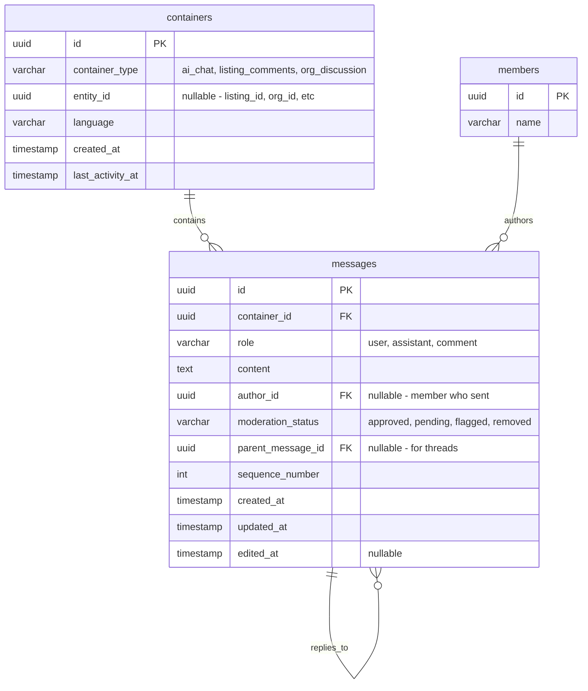

# Wire Up Container + Message Models with Machines for Agent Chat

## Overview

Implement a realtime agent-user chat system by wiring up the existing Container and Message models with the Seesaw machines pattern from the Shay codebase. This will enable agent-only chat initially (keeping it simple), with the architecture ready to support user-to-user chat later.

## Problem Statement / Motivation

The mntogether codebase already has:
- Database tables: `containers`, `messages` (from migrations 000046)
- Rust models: `Container`, `Message` with full CRUD methods
- Typed IDs: `ContainerId`, `MessageId`
- Enums: `ContainerType`, `MessageRole`, `ModerationStatus`

What's missing:
- GraphQL data types and edges for containers/messages
- Seesaw machines to orchestrate agent messaging
- Commands/Events for the chat workflow
- Effects to execute message creation and agent replies
- Integration with AI service for generating replies

The Shay codebase has a battle-tested implementation of this pattern with `AgentMessagingMachine`, `GenerateAgentReplyCommand`, and the pure effect pattern.

## Proposed Solution

Replicate the Shay architecture:

1. **Pure Effect Pattern**: Effects generate AI text and return fact events; machines observe facts and emit entry commands
2. **Causality Chain**: Every state transition is visible in the event stream
3. **Background Jobs**: Agent reply generation runs as background jobs with idempotency

```
User sends message → MessageEvent::SendRequested
    → MessageMachine → MessageCommand::Create
    → MessageEffect → MessageEvent::Created
    → AgentReplyMachine → GenerateAgentReplyCommand (background)
    → GenerateAgentReplyEffect → ChatMessagingEvent::ReplyGenerated
    → AgentMessagingMachine → MessageCommand::Create
    → MessageEffect → MessageEvent::Created
```

## Technical Approach

### Architecture Overview

```
┌─────────────────────────────────────────────────────────────────┐
│                        GraphQL Layer                            │
│  ┌──────────────┐  ┌──────────────┐  ┌──────────────────────┐  │
│  │ Query        │  │ Mutation     │  │ Subscription         │  │
│  │ - container  │  │ - sendMessage│  │ - containerEvents    │  │
│  │ - messages   │  │ - createChat │  │   (via NATS)         │  │
│  └──────────────┘  └──────────────┘  └──────────────────────┘  │
└────────────────────────┬───────────────────▲────────────────────┘
                         │ dispatch_request  │ NATS stream
┌────────────────────────▼───────────────────┼────────────────────┐
│                      Seesaw Event Bus      │                    │
└────────────────────────┬───────────────────┼────────────────────┘
                         │                   │
        ┌────────────────┼────────────────┐  │
        ▼                ▼                ▼  │
┌───────────────┐ ┌───────────────┐ ┌───────────────────────┐
│ ChatMachine   │ │ AgentReply    │ │ AgentMessagingMachine │
│               │ │ Machine       │ │                       │
│ Routes message│ │ Schedules     │ │ Converts generated    │
│ requests to   │ │ reply gen     │ │ text to message       │
│ create cmds   │ │ on new msgs   │ │ create commands       │
└───────┬───────┘ └───────┬───────┘ └───────────┬───────────┘
        │                 │                     │
        ▼                 ▼                     ▼
┌───────────────┐ ┌───────────────┐ ┌───────────────────────┐
│ MessageEffect │ │ GenerateReply │ │ (same MessageEffect)  │
│               │ │ Effect        │ │                       │
│ Creates msg   │ │ Calls AI,     │ │                       │
│ in database   │ │ returns fact  │ │                       │
└───────┬───────┘ └───────────────┘ └───────────────────────┘
        │
        ▼ (after effect completes)
┌───────────────────────────────────────────────────────────────┐
│                     NatsPublishTap                            │
│  Publishes to: members.{member_id}.containers.{cid}.messages  │
│  (broadcasts to all container members across all nodes)       │
└───────────────────────────────────────────────────────────────┘
```

### Real-Time Broadcasting (NATS)

For multi-node deployments, NATS provides cross-node event broadcasting:

```
┌─────────────┐     ┌─────────────┐     ┌─────────────┐
│   Node 1    │     │   Node 2    │     │   Node 3    │
│  (GraphQL)  │     │  (GraphQL)  │     │  (Worker)   │
└──────┬──────┘     └──────┬──────┘     └──────┬──────┘
       │                   │                   │
       └───────────────────┼───────────────────┘
                           │
                    ┌──────▼──────┐
                    │    NATS     │
                    │  (JetStream)│
                    └─────────────┘
```

**NATS Subject Pattern:**
```
members.{member_id}.containers.{container_id}.{suffix}
```

**Suffixes:**
- `.messages` - Message created/updated/deleted events
- `.typing` - Typing indicator events (ephemeral)

**Flow:**
1. Effect creates message → emits `ChatEvent::MessageCreated`
2. `NatsPublishTap` observes the event (runs AFTER effect commits)
3. Tap looks up all container members with read access
4. For each member, publishes to `members.{member_id}.containers.{cid}.messages`
5. GraphQL subscription on any node receives the NATS message
6. Client gets real-time update

### ERD Diagram



## Acceptance Criteria

### Functional Requirements

- [ ] User can create a new AI chat container
- [ ] User can send a message to a container
- [ ] Agent automatically generates a reply to user messages
- [ ] Messages are persisted with correct sequence numbers
- [ ] GraphQL subscriptions notify clients of new messages
- [ ] Container tracks last_activity_at
- [ ] Slide-out `<Chatroom />` component on admin pages
- [ ] Chat persists across page navigation (container ID in localStorage)
- [ ] Typing indicators show when agent is generating
- [ ] Admin users get admin tools (approve, reject, scrape)
- [ ] Anonymous users get read-only tools (search public resources)

### Non-Functional Requirements

- [ ] Agent reply generation runs as background job (won't block request)
- [ ] Idempotent job handling (same message won't trigger duplicate replies)
- [ ] All state transitions visible in event stream (debuggable)
- [ ] Real-time updates work across multiple server nodes (via NATS)
- [ ] Typing indicators don't echo back to sender

### Quality Gates

- [ ] Follows existing sqlx patterns (query_as function, not macro)
- [ ] Effects are thin orchestration (business logic in handlers)
- [ ] No JSONB columns for structured data

## Implementation Phases

### Phase 1: Events & Commands

Create the event and command definitions following Shay patterns.

**Files to create:**

#### `packages/server/src/domains/chatrooms/events/mod.rs`

```rust
use crate::common::{ContainerId, MemberId, MessageId};

/// Chat domain events - immutable facts
#[derive(Debug, Clone)]
pub enum ChatEvent {
    // =========================================================================
    // Request Events (from edges - entry points)
    // =========================================================================

    /// User requests to create a new chat container
    CreateContainerRequested {
        container_type: String,
        entity_id: Option<uuid::Uuid>,
        language: String,
        requested_by: Option<MemberId>,
    },

    /// User sends a message
    SendMessageRequested {
        container_id: ContainerId,
        content: String,
        author_id: Option<MemberId>,
        parent_message_id: Option<MessageId>,
    },

    // =========================================================================
    // Fact Events (from effects - what actually happened)
    // =========================================================================

    /// Container was created
    ContainerCreated {
        container_id: ContainerId,
        container_type: String,
    },

    /// Message was created
    MessageCreated {
        message_id: MessageId,
        container_id: ContainerId,
        role: String,
        author_id: Option<MemberId>,
    },

    /// Message creation failed
    MessageFailed {
        container_id: ContainerId,
        reason: String,
    },
}

/// Agent messaging events (pure effect pattern)
#[derive(Debug, Clone)]
pub enum ChatMessagingEvent {
    /// Agent reply text was generated (fact about AI output)
    /// A machine will observe this and emit MessageCommand::Create
    ReplyGenerated {
        container_id: ContainerId,
        response_to_id: MessageId,
        author_id: MemberId, // Agent's member ID
        text: String,
    },

    /// Reply generation was skipped (no agent, author is agent, etc.)
    Skipped { reason: &'static str },
}
```

#### `packages/server/src/domains/chatrooms/commands/mod.rs`

```rust
use seesaw_core::Command;
use serde::{Deserialize, Serialize};

use crate::common::{ContainerId, MemberId, MessageId};

/// Chat domain commands
#[derive(Debug, Clone, Serialize, Deserialize)]
pub enum ChatCommand {
    /// Create a new container
    CreateContainer {
        container_type: String,
        entity_id: Option<uuid::Uuid>,
        language: String,
        requested_by: Option<MemberId>,
    },

    /// Create a message in a container
    CreateMessage {
        container_id: ContainerId,
        role: String,
        content: String,
        author_id: Option<MemberId>,
        parent_message_id: Option<MessageId>,
    },
}

impl Command for ChatCommand {
    fn execution_mode(&self) -> seesaw_core::ExecutionMode {
        seesaw_core::ExecutionMode::Inline
    }
}

// Job type constants
pub const GENERATE_AGENT_REPLY_JOB_TYPE: &str = "generate_chat_reply";

/// Command to generate an agent reply (runs as background job)
#[derive(Debug, Clone, Serialize, Deserialize)]
pub struct GenerateChatReplyCommand {
    pub message_id: uuid::Uuid,
    pub container_id: uuid::Uuid,
}

impl GenerateChatReplyCommand {
    pub fn new(message_id: MessageId, container_id: ContainerId) -> Self {
        Self {
            message_id: message_id.into_uuid(),
            container_id: container_id.into_uuid(),
        }
    }
}

impl Command for GenerateChatReplyCommand {
    fn execution_mode(&self) -> seesaw_core::ExecutionMode {
        seesaw_core::ExecutionMode::Background
    }

    fn job_spec(&self) -> Option<seesaw_core::JobSpec> {
        Some(
            seesaw_core::JobSpec::new(GENERATE_AGENT_REPLY_JOB_TYPE)
                .with_reference_id(self.message_id)
                .with_idempotency_key(format!(
                    "{}:{}",
                    GENERATE_AGENT_REPLY_JOB_TYPE,
                    self.message_id
                )),
        )
    }

    fn serialize_to_json(&self) -> Option<serde_json::Value> {
        serde_json::to_value(self).ok()
    }
}
```

### Phase 2: Machines

Create the state machines for orchestration.

#### `packages/server/src/domains/chatrooms/machines/mod.rs`

```rust
use seesaw_core::Machine;

use crate::common::{MemberId, MessageId};

use super::commands::{ChatCommand, GenerateChatReplyCommand};
use super::events::{ChatEvent, ChatMessagingEvent};

/// Machine that routes chat requests to commands
pub struct ChatEventMachine;

impl Machine for ChatEventMachine {
    type Event = ChatEvent;
    type Command = ChatCommand;

    fn decide(&mut self, event: &ChatEvent) -> Option<ChatCommand> {
        match event {
            ChatEvent::CreateContainerRequested {
                container_type,
                entity_id,
                language,
                requested_by,
            } => Some(ChatCommand::CreateContainer {
                container_type: container_type.clone(),
                entity_id: *entity_id,
                language: language.clone(),
                requested_by: *requested_by,
            }),

            ChatEvent::SendMessageRequested {
                container_id,
                content,
                author_id,
                parent_message_id,
            } => Some(ChatCommand::CreateMessage {
                container_id: *container_id,
                role: "user".to_string(),
                content: content.clone(),
                author_id: *author_id,
                parent_message_id: *parent_message_id,
            }),

            // Fact events don't trigger commands in this machine
            ChatEvent::ContainerCreated { .. }
            | ChatEvent::MessageCreated { .. }
            | ChatEvent::MessageFailed { .. } => None,
        }
    }
}

/// Machine that schedules agent reply generation for new user messages
pub struct AgentReplyMachine;

impl Machine for AgentReplyMachine {
    type Event = ChatEvent;
    type Command = GenerateChatReplyCommand;

    fn decide(&mut self, event: &ChatEvent) -> Option<GenerateChatReplyCommand> {
        match event {
            ChatEvent::MessageCreated {
                message_id,
                container_id,
                role,
                ..
            } => {
                // Only trigger for user messages, not assistant messages
                if role == "user" {
                    Some(GenerateChatReplyCommand::new(*message_id, *container_id))
                } else {
                    None
                }
            }
            _ => None,
        }
    }
}

/// Machine that converts agent messaging events to message commands
/// (Pure effect pattern)
pub struct AgentMessagingMachine;

impl Machine for AgentMessagingMachine {
    type Event = ChatMessagingEvent;
    type Command = ChatCommand;

    fn decide(&mut self, event: &ChatMessagingEvent) -> Option<ChatCommand> {
        match event {
            ChatMessagingEvent::ReplyGenerated {
                container_id,
                response_to_id,
                author_id,
                text,
            } => Some(ChatCommand::CreateMessage {
                container_id: *container_id,
                role: "assistant".to_string(),
                content: text.clone(),
                author_id: Some(*author_id),
                parent_message_id: Some(*response_to_id),
            }),

            ChatMessagingEvent::Skipped { .. } => None,
        }
    }
}
```

### Phase 3: Effects

Create the effects that execute commands.

#### `packages/server/src/domains/chatrooms/effects/mod.rs`

```rust
pub mod chat;
pub mod messaging;

pub use chat::ChatEffect;
pub use messaging::GenerateChatReplyEffect;
```

#### `packages/server/src/domains/chatrooms/effects/chat.rs`

```rust
use anyhow::Result;
use async_trait::async_trait;
use seesaw_core::{Effect, EffectContext};
use tracing::info;

use crate::common::{ContainerId, MessageId};
use crate::domains::chatrooms::models::{Container, Message};
use crate::server::deps::ServerDeps;

use super::super::commands::ChatCommand;
use super::super::events::ChatEvent;

/// Effect that executes chat commands
pub struct ChatEffect;

#[async_trait]
impl Effect<ChatCommand, ServerDeps> for ChatEffect {
    type Event = ChatEvent;

    async fn execute(
        &self,
        cmd: ChatCommand,
        ctx: EffectContext<ServerDeps>,
    ) -> Result<ChatEvent> {
        match cmd {
            ChatCommand::CreateContainer {
                container_type,
                entity_id,
                language,
                requested_by: _,
            } => handle_create_container(container_type, entity_id, language, &ctx).await,

            ChatCommand::CreateMessage {
                container_id,
                role,
                content,
                author_id,
                parent_message_id,
            } => {
                handle_create_message(container_id, role, content, author_id, parent_message_id, &ctx)
                    .await
            }
        }
    }
}

// ============================================================================
// Handler Functions (Business Logic)
// ============================================================================

async fn handle_create_container(
    container_type: String,
    entity_id: Option<uuid::Uuid>,
    language: String,
    ctx: &EffectContext<ServerDeps>,
) -> Result<ChatEvent> {
    info!(container_type = %container_type, "Creating chat container");

    let container = Container::create(
        container_type.clone(),
        entity_id,
        language,
        &ctx.deps().db_pool,
    )
    .await?;

    Ok(ChatEvent::ContainerCreated {
        container_id: container.id,
        container_type,
    })
}

async fn handle_create_message(
    container_id: ContainerId,
    role: String,
    content: String,
    author_id: Option<crate::common::MemberId>,
    parent_message_id: Option<MessageId>,
    ctx: &EffectContext<ServerDeps>,
) -> Result<ChatEvent> {
    info!(container_id = %container_id, role = %role, "Creating message");

    // Get next sequence number
    let sequence_number = Message::next_sequence_number(container_id, &ctx.deps().db_pool).await?;

    // Create message
    let message = Message::create(
        container_id,
        role.clone(),
        content,
        author_id,
        Some("approved".to_string()), // AI chat messages auto-approved
        parent_message_id,
        sequence_number,
        &ctx.deps().db_pool,
    )
    .await?;

    // Update container activity
    Container::touch_activity(container_id, &ctx.deps().db_pool).await?;

    Ok(ChatEvent::MessageCreated {
        message_id: message.id,
        container_id,
        role,
        author_id,
    })
}
```

#### `packages/server/src/domains/chatrooms/effects/messaging.rs`

```rust
use anyhow::Result;
use async_trait::async_trait;
use seesaw_core::{Effect, EffectContext};
use tracing::info;

use crate::common::{ContainerId, MemberId, MessageId};
use crate::domains::chatrooms::models::{Container, Message};
use crate::server::deps::ServerDeps;

use super::super::commands::GenerateChatReplyCommand;
use super::super::events::ChatMessagingEvent;

/// Effect that generates agent replies
pub struct GenerateChatReplyEffect;

#[async_trait]
impl Effect<GenerateChatReplyCommand, ServerDeps> for GenerateChatReplyEffect {
    type Event = ChatMessagingEvent;

    async fn execute(
        &self,
        cmd: GenerateChatReplyCommand,
        ctx: EffectContext<ServerDeps>,
    ) -> Result<ChatMessagingEvent> {
        handle_generate_reply(cmd, &ctx).await
    }
}

// ============================================================================
// Handler Functions (Business Logic)
// ============================================================================

async fn handle_generate_reply(
    cmd: GenerateChatReplyCommand,
    ctx: &EffectContext<ServerDeps>,
) -> Result<ChatMessagingEvent> {
    let message_id = MessageId::from_uuid(cmd.message_id);
    let container_id = ContainerId::from_uuid(cmd.container_id);

    info!(message_id = %message_id, "Generating agent reply");

    // Load the original message
    let original_message = Message::find_by_id(message_id, &ctx.deps().db_pool).await?;

    // Skip if the author is already an agent (prevent loops)
    // TODO: Check if author is an agent member
    if original_message.role == "assistant" {
        return Ok(ChatMessagingEvent::Skipped {
            reason: "Author is already an agent",
        });
    }

    // Load conversation context (recent messages)
    let messages = Message::find_by_container(container_id, &ctx.deps().db_pool).await?;
    let context = build_conversation_context(&messages);

    // Generate reply using AI service
    let ai = &ctx.deps().ai;
    let reply_text = ai
        .chat_completion(
            "You are a helpful assistant.",
            &context,
        )
        .await?;

    // Get or create agent member ID
    // TODO: Look up agent for this container, for now use a placeholder
    let agent_member_id = MemberId::new(); // Placeholder - should be looked up

    Ok(ChatMessagingEvent::ReplyGenerated {
        container_id,
        response_to_id: message_id,
        author_id: agent_member_id,
        text: reply_text,
    })
}

fn build_conversation_context(messages: &[Message]) -> String {
    messages
        .iter()
        .map(|m| format!("{}: {}", m.role, m.content))
        .collect::<Vec<_>>()
        .join("\n")
}
```

### Phase 4: GraphQL Data Types

Create GraphQL-friendly data types.

#### `packages/server/src/domains/chatrooms/data/mod.rs`

```rust
pub mod container;
pub mod message;

pub use container::*;
pub use message::*;
```

#### `packages/server/src/domains/chatrooms/data/container.rs`

```rust
use chrono::{DateTime, Utc};
use juniper::GraphQLObject;
use serde::{Deserialize, Serialize};

use crate::domains::chatrooms::models::Container;

#[derive(Debug, Clone, Serialize, Deserialize, GraphQLObject)]
#[graphql(description = "Chat container")]
pub struct ContainerData {
    pub id: String,
    pub container_type: String,
    pub entity_id: Option<String>,
    pub language: String,
    pub created_at: DateTime<Utc>,
    pub last_activity_at: DateTime<Utc>,
}

impl From<Container> for ContainerData {
    fn from(c: Container) -> Self {
        Self {
            id: c.id.to_string(),
            container_type: c.container_type,
            entity_id: c.entity_id.map(|id| id.to_string()),
            language: c.language,
            created_at: c.created_at,
            last_activity_at: c.last_activity_at,
        }
    }
}
```

#### `packages/server/src/domains/chatrooms/data/message.rs`

```rust
use chrono::{DateTime, Utc};
use juniper::GraphQLObject;
use serde::{Deserialize, Serialize};

use crate::domains::chatrooms::models::Message;

#[derive(Debug, Clone, Serialize, Deserialize, GraphQLObject)]
#[graphql(description = "Chat message")]
pub struct MessageData {
    pub id: String,
    pub container_id: String,
    pub role: String,
    pub content: String,
    pub author_id: Option<String>,
    pub moderation_status: String,
    pub parent_message_id: Option<String>,
    pub sequence_number: i32,
    pub created_at: DateTime<Utc>,
    pub updated_at: DateTime<Utc>,
    pub edited_at: Option<DateTime<Utc>>,
}

impl From<Message> for MessageData {
    fn from(m: Message) -> Self {
        Self {
            id: m.id.to_string(),
            container_id: m.container_id.to_string(),
            role: m.role,
            content: m.content,
            author_id: m.author_id.map(|id| id.to_string()),
            moderation_status: m.moderation_status,
            parent_message_id: m.parent_message_id.map(|id| id.to_string()),
            sequence_number: m.sequence_number,
            created_at: m.created_at,
            updated_at: m.updated_at,
            edited_at: m.edited_at,
        }
    }
}
```

### Phase 5: GraphQL Edges

Create the GraphQL queries and mutations.

#### `packages/server/src/domains/chatrooms/edges/mod.rs`

```rust
pub mod mutation;
pub mod query;

pub use mutation::*;
pub use query::*;
```

#### `packages/server/src/domains/chatrooms/edges/query.rs`

```rust
use anyhow::Result;
use juniper::FieldResult;

use crate::common::ContainerId;
use crate::domains::chatrooms::data::{ContainerData, MessageData};
use crate::domains::chatrooms::models::{Container, Message};
use crate::server::graphql::context::GraphQLContext;

/// Get a container by ID
pub async fn container(ctx: &GraphQLContext, id: String) -> FieldResult<ContainerData> {
    let container_id = ContainerId::from_string(&id)?;
    let container = Container::find_by_id(container_id, &ctx.db_pool).await?;
    Ok(container.into())
}

/// Get messages for a container
pub async fn messages(ctx: &GraphQLContext, container_id: String) -> FieldResult<Vec<MessageData>> {
    let container_id = ContainerId::from_string(&container_id)?;
    let messages = Message::find_by_container(container_id, &ctx.db_pool).await?;
    Ok(messages.into_iter().map(Into::into).collect())
}

/// Get recent chat containers
pub async fn recent_chats(ctx: &GraphQLContext, limit: Option<i32>) -> FieldResult<Vec<ContainerData>> {
    let limit = limit.unwrap_or(20) as i64;
    let containers = Container::find_recent_by_type("ai_chat", limit, &ctx.db_pool).await?;
    Ok(containers.into_iter().map(Into::into).collect())
}
```

#### `packages/server/src/domains/chatrooms/edges/mutation.rs`

```rust
use juniper::FieldResult;
use seesaw_core::dispatch_request;

use crate::common::{ContainerId, MemberId};
use crate::domains::chatrooms::data::{ContainerData, MessageData};
use crate::domains::chatrooms::events::ChatEvent;
use crate::domains::chatrooms::models::{Container, Message};
use crate::server::graphql::context::GraphQLContext;

/// Create a new AI chat container
pub async fn create_chat(
    ctx: &GraphQLContext,
    language: Option<String>,
) -> FieldResult<ContainerData> {
    let user = ctx.auth_user.as_ref();
    let member_id = user.map(|u| u.member_id);

    let result = dispatch_request(
        ChatEvent::CreateContainerRequested {
            container_type: "ai_chat".to_string(),
            entity_id: None,
            language: language.unwrap_or_else(|| "en".to_string()),
            requested_by: member_id,
        },
        &ctx.bus,
        |m| {
            m.try_match(|e: &ChatEvent| match e {
                ChatEvent::ContainerCreated { container_id, .. } => {
                    Some(Ok(*container_id))
                }
                _ => None,
            })
        },
    )
    .await?;

    let container = Container::find_by_id(result, &ctx.db_pool).await?;
    Ok(container.into())
}

/// Send a message to a chat container
pub async fn send_message(
    ctx: &GraphQLContext,
    container_id: String,
    content: String,
) -> FieldResult<MessageData> {
    let user = ctx.auth_user.as_ref();
    let author_id = user.map(|u| u.member_id);
    let container_id = ContainerId::from_string(&container_id)?;

    let result = dispatch_request(
        ChatEvent::SendMessageRequested {
            container_id,
            content,
            author_id,
            parent_message_id: None,
        },
        &ctx.bus,
        |m| {
            m.try_match(|e: &ChatEvent| match e {
                ChatEvent::MessageCreated { message_id, .. } => {
                    Some(Ok(*message_id))
                }
                ChatEvent::MessageFailed { reason, .. } => {
                    Some(Err(anyhow::anyhow!("{}", reason)))
                }
                _ => None,
            })
        },
    )
    .await?;

    let message = Message::find_by_id(result, &ctx.db_pool).await?;
    Ok(message.into())
}
```

### Phase 6: Wire Up to Server

Update the domain module and GraphQL schema.

#### Update `packages/server/src/domains/chatrooms/mod.rs`

```rust
pub mod commands;
pub mod data;
pub mod edges;
pub mod effects;
pub mod events;
pub mod machines;
pub mod models;

pub use commands::*;
pub use data::*;
pub use edges::*;
pub use effects::*;
pub use events::*;
pub use machines::*;
pub use models::*;
```

#### Update GraphQL Schema

Add to query:
```rust
field container(&executor, id: String) -> FieldResult<ContainerData> {
    chatrooms::edges::query::container(ctx, id).await
}

field messages(&executor, container_id: String) -> FieldResult<Vec<MessageData>> {
    chatrooms::edges::query::messages(ctx, container_id).await
}

field recent_chats(&executor, limit: Option<i32>) -> FieldResult<Vec<ContainerData>> {
    chatrooms::edges::query::recent_chats(ctx, limit).await
}
```

Add to mutation:
```rust
field create_chat(&executor, language: Option<String>) -> FieldResult<ContainerData> {
    chatrooms::edges::mutation::create_chat(ctx, language).await
}

field send_message(&executor, container_id: String, content: String) -> FieldResult<MessageData> {
    chatrooms::edges::mutation::send_message(ctx, container_id, content).await
}
```

### Phase 7: NATS Broadcasting & Subscriptions

Enable real-time updates across multiple server nodes.

#### `packages/server/src/domains/chatrooms/realtime/mod.rs`

```rust
pub mod events;
pub mod nats;
pub mod stream;

pub use events::*;
pub use nats::*;
pub use stream::*;
```

#### `packages/server/src/domains/chatrooms/realtime/events.rs`

GraphQL subscription event types (what clients receive):

```rust
use juniper::GraphQLObject;
use serde::{Deserialize, Serialize};

use crate::domains::chatrooms::data::MessageData;

/// Container event for GraphQL subscriptions
#[derive(Debug, Clone, Serialize, Deserialize, GraphQLObject)]
pub enum ContainerEvent {
    /// A message was created in the container
    MessageCreated { message: MessageData },

    /// A message was updated
    MessageUpdated { message: MessageData },

    /// A message was deleted
    MessageDeleted { message_id: String },

    /// Someone started typing
    TypingStarted {
        container_id: String,
        member_id: String,
    },
}
```

#### `packages/server/src/common/nats.rs` (copy from Shay)

The `IntoNatsPayload` trait from Shay provides a clean abstraction for NATS publishing:

```rust
//! Common NATS publishing utilities.
//!
//! Events implement the `IntoNatsPayload` trait to declare their NATS behavior.
//! Publishing is handled by event taps which run after effects complete.

use uuid::Uuid;

/// Trait for domain events that can be published to NATS.
///
/// Implement this trait on your domain events to enable automatic NATS publishing.
/// Events that return `None` from `container_id()` will not be published.
pub trait IntoNatsPayload: Send + Sync {
    /// Get the container ID for scoping the publish to container members.
    ///
    /// Return `None` if this event should not be published to NATS.
    fn container_id(&self) -> Option<Uuid>;

    /// Convert the event to a NATS-serializable JSON payload.
    fn into_payload(&self) -> serde_json::Value;

    /// Get the NATS subject suffix (e.g., "messages", "typing").
    ///
    /// The full subject will be: `members.{member_id}.containers.{container_id}.{suffix}`
    fn subject_suffix() -> &'static str;

    /// Optional: Get an additional container ID to publish to.
    ///
    /// Override this to publish to multiple containers. Default returns `None`.
    fn additional_container_id(&self) -> Option<Uuid> {
        None
    }

    /// Optional: Get a member ID to exclude from publishing (e.g., sender for typing).
    ///
    /// Override this to skip specific members. Default returns `None`.
    fn exclude_member_id(&self) -> Option<Uuid> {
        None
    }
}
```

#### `packages/server/src/domains/chatrooms/realtime/nats.rs`

Implement `IntoNatsPayload` for chat events:

```rust
use uuid::Uuid;

use crate::common::nats::IntoNatsPayload;
use crate::common::{ContainerId, MemberId};
use crate::domains::chatrooms::events::ChatEvent;

impl IntoNatsPayload for ChatEvent {
    fn container_id(&self) -> Option<Uuid> {
        match self {
            // Only publish fact events with container context
            ChatEvent::MessageCreated { container_id, .. } => Some(container_id.into_uuid()),
            // Input events and failures are not published
            ChatEvent::CreateContainerRequested { .. }
            | ChatEvent::SendMessageRequested { .. }
            | ChatEvent::ContainerCreated { .. }
            | ChatEvent::MessageFailed { .. } => None,
        }
    }

    fn into_payload(&self) -> serde_json::Value {
        match self {
            ChatEvent::MessageCreated {
                message_id,
                container_id,
                role,
                author_id,
            } => serde_json::json!({
                "type": "message_created",
                "message_id": message_id.to_string(),
                "container_id": container_id.to_string(),
                "role": role,
                "author_id": author_id.map(|id| id.to_string()),
            }),
            _ => serde_json::json!({}),
        }
    }

    fn subject_suffix() -> &'static str {
        "messages"
    }
}

/// Typing event (ephemeral signal - not persisted)
#[derive(Debug, Clone)]
pub enum TypingEvent {
    Started {
        container_id: ContainerId,
        member_id: MemberId,
    },
}

impl IntoNatsPayload for TypingEvent {
    fn container_id(&self) -> Option<Uuid> {
        match self {
            TypingEvent::Started { container_id, .. } => Some(container_id.into_uuid()),
        }
    }

    fn into_payload(&self) -> serde_json::Value {
        match self {
            TypingEvent::Started {
                container_id,
                member_id,
            } => serde_json::json!({
                "type": "typing_started",
                "container_id": container_id.to_string(),
                "member_id": member_id.to_string(),
            }),
        }
    }

    fn subject_suffix() -> &'static str {
        "typing"
    }

    // Exclude sender from receiving their own typing event
    fn exclude_member_id(&self) -> Option<Uuid> {
        match self {
            TypingEvent::Started { member_id, .. } => Some(member_id.into_uuid()),
        }
    }
}
```

#### `packages/server/src/common/nats_tap.rs` (copy from Shay)

The `NatsPublishTap` handles publishing to all container members:

```rust
//! NATS Event Taps - observe events and publish to NATS.
//!
//! Taps are observers - they run after effects complete and publish
//! committed facts to external systems (fire-and-forget).

use std::marker::PhantomData;
use std::sync::Arc;

use anyhow::Result;
use bytes::Bytes;
use seesaw::{EventTap, TapContext, async_trait};
use tracing::{info, warn};

use crate::common::nats::IntoNatsPayload;
use crate::domains::chatrooms::models::Container;
use crate::kernel::ServerKernel;

/// Event tap that publishes events to NATS after effects complete.
pub struct NatsPublishTap<E> {
    kernel: Arc<ServerKernel>,
    _phantom: PhantomData<E>,
}

impl<E> NatsPublishTap<E> {
    pub fn new(kernel: Arc<ServerKernel>) -> Self {
        Self {
            kernel,
            _phantom: PhantomData,
        }
    }
}

#[async_trait]
impl<E> EventTap<E> for NatsPublishTap<E>
where
    E: IntoNatsPayload + Clone + Send + Sync + 'static,
{
    async fn on_event(&self, event: &E, _ctx: &TapContext) -> Result<()> {
        publish_to_members(event, &self.kernel).await
    }
}

/// Publish an event to all members of its container(s).
async fn publish_to_members<E: IntoNatsPayload>(event: &E, kernel: &ServerKernel) -> Result<()> {
    let Some(container_id) = event.container_id() else {
        return Ok(()); // Event doesn't want to be published
    };

    let payload = event.into_payload();
    let exclude_member = event.exclude_member_id();

    // Publish to main container
    publish_to_container(
        container_id,
        &payload,
        E::subject_suffix(),
        exclude_member,
        kernel,
    )
    .await?;

    // Publish to additional container if specified
    if let Some(additional_id) = event.additional_container_id() {
        if additional_id != container_id {
            publish_to_container(
                additional_id,
                &payload,
                E::subject_suffix(),
                exclude_member,
                kernel,
            )
            .await?;
        }
    }

    Ok(())
}

/// Publish a payload to all members of a specific container.
async fn publish_to_container(
    container_id: uuid::Uuid,
    payload: &serde_json::Value,
    subject_suffix: &str,
    exclude_member: Option<uuid::Uuid>,
    kernel: &ServerKernel,
) -> Result<()> {
    let db = &kernel.db_pool;

    // Get container members (for AI chat, this is just the creator)
    // TODO: Implement container membership cache like Shay
    let members = get_container_members(container_id, db).await?;

    let payload_bytes = serde_json::to_vec(payload)?;

    info!(
        container_id = %container_id,
        member_count = members.len(),
        subject_suffix = %subject_suffix,
        "publishing NATS event to container members"
    );

    for member_id in &members {
        // Skip excluded member (e.g., sender for typing events)
        if Some(*member_id) == exclude_member {
            continue;
        }

        let subject = format!(
            "members.{}.containers.{}.{}",
            member_id, container_id, subject_suffix
        );

        if let Err(e) = kernel
            .nats_client
            .publish(subject.clone(), Bytes::from(payload_bytes.clone()))
            .await
        {
            warn!(
                error = %e,
                subject = %subject,
                "Failed to publish NATS event"
            );
        }
    }

    Ok(())
}

async fn get_container_members(
    container_id: uuid::Uuid,
    pool: &sqlx::PgPool,
) -> Result<Vec<uuid::Uuid>> {
    // For AI chat (agent-only), query container creator
    // TODO: Implement proper container membership when multi-user chat needed
    let container = Container::find_by_id(container_id.into(), pool).await?;

    // For now, return empty - will be populated when membership is added
    Ok(vec![])
}
```

#### `packages/server/src/domains/chatrooms/realtime/stream.rs`

GraphQL subscription stream:

```rust
use std::pin::Pin;

use futures::stream::Stream;
use futures::StreamExt;

use crate::server::kernel::ServerKernel;

use super::ContainerEvent;

pub type ContainerEventStream = Pin<Box<dyn Stream<Item = ContainerEvent> + Send>>;

/// Subscribe to container events via NATS
pub async fn subscribe_to_container(
    kernel: &ServerKernel,
    member_id: uuid::Uuid,
    container_id: uuid::Uuid,
) -> anyhow::Result<ContainerEventStream> {
    // TODO: Permission check - verify member has read access

    // Subscribe to all suffixes for this container
    let subject = format!("members.{}.containers.{}.>", member_id, container_id);

    let subscription = kernel.nats_client.subscribe(subject).await?;

    let stream = subscription.filter_map(move |message| {
        let subject = message.subject.to_string();
        async move {
            // Route based on subject suffix
            if subject.ends_with(".messages") {
                // Parse message event
                let payload: serde_json::Value =
                    serde_json::from_slice(&message.payload).ok()?;

                match payload.get("type")?.as_str()? {
                    "message_created" => {
                        // TODO: Fetch full message data and return ContainerEvent::MessageCreated
                        None
                    }
                    _ => None,
                }
            } else if subject.ends_with(".typing") {
                let payload: serde_json::Value =
                    serde_json::from_slice(&message.payload).ok()?;

                Some(ContainerEvent::TypingStarted {
                    container_id: payload.get("container_id")?.as_str()?.to_string(),
                    member_id: payload.get("member_id")?.as_str()?.to_string(),
                })
            } else {
                None
            }
        }
    });

    Ok(Box::pin(stream))
}
```

#### `packages/server/src/common/nats_tap.rs`

Event tap that publishes to NATS after effects complete:

```rust
use std::marker::PhantomData;
use std::sync::Arc;

use async_trait::async_trait;
use seesaw_core::{EventTap, TapContext};

use crate::domains::chatrooms::realtime::{publish_to_container, IntoNatsPayload};
use crate::server::kernel::ServerKernel;

/// Event tap that publishes events to NATS for real-time subscriptions
pub struct NatsPublishTap<E> {
    kernel: Arc<ServerKernel>,
    _phantom: PhantomData<E>,
}

impl<E> NatsPublishTap<E> {
    pub fn new(kernel: Arc<ServerKernel>) -> Self {
        Self {
            kernel,
            _phantom: PhantomData,
        }
    }
}

#[async_trait]
impl<E> EventTap<E> for NatsPublishTap<E>
where
    E: IntoNatsPayload + Clone + Send + Sync + 'static,
{
    async fn on_event(&self, event: &E, _ctx: &TapContext) -> anyhow::Result<()> {
        publish_to_container(event, &self.kernel).await
    }
}
```

#### GraphQL Subscription

Add to `packages/server/src/server/graphql/subscriptions.rs`:

```rust
use futures::Stream;
use juniper::FieldResult;
use std::pin::Pin;

use crate::domains::chatrooms::realtime::{subscribe_to_container, ContainerEvent};
use crate::server::graphql::context::Context;

pub struct SubscriptionRoot;

type ContainerEventStream = Pin<Box<dyn Stream<Item = ContainerEvent> + Send>>;

#[juniper::graphql_subscription(context = Context)]
impl SubscriptionRoot {
    /// Subscribe to real-time events for a container
    async fn container_events(
        context: &Context,
        container_id: String,
    ) -> FieldResult<ContainerEventStream> {
        let member_id = context
            .auth_user
            .as_ref()
            .ok_or_else(|| juniper::FieldError::new("Authentication required", juniper::Value::Null))?
            .member_id;

        let container_uuid = uuid::Uuid::parse_str(&container_id)?;

        let stream = subscribe_to_container(&context.kernel, member_id.into_uuid(), container_uuid)
            .await?;

        Ok(stream)
    }
}
```

#### Engine Configuration with Taps

Update engine builder to include NATS publishing tap:

```rust
pub fn chat_engine(kernel: Arc<ServerKernel>, bus: EventBus) -> Engine<ServerKernel> {
    EngineBuilder::with_arc(kernel.clone())
        .with_bus(bus)
        .with_job_queue(kernel.job_queue.clone())

        // Machines
        .with_machine(ChatEventMachine)
        .with_machine(AgentReplyMachine)
        .with_machine(AgentMessagingMachine)

        // Effects
        .with_effect::<ChatCommand, _>(ChatEffect)
        .with_effect::<GenerateChatReplyCommand, _>(GenerateChatReplyEffect)

        // Event Taps - NATS publishing AFTER effects complete
        .with_event_tap(NatsPublishTap::<ChatEvent>::new(kernel.clone()))
        .with_event_tap(NatsPublishTap::<TypingEvent>::new(kernel))

        .build()
}
```

### Phase 8: Typing Indicators

Add mutation for signaling typing state:

#### `packages/server/src/domains/chatrooms/edges/mutation.rs` (add)

```rust
/// Signal that user is typing in a container
pub async fn signal_typing(
    ctx: &GraphQLContext,
    container_id: String,
) -> FieldResult<bool> {
    let user = ctx
        .auth_user
        .as_ref()
        .ok_or_else(|| juniper::FieldError::new("Authentication required", juniper::Value::Null))?;

    let container_id = ContainerId::from_string(&container_id)?;

    // Emit typing event directly to bus (ephemeral, not persisted)
    ctx.bus.emit(TypingEvent::Started {
        container_id,
        member_id: user.member_id,
    });

    Ok(true)
}
```

### Phase 9: Frontend Chatroom Component

Create a slide-out chat panel for the admin dashboard with tool-aware agent capabilities.

#### Architecture: Tool-Based Auth

```
┌─────────────────────────────────────────────────────────────────┐
│                        Frontend                                  │
│  ┌────────────────────────────────────────────────────────────┐ │
│  │ <Chatroom />                                               │ │
│  │  - Slides in from right side                               │ │
│  │  - Persists conversation in localStorage                   │ │
│  │  - Shows typing indicators via subscription                │ │
│  └────────────────────────────────────────────────────────────┘ │
└────────────────────────┬────────────────────────────────────────┘
                         │ sendMessage mutation
                         ▼
┌─────────────────────────────────────────────────────────────────┐
│                        Backend                                   │
│  ┌────────────────────────────────────────────────────────────┐ │
│  │ GenerateChatReplyEffect                                    │ │
│  │  - Checks auth context                                     │ │
│  │  - Admin? → Add admin tools (approve listings, scrape, etc)│ │
│  │  - Anonymous? → Read-only tools (search public listings)   │ │
│  └────────────────────────────────────────────────────────────┘ │
└─────────────────────────────────────────────────────────────────┘
```

#### `packages/web-app/src/components/Chatroom.tsx`

```tsx
import React, { useState, useEffect, useRef } from 'react';
import { useMutation, useQuery, useSubscription } from '@apollo/client';
import { useAuth } from '../contexts/AuthContext';
import {
  GET_CHAT_MESSAGES,
  CREATE_CHAT,
  SEND_CHAT_MESSAGE,
  CONTAINER_EVENTS_SUBSCRIPTION,
} from '../graphql/queries';

interface Message {
  id: string;
  role: 'user' | 'assistant';
  content: string;
  createdAt: string;
}

interface ChatroomProps {
  isOpen: boolean;
  onClose: () => void;
}

export function Chatroom({ isOpen, onClose }: ChatroomProps) {
  const { isAuthenticated } = useAuth();
  const [messages, setMessages] = useState<Message[]>([]);
  const [input, setInput] = useState('');
  const [containerId, setContainerId] = useState<string | null>(() =>
    localStorage.getItem('chat_container_id')
  );
  const [isTyping, setIsTyping] = useState(false);
  const messagesEndRef = useRef<HTMLDivElement>(null);

  // Fetch existing messages if we have a container
  const { data: messagesData } = useQuery(GET_CHAT_MESSAGES, {
    variables: { containerId },
    skip: !containerId,
  });

  // Create chat mutation
  const [createChat] = useMutation(CREATE_CHAT, {
    onCompleted: (data) => {
      const id = data.createChat.id;
      setContainerId(id);
      localStorage.setItem('chat_container_id', id);
    },
  });

  // Send message mutation
  const [sendMessage, { loading: sending }] = useMutation(SEND_CHAT_MESSAGE);

  // Subscribe to container events (new messages, typing)
  useSubscription(CONTAINER_EVENTS_SUBSCRIPTION, {
    variables: { containerId },
    skip: !containerId,
    onData: ({ data }) => {
      const event = data.data?.containerEvents;
      if (event?.__typename === 'MessageCreated') {
        // Refetch messages or append to local state
        setIsTyping(false);
      } else if (event?.__typename === 'TypingStarted') {
        setIsTyping(true);
        // Clear typing after 3 seconds
        setTimeout(() => setIsTyping(false), 3000);
      }
    },
  });

  // Update messages when data loads
  useEffect(() => {
    if (messagesData?.messages) {
      setMessages(messagesData.messages);
    }
  }, [messagesData]);

  // Scroll to bottom on new messages
  useEffect(() => {
    messagesEndRef.current?.scrollIntoView({ behavior: 'smooth' });
  }, [messages]);

  // Create container on first open if needed
  useEffect(() => {
    if (isOpen && !containerId) {
      createChat();
    }
  }, [isOpen, containerId, createChat]);

  const handleSend = async () => {
    if (!input.trim() || !containerId || sending) return;

    const userMessage = input.trim();
    setInput('');

    // Optimistic update
    setMessages((prev) => [
      ...prev,
      { id: 'temp', role: 'user', content: userMessage, createdAt: new Date().toISOString() },
    ]);

    await sendMessage({
      variables: { containerId, content: userMessage },
    });
  };

  const handleKeyDown = (e: React.KeyboardEvent) => {
    if (e.key === 'Enter' && !e.shiftKey) {
      e.preventDefault();
      handleSend();
    }
  };

  if (!isOpen) return null;

  return (
    <div className="fixed inset-y-0 right-0 w-96 bg-white shadow-xl border-l border-stone-200 flex flex-col z-50">
      {/* Header */}
      <div className="flex items-center justify-between px-4 py-3 border-b border-stone-200 bg-stone-50">
        <div>
          <h2 className="font-semibold text-stone-900">
            {isAuthenticated ? 'Admin Assistant' : 'Chat'}
          </h2>
          <p className="text-xs text-stone-500">
            {isAuthenticated ? 'Full admin tools available' : 'Public information only'}
          </p>
        </div>
        <button
          onClick={onClose}
          className="p-1 hover:bg-stone-200 rounded text-stone-500"
        >
          <svg className="w-5 h-5" fill="none" stroke="currentColor" viewBox="0 0 24 24">
            <path strokeLinecap="round" strokeLinejoin="round" strokeWidth={2} d="M6 18L18 6M6 6l12 12" />
          </svg>
        </button>
      </div>

      {/* Messages */}
      <div className="flex-1 overflow-y-auto p-4 space-y-4">
        {messages.length === 0 && (
          <div className="text-center text-stone-500 mt-8">
            <p className="text-sm">
              {isAuthenticated
                ? "I can help you manage listings, scrape websites, and more."
                : "Ask me about available resources and services."}
            </p>
          </div>
        )}

        {messages.map((msg) => (
          <div
            key={msg.id}
            className={`flex ${msg.role === 'user' ? 'justify-end' : 'justify-start'}`}
          >
            <div
              className={`max-w-[80%] rounded-lg px-4 py-2 ${
                msg.role === 'user'
                  ? 'bg-amber-600 text-white'
                  : 'bg-stone-100 text-stone-900'
              }`}
            >
              <p className="text-sm whitespace-pre-wrap">{msg.content}</p>
            </div>
          </div>
        ))}

        {isTyping && (
          <div className="flex justify-start">
            <div className="bg-stone-100 rounded-lg px-4 py-2">
              <div className="flex space-x-1">
                <div className="w-2 h-2 bg-stone-400 rounded-full animate-bounce" />
                <div className="w-2 h-2 bg-stone-400 rounded-full animate-bounce delay-100" />
                <div className="w-2 h-2 bg-stone-400 rounded-full animate-bounce delay-200" />
              </div>
            </div>
          </div>
        )}

        <div ref={messagesEndRef} />
      </div>

      {/* Input */}
      <div className="border-t border-stone-200 p-4">
        <div className="flex space-x-2">
          <textarea
            value={input}
            onChange={(e) => setInput(e.target.value)}
            onKeyDown={handleKeyDown}
            placeholder="Type a message..."
            rows={1}
            className="flex-1 px-3 py-2 border border-stone-300 rounded-lg resize-none focus:outline-none focus:ring-2 focus:ring-amber-500"
          />
          <button
            onClick={handleSend}
            disabled={!input.trim() || sending}
            className="px-4 py-2 bg-amber-600 text-white rounded-lg hover:bg-amber-700 disabled:opacity-50 disabled:cursor-not-allowed"
          >
            Send
          </button>
        </div>
      </div>
    </div>
  );
}
```

#### `packages/web-app/src/graphql/queries.ts` (additions)

```typescript
export const GET_CHAT_MESSAGES = gql`
  query GetChatMessages($containerId: String!) {
    messages(containerId: $containerId) {
      id
      role
      content
      authorId
      createdAt
    }
  }
`;

export const CREATE_CHAT = gql`
  mutation CreateChat($language: String) {
    createChat(language: $language) {
      id
      containerType
      createdAt
    }
  }
`;

export const SEND_CHAT_MESSAGE = gql`
  mutation SendChatMessage($containerId: String!, $content: String!) {
    sendMessage(containerId: $containerId, content: $content) {
      id
      role
      content
      createdAt
    }
  }
`;

export const CONTAINER_EVENTS_SUBSCRIPTION = gql`
  subscription ContainerEvents($containerId: String!) {
    containerEvents(containerId: $containerId) {
      ... on MessageCreated {
        message {
          id
          role
          content
          createdAt
        }
      }
      ... on TypingStarted {
        memberId
      }
    }
  }
`;
```

#### Admin Layout Integration

Update `App.tsx` to add chat toggle to admin layout:

```tsx
// In AdminLayout component
function AdminLayout() {
  const { isAuthenticated, logout } = useAuth();
  const [chatOpen, setChatOpen] = useState(false);

  if (!isAuthenticated) {
    return <Navigate to="/admin/login" replace />;
  }

  return (
    <div className="min-h-screen bg-stone-50">
      {/* Header with chat button */}
      <header className="bg-white shadow-sm border-b border-stone-200">
        <div className="max-w-7xl mx-auto px-4 py-3 flex justify-between items-center">
          <nav>{/* existing nav */}</nav>
          <div className="flex items-center space-x-4">
            <button
              onClick={() => setChatOpen(!chatOpen)}
              className="p-2 text-stone-600 hover:bg-stone-100 rounded-lg"
              title="Open Chat"
            >
              <svg className="w-6 h-6" fill="none" stroke="currentColor" viewBox="0 0 24 24">
                <path strokeLinecap="round" strokeLinejoin="round" strokeWidth={2}
                  d="M8 12h.01M12 12h.01M16 12h.01M21 12c0 4.418-4.03 8-9 8a9.863 9.863 0 01-4.255-.949L3 20l1.395-3.72C3.512 15.042 3 13.574 3 12c0-4.418 4.03-8 9-8s9 3.582 9 8z"
                />
              </svg>
            </button>
            <button onClick={logout} className="text-stone-600 hover:text-stone-900">
              Logout
            </button>
          </div>
        </div>
      </header>

      <main className={chatOpen ? 'mr-96' : ''}>
        <Outlet />
      </main>

      <Chatroom isOpen={chatOpen} onClose={() => setChatOpen(false)} />
    </div>
  );
}
```

### Phase 10: Admin Tools for Agent

Configure different tool sets based on auth context.

#### Backend: Tool Configuration

```rust
// packages/server/src/domains/chatrooms/effects/messaging.rs

async fn handle_generate_reply(
    cmd: GenerateChatReplyCommand,
    ctx: &EffectContext<ServerDeps>,
) -> Result<ChatMessagingEvent> {
    let message_id = MessageId::from_uuid(cmd.message_id);
    let container_id = ContainerId::from_uuid(cmd.container_id);

    // Load container to get creator/context
    let container = Container::find_by_id(container_id, &ctx.deps().db_pool).await?;

    // Load the original message
    let original_message = Message::find_by_id(message_id, &ctx.deps().db_pool).await?;

    // Check if author is admin
    let is_admin = if let Some(author_id) = original_message.author_id {
        check_is_admin(author_id, &ctx.deps().db_pool).await?
    } else {
        false
    };

    // Build tool set based on auth
    let tools = if is_admin {
        build_admin_tools(ctx)
    } else {
        build_public_tools(ctx)
    };

    // Load conversation context
    let messages = Message::find_by_container(container_id, &ctx.deps().db_pool).await?;
    let context = build_conversation_context(&messages);

    // Generate reply with tools
    let ai = &ctx.deps().ai;
    let reply_text = ai
        .chat_completion_with_tools(
            get_system_prompt(is_admin),
            &context,
            &tools,
        )
        .await?;

    // Get agent member ID
    let agent_member_id = get_or_create_agent_member(&ctx.deps().db_pool).await?;

    Ok(ChatMessagingEvent::ReplyGenerated {
        container_id,
        response_to_id: message_id,
        author_id: agent_member_id,
        text: reply_text,
    })
}

fn get_system_prompt(is_admin: bool) -> &'static str {
    if is_admin {
        r#"You are an admin assistant for MN Together, a resource-sharing platform.
You can help administrators:
- Approve or reject listings
- Scrape websites for new resources
- Generate website assessments
- Search and filter listings
- Manage organizations

Be helpful and proactive. If an admin asks to do something, use the appropriate tool."#
    } else {
        r#"You are a helpful assistant for MN Together, a resource-sharing platform.
You can help users find resources and services in their community.
You have access to publicly available listings and can search for relevant information.
You cannot modify any data - only provide information."#
    }
}

fn build_admin_tools(ctx: &EffectContext<ServerDeps>) -> Vec<Tool> {
    vec![
        Tool::new("approve_listing")
            .description("Approve a pending listing to make it public")
            .param("listing_id", "string", "The listing ID to approve"),
        Tool::new("reject_listing")
            .description("Reject a listing with a reason")
            .param("listing_id", "string", "The listing ID to reject")
            .param("reason", "string", "Reason for rejection"),
        Tool::new("scrape_website")
            .description("Scrape a website for new listings")
            .param("website_id", "string", "The website ID to scrape"),
        Tool::new("search_listings")
            .description("Search listings by query")
            .param("query", "string", "Search query")
            .param("status", "string", "Filter by status: pending, approved, rejected"),
        Tool::new("get_pending_count")
            .description("Get count of pending listings awaiting approval"),
    ]
}

fn build_public_tools(ctx: &EffectContext<ServerDeps>) -> Vec<Tool> {
    vec![
        Tool::new("search_resources")
            .description("Search for available resources and services")
            .param("query", "string", "What are you looking for?")
            .param("location", "string", "Optional location filter"),
        Tool::new("get_resource_details")
            .description("Get details about a specific resource")
            .param("listing_id", "string", "The resource ID"),
    ]
}
```

#### Tool Execution Handler

```rust
// packages/server/src/domains/chatrooms/effects/tools.rs

use crate::domains::listings::events::ListingEvent;

pub async fn execute_tool(
    tool_name: &str,
    params: serde_json::Value,
    is_admin: bool,
    ctx: &EffectContext<ServerDeps>,
) -> Result<String> {
    // Verify admin tools require admin auth
    let admin_tools = ["approve_listing", "reject_listing", "scrape_website"];
    if admin_tools.contains(&tool_name) && !is_admin {
        return Ok("Error: This action requires admin permissions.".to_string());
    }

    match tool_name {
        "approve_listing" => {
            let listing_id = params["listing_id"].as_str()
                .ok_or_else(|| anyhow::anyhow!("Missing listing_id"))?;

            // Dispatch approval event
            ctx.bus().emit(ListingEvent::ApproveListingRequested {
                listing_id: ListingId::from_string(listing_id)?,
                requested_by: get_system_member_id(),
                is_admin: true,
            });

            Ok(format!("Listing {} has been approved.", listing_id))
        }

        "search_listings" => {
            let query = params["query"].as_str().unwrap_or("");
            let status = params["status"].as_str();

            let listings = search_listings(query, status, &ctx.deps().db_pool).await?;

            Ok(format_listings_for_chat(&listings))
        }

        "search_resources" => {
            let query = params["query"].as_str().unwrap_or("");

            // Only search approved/public listings
            let listings = search_public_listings(query, &ctx.deps().db_pool).await?;

            Ok(format_listings_for_chat(&listings))
        }

        _ => Ok(format!("Unknown tool: {}", tool_name)),
    }
}
```

## Success Metrics

- Agent responds to user messages within 5 seconds
- All state transitions visible in logs/event stream
- No duplicate agent replies (idempotency working)
- Container activity timestamp updates on each message

## Dependencies & Risks

### Dependencies
- AI service must be available (`ctx.deps().ai`)
- Seesaw bus must be configured to route chat events/commands
- Database migrations already applied (containers, messages tables exist)
- NATS server running (with JetStream enabled for persistence)
- `async_nats` crate for Rust NATS client
- ServerKernel must have `nats_client: async_nats::Client` field

### Risks
- **Risk**: AI service latency could affect user experience
  - **Mitigation**: Background job with typing indicators
- **Risk**: Agent loops (agent replying to agent)
  - **Mitigation**: Check role before scheduling reply
- **Risk**: Admin tools exposed to non-admin users
  - **Mitigation**: Auth check in tool execution handler, not just tool selection
- **Risk**: Tool execution failures silently ignored
  - **Mitigation**: Return error messages to chat, log failures

## Future Considerations

1. **User-to-user chat**: Add membership model for multi-user containers
2. **Streaming responses**: Stream AI output token-by-token (SSE or WebSocket)
3. **Message editing**: Add edit commands/events
4. **Tool confirmations**: "Are you sure you want to approve this listing?" before destructive actions
5. **Chat history**: Searchable history of past conversations
6. **Context awareness**: Inject current page context (e.g., "I'm looking at listing X")
7. **Public chat widget**: Embed chat on public-facing pages for resource discovery
8. **Multi-language support**: Agent responds in user's language

## References

### Internal References
- Shay agent machines: `/Users/craig/Developer/fourthplaces/shay/packages/api-core/src/domains/agent/machines/mod.rs`
- Shay agent effects: `/Users/craig/Developer/fourthplaces/shay/packages/api-core/src/domains/agent/effects/messaging.rs`
- Existing container model: `packages/server/src/domains/chatrooms/models/chatroom.rs:12`
- Existing message model: `packages/server/src/domains/chatrooms/models/chatroom.rs:23`
- Listings events example: `packages/server/src/domains/listings/events/mod.rs`

### Shay Patterns to Follow
- Pure effect pattern: Effects return facts, machines orchestrate
- Background commands with idempotency keys
- Thin effects that dispatch to handler functions
- Causality chain visible in event stream
- Event taps for NATS publishing (runs after effects commit)
- NATS subject pattern: `members.{member_id}.containers.{container_id}.{suffix}`
- IntoNatsPayload trait for event serialization

### Shay NATS References
- **IntoNatsPayload trait**: `/Users/craig/Developer/fourthplaces/shay/packages/api-core/src/common/nats.rs` (copy this)
- **NatsPublishTap**: `/Users/craig/Developer/fourthplaces/shay/packages/api-core/src/common/nats_tap.rs` (copy this)
- Subscription stream: `/Users/craig/Developer/fourthplaces/shay/packages/api-core/src/domains/container/realtime/stream.rs`
- Engine with taps: `/Users/craig/Developer/fourthplaces/shay/packages/api-core/src/kernel/engine.rs:342-376`
- Typing events: `/Users/craig/Developer/fourthplaces/shay/packages/api-core/src/domains/entry/edges/typing/mod.rs`
