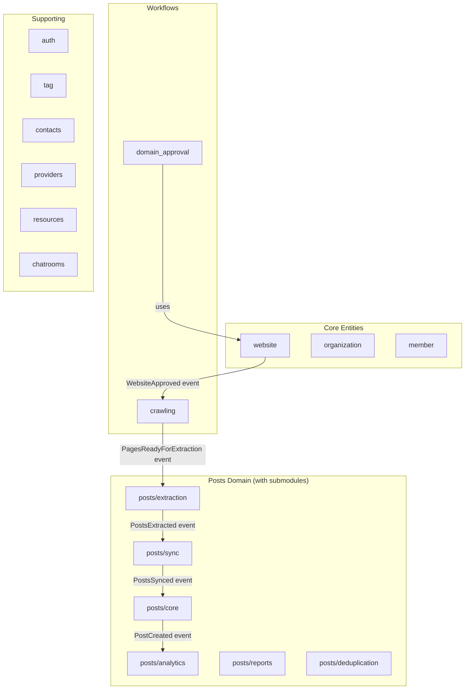
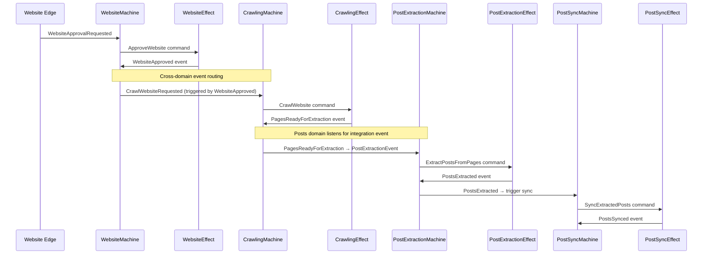

# refactor: Untangle Seesaw Architecture - Atomic Effects & Domain Boundaries

**Date:** 2026-02-01
**Type:** refactor
**Scope:** Aggressive architecture reorganization

---

## Overview

The codebase has significant architectural debt: broken encapsulation, cross-cutting domain imports, fat effects doing multiple things, and insufficient event chaining. This plan outlines a systematic refactoring to enforce proper seesaw-rs architecture:

**Current State:**
- 14 domains with blurry boundaries
- `scraping` domain is deprecated but still re-exports from `crawling` + `website`
- `posts` domain has 1600+ line crawler effect files
- Effects contain business logic instead of dispatching to handlers
- Cross-domain imports everywhere (models, events, commands)
- Website mutations bypass event flow entirely
- Commands do too much - not atomic

**Target State:**
- Clear domain boundaries with explicit integration events
- Thin effects that dispatch to single-purpose handlers
- Atomic commands (one command = one transaction = one thing)
- Event → Command → Effect → Event cascading throughout
- Each domain owns its models, events, commands - no direct imports

---

## Seesaw Architecture Deep Dive

### Canonical Patterns (from SEESAW_ARCHITECTURE.md)

#### Core Principle
> **One Command = One Transaction.** If multiple writes must be atomic, they belong in one command handled by one effect.

#### Layer Responsibilities

| Layer | Responsibility | IO Allowed |
|-------|----------------|------------|
| `models/` | SQL queries ONLY | Yes (DB) |
| `events/` | Facts and requests (immutable) | No |
| `commands/` | Intent for IO operations | No |
| `machines/` | Pure state transitions, `decide()` | **No** |
| `effects/` | Stateless command handlers, emit facts | Yes |
| `edges/` | THIN wrappers, `dispatch_request()` | Read-only DB |

#### Architecture Flow
```
Edge (dispatch_request) → Event → Machine.decide() → Command → Effect.execute() → Event
                                                                                    ↓
                                                                               EventTaps
```

#### Event Types
- **Request Events** (from edges): `*Requested` - triggers machine
- **Fact Events** (from effects): `*Created`, `*Completed`, `*Failed` - results

#### Effect Pattern (CRITICAL - from CLAUDE.md)
```rust
// Effects MUST be thin dispatchers to handler functions
impl Effect<Cmd, Deps> for MyEffect {
    async fn execute(&self, cmd: Cmd, ctx: EffectContext<Deps>) -> Result<Event> {
        match cmd {
            Cmd::DoThing { .. } => handlers::handle_do_thing(cmd, &ctx).await,
        }
    }
}

// Handler functions contain all business logic
async fn handle_do_thing(cmd: Cmd, ctx: &EffectContext<Deps>) -> Result<Event> {
    // All business logic here
}
```

#### Edge Pattern (NON-NEGOTIABLE)

**ONE `dispatch_request` per edge.** Edge dispatches ONE request event, waits for TERMINAL event.

```rust
pub async fn do_something(ctx: &GraphQLContext, id: Uuid) -> FieldResult<Result> {
    // ONE request - wait for the TERMINAL event of the entire workflow
    dispatch_request(
        MyEvent::DoSomethingRequested { id },
        &ctx.bus,
        |m| m.try_match(|e: &MyEvent| match e {
            MyEvent::SomethingCompleted { .. } => Some(Ok(())),
            MyEvent::SomethingFailed { reason, .. } => Some(Err(anyhow::anyhow!("{}", reason))),
            _ => None,
        }).result()
    ).await?;

    // Query result (reads are OK in edges)
    let result = MyModel::find_by_id(id, &ctx.db_pool).await?;
    Ok(result.into())
}
```

**Edges NEVER orchestrate multiple requests.** All cascades happen automatically - machines in the receiving domain listen to foreign events.

---

### Current Violations Audit

#### 1. Website Mutations Bypass Event Flow ❌

**File:** `website/edges/mutation.rs:15-130`

```rust
/// Direct database operation - no event bus needed for approval workflow  // ← WRONG!
pub async fn approve_website(ctx: &GraphQLContext, website_id: String) -> FieldResult<WebsiteData> {
    // Direct DB call - bypasses event bus entirely
    let website = Website::approve(id, user.member_id, &ctx.db_pool).await?;
    Ok(WebsiteData::from(website))
}
```

**Violation:** Edge performs mutation directly instead of dispatching to event bus.

**Canonical Pattern:**
```rust
pub async fn approve_website(ctx: &GraphQLContext, website_id: String) -> FieldResult<WebsiteData> {
    dispatch_request(
        WebsiteEvent::ApproveWebsiteRequested { website_id, requested_by, is_admin },
        &ctx.bus,
        |m| m.try_match(|e: &WebsiteEvent| match e {
            WebsiteEvent::WebsiteApproved { .. } => Some(Ok(())),
            _ => None,
        }).result()
    ).await?;

    // Query result (reads are OK in edges)
    let website = Website::find_by_id(id, &ctx.db_pool).await?;
    Ok(WebsiteData::from(website))
}
```

**Same violations for:** `reject_website`, `suspend_website`, `update_website_crawl_settings`

---

#### 2. Crawling Domain Does Post Extraction ❌

**File:** `crawling/effects/crawler.rs`

The crawling domain handles:
- `ExtractPostsFromPages` (lines 134-138) - **should be posts domain**
- `SyncCrawledPosts` (lines 148-153) - **should be posts domain**
- `llm_deduplicate_website_posts` (lines 753-776) - **imports from posts domain!**

**Violation:** Crawling domain owns post extraction logic. Cross-domain coupling.

**Current (wrong):**
```rust
// crawling/effects/crawler.rs
CrawlCommand::ExtractPostsFromPages { website_id, job_id, pages } => {
    handle_extract_from_pages(website_id, job_id, pages, &ctx).await
}

// Line 757 - imports from posts domain!
use crate::domains::posts::effects::deduplication::{deduplicate_posts_llm, apply_dedup_results};
```

**Canonical Pattern:**
- Crawling emits `PagesReadyForExtraction` event
- Posts domain listens and handles extraction
- No cross-domain imports

---

#### 3. Effects Are Fat (Not Thin Dispatchers) ❌

**Worst offenders:**
| File | Lines | Violation |
|------|-------|-----------|
| `crawling/effects/crawler.rs` | 1416 | Contains extraction logic directly |
| `posts/effects/crawler.rs` | 1620 | Contains sync/dedup logic |
| `posts/effects/post.rs` | 908 | 18+ command handlers |

**Per CLAUDE.md HARD RULE:**
> Effects should dispatch to handler functions, not contain business logic directly.

---

#### 4. Cross-Domain Model Imports ❌

**Violations found:**

```rust
// crawling/effects/crawler.rs:28
use crate::domains::website::models::Website;

// crawling/effects/crawler.rs:757
use crate::domains::posts::effects::deduplication::{deduplicate_posts_llm, apply_dedup_results};

// posts/effects/post.rs:584
use crate::domains::scraping::models::Website;  // Deprecated!

// website/edges/mutation.rs:3-4
use crate::domains::crawling::events::CrawlEvent;
use crate::domains::posts::events::PostEvent;
```

**Canonical Pattern:** Domains communicate via events only, not direct imports.

---

#### 5. Missing Website Machine + Events ❌

**Current state:**
- Website domain has NO machine
- Website domain has NO events
- Website domain has NO commands

**Canonical pattern requires:**
```rust
// website/events/mod.rs
pub enum WebsiteEvent {
    ApproveWebsiteRequested { ... },
    WebsiteApproved { ... },
    RejectWebsiteRequested { ... },
    WebsiteRejected { ... },
    // etc.
}

// website/machines/mod.rs
impl Machine for WebsiteMachine {
    fn decide(&mut self, event: &WebsiteEvent) -> Option<WebsiteCommand> { ... }
}
```

---

#### 6. Engine Wiring Missing Cross-Domain Routing ⚠️

**Current engine setup** (`server/app.rs:157-183`):
```rust
let engine = EngineBuilder::new(server_deps)
    .with_machine(CrawlMachine::new())
    .with_effect::<CrawlCommand, _>(CrawlerEffect)
    .with_machine(PostMachine::new())
    .with_effect::<PostCommand, _>(PostCompositeEffect::new())
    // ...
    .build();
```

**Problem:** Each domain's machine only sees its own events. No mechanism for:
- `CrawlEvent::PagesReadyForExtraction` → triggers `PostExtractionMachine`
- `WebsiteEvent::WebsiteApproved` → triggers `CrawlMachine`

**Solution needed:** Cross-domain event routing via:
- Composite machine wrapper, OR
- Event bus subscriptions

---

### Alignment Checklist

| Pattern | Current State | Target State |
|---------|---------------|--------------|
| Effects are thin dispatchers | ❌ Fat effects with logic | ✅ Dispatch to handlers |
| One command = one transaction | ⚠️ Some violations | ✅ Atomic commands |
| Machines are pure | ✅ Mostly compliant | ✅ No IO in decide() |
| Events for integration | ❌ Direct imports | ✅ Event-only communication |
| Edges use dispatch_request | ⚠️ Some bypass | ✅ All mutations dispatched |
| Website has machine | ❌ Missing | ✅ WebsiteMachine |
| Cross-domain routing | ❌ Missing | ✅ Event routing setup |
| scraping domain deleted | ❌ Still exists | ✅ Removed |
| Posts owns extraction | ❌ In crawling | ✅ In posts/extraction |

---

## Problem Analysis

### 1. Fat Effects (Doing Too Much)

**Worst offenders by line count:**
| File | Lines | Commands Handled |
|------|-------|------------------|
| `posts/effects/crawler.rs` | 1620 | 9+ commands with embedded logic |
| `crawling/effects/crawler.rs` | 1416 | Crawling + extraction + syncing |
| `posts/effects/post.rs` | 908 | 18+ commands (lifecycle, reports, dedup) |
| `posts/effects/post_extraction.rs` | 545 | AI extraction logic |
| `posts/effects/deduplication.rs` | 400 | LLM dedup logic |

**Pattern violation:** These effects contain business logic directly instead of dispatching to thin handler functions.

### 2. Cross-Domain Coupling

```
crawling/effects/crawler.rs:
  ├─ imports → website::models::Website
  ├─ imports → posts::effects::deduplication
  └─ returns → posts events (should be crawling events)

posts/effects/post.rs:
  ├─ imports → scraping::models (deprecated!)
  ├─ imports → website::models
  └─ creates Website records directly

domain_approval/effects/*:
  ├─ imports → scraping::models (deprecated re-exports)
  └─ should import → website::models directly
```

### 3. The Deprecated `scraping` Domain Problem

`scraping/models/mod.rs` is just re-exports:
```rust
pub use crate::domains::crawling::models::{ ... };
pub use crate::domains::website::models::{ ... };
```

This creates a false indirection. Other domains import from `scraping` when they should import from `crawling` or `website` directly - or better, not import models at all.

### 4. Commands That Do Too Much

Current `PostCommand` has 30+ variants doing unrelated things:
- Post CRUD (create, update, delete)
- Scraping workflow (scrape, extract, sync)
- Analytics (view, click)
- Reports (create, resolve, dismiss)
- Deduplication
- Website creation

These should be split across multiple domains with their own machines.

### 5. Missing Event Chaining

The `DeduplicatePostsRequested` event goes directly to terminal in the machine:
```rust
| PostEvent::DeduplicatePostsRequested { .. }
| PostEvent::PostsDeduplicated { .. }  // Terminal - no cascade
```

Should cascade: `DeduplicatePostsRequested` → `DeduplicatePosts` command → effect runs → `PostsDeduplicated` → *potentially trigger downstream events*

### 6. Bypassing Event Flow

`website/edges/mutation.rs` has:
```rust
/// Direct database operation - no event bus needed for approval workflow
pub async fn approve_website(...) { ... }
```

This explicitly bypasses events for mutations - anti-pattern in event-sourced architecture.

---

## Proposed Domain Structure

### Current Domains (14)
```
auth, chatrooms, contacts, crawling, domain_approval, member,
organization, posts, providers, resources, scraping (deprecated), tag, website
```

### Proposed Domain Split

#### Keep (with refined boundaries):
- **auth** - Authentication only
- **member** - Member/user management
- **organization** - Organization entities
- **tag** - Tagging system
- **contacts** - Contact information
- **providers** - Service providers
- **resources** - Resource management
- **chatrooms** - Chat functionality

#### Consolidate/Reorganize:
- **website** - Website entity + status management (absorbs website-related from scraping)
- **crawling** - Multi-page crawling ONLY (crawl pages, store snapshots, emit "pages ready" event). Does NOT extract posts.
- **domain_approval** - Assessment workflow (keep as-is, fix imports)

#### Reorganize `posts` domain (keep as one domain, split commands):
- **Keep all post-related functionality in `posts` domain**
- Split into multiple command/event/machine sets within the domain:
  - `PostCommand` - Core post entity CRUD + lifecycle
  - `PostExtractionCommand` - AI extraction from crawled content (NEW - moved from crawling)
  - `PostSyncCommand` - Syncing extracted posts to database
  - `PostAnalyticsCommand` - View/click tracking
  - `PostReportCommand` - Moderation/reporting
  - `PostDeduplicationCommand` - Dedup workflow

**Key insight:** Crawling domain crawls and stores page content. Posts domain owns ALL post extraction logic.

#### Delete:
- **scraping** - Fully remove, update all imports to correct domains

---

## Implementation Phases

### Phase 1: Fix Effect Thickness (Foundation)

**Goal:** All effects become thin dispatchers to handler functions.

#### 1.1 Extract handlers from `posts/effects/post.rs`

Create `posts/effects/handlers/` directory:
```
posts/effects/handlers/
├── mod.rs
├── post_entry.rs      # handle_create_post_entry, etc.
├── post_status.rs     # handle_update_post_status, handle_update_post_and_approve
├── post_lifecycle.rs  # handle_expire_post, handle_archive_post, handle_delete_post
├── post_creation.rs   # handle_create_post_announcement, handle_create_custom_post
└── post_analytics.rs  # handle_increment_view, handle_increment_click
```

Effect becomes:
```rust
impl Effect<PostCommand, ServerDeps> for PostEffect {
    async fn execute(&self, cmd: PostCommand, ctx: EffectContext<ServerDeps>) -> Result<PostEvent> {
        match cmd {
            PostCommand::CreatePostEntry { .. } => handlers::post_entry::handle_create(cmd, &ctx).await,
            PostCommand::UpdatePostStatus { .. } => handlers::post_status::handle_update(cmd, &ctx).await,
            // ... thin dispatch only
        }
    }
}
```

#### 1.2 Extract handlers from `posts/effects/crawler.rs`

Create `posts/effects/handlers/` for crawler:
```
posts/effects/handlers/
├── crawl_website.rs
├── extract_from_pages.rs
├── sync_crawled_posts.rs
└── regenerate.rs
```

#### 1.3 Extract handlers from `crawling/effects/crawler.rs`

Same pattern - thin effect, fat handlers.

**Acceptance Criteria:**
- [ ] No effect file has > 100 lines of implementation
- [ ] All business logic lives in `handlers/` subdirectory
- [ ] Effect `execute()` methods are pure pattern matching → dispatch

---

### Phase 2: Delete Deprecated `scraping` Domain

**Goal:** Remove the false indirection.

#### 2.1 Audit all imports from `scraping`

```bash
grep -r "domains::scraping" packages/server/src/
```

Current importers:
- `posts/effects/post.rs` → PageSnapshot, Website, WebsiteSnapshot
- `domain_approval/effects/*` → TavilySearchQuery, Website, WebsiteResearch
- `organization/data/organization.rs` → Website
- Several edge files

#### 2.2 Update imports to correct source

| Old Import | New Import |
|------------|------------|
| `scraping::models::Website` | `website::models::Website` |
| `scraping::models::WebsiteAssessment` | `website::models::WebsiteAssessment` |
| `scraping::models::PageSnapshot` | `crawling::models::PageSnapshot` |
| `scraping::models::WebsiteSnapshot` | `crawling::models::WebsiteSnapshot` |

#### 2.3 Delete `scraping` domain

```bash
rm -rf packages/server/src/domains/scraping
```

Update `domains/mod.rs` to remove `pub mod scraping`.

**Acceptance Criteria:**
- [ ] Zero imports from `domains::scraping`
- [ ] `scraping` directory deleted
- [ ] All tests pass

---

### Phase 3: Reorganize `posts` Domain with Multiple Command Sets

**Goal:** Keep all post-related functionality in `posts` domain, but split into focused command/event/machine sets.

#### 3.1 Machine Litmus Test

**Critical insight:** Machines should exist to DECIDE, not just to route.

> If a machine has no internal state and no branching, it's a smell.

**Ask for each submodule:**
1. Does it need to track pending operations? (state)
2. Does it have conditional logic based on event data? (branching)
3. Does it orchestrate multi-step workflows? (coordination)

If all answers are "no" → just use commands + effects, no machine needed.

#### 3.2 Submodule Analysis

| Submodule | Needs Machine? | Reasoning |
|-----------|----------------|-----------|
| **core** | ✅ Yes | Tracks pending scrapes, approval workflow branching |
| **extraction** | ✅ Yes | Multi-step workflow: summarize → synthesize → extract |
| **sync** | ⚠️ Maybe | Could be stateless effect, but may need batch tracking |
| **analytics** | ❌ No | Stateless: request → increment → done |
| **reports** | ⚠️ Maybe | If escalation logic exists, otherwise stateless |
| **deduplication** | ✅ Yes | Multi-step: analyze → confirm → apply |

#### 3.3 New Directory Structure

```
domains/posts/
├── mod.rs
├── models/
│   ├── mod.rs
│   ├── post.rs
│   └── post_report.rs
├── data/
│   ├── mod.rs
│   ├── post.rs
│   └── post_report.rs
├── edges/
│   ├── mod.rs
│   ├── mutation.rs
│   └── query.rs
│
├── core/                      # Core post CRUD + lifecycle
│   ├── mod.rs
│   ├── commands.rs            # PostCommand
│   ├── events.rs              # PostEvent
│   ├── machines.rs            # PostMachine ✅
│   └── effects/
│       ├── mod.rs
│       └── handlers/
│
├── extraction/                # AI extraction from crawled content
│   ├── mod.rs
│   ├── commands.rs            # PostExtractionCommand
│   ├── events.rs              # PostExtractionEvent
│   ├── machines.rs            # PostExtractionMachine ✅
│   └── effects/
│       ├── mod.rs
│       └── handlers/
│           ├── summarize.rs
│           └── synthesize.rs
│
├── sync/                      # Syncing extracted posts to DB
│   ├── mod.rs
│   ├── commands.rs            # PostSyncCommand
│   ├── events.rs              # PostSyncEvent
│   ├── machines.rs            # PostSyncMachine (optional - may be stateless)
│   └── effects/
│       ├── mod.rs
│       └── handlers/
│
├── analytics/                 # View/click tracking (NO MACHINE - stateless)
│   ├── mod.rs
│   ├── commands.rs            # PostAnalyticsCommand
│   ├── events.rs              # PostAnalyticsEvent
│   └── effects/               # Direct command → effect, no machine
│       ├── mod.rs
│       └── handlers/
│
├── reports/                   # Moderation/reporting
│   ├── mod.rs
│   ├── commands.rs            # PostReportCommand
│   ├── events.rs              # PostReportEvent
│   ├── machines.rs            # PostReportMachine (only if escalation logic)
│   └── effects/
│       ├── mod.rs
│       └── handlers/
│
└── deduplication/             # Dedup workflow
    ├── mod.rs
    ├── commands.rs            # PostDeduplicationCommand
    ├── events.rs              # PostDeduplicationEvent
    ├── machines.rs            # PostDeduplicationMachine ✅
    └── effects/
        ├── mod.rs
        └── handlers/
```

#### 3.2 Command Sets

**PostCommand (core/):**
```rust
pub enum PostCommand {
    CreatePostEntry { ... },
    UpdatePostStatus { ... },
    UpdatePostAndApprove { ... },
    CreatePost { ... },
    CreateCustomPost { ... },
    RepostPost { ... },
    ExpirePost { ... },
    ArchivePost { ... },
    DeletePost { ... },
}
```

**PostExtractionCommand (extraction/):**
```rust
pub enum PostExtractionCommand {
    ExtractPostsFromPages { website_id, job_id, pages: Vec<CrawledPageInfo> },
    SummarizePages { website_id, job_id, pages },
    SynthesizePosts { website_id, job_id, summaries },
    RegeneratePosts { website_id, job_id, requested_by, is_admin },
    RegeneratePageSummary { page_snapshot_id, job_id, requested_by, is_admin },
    RegeneratePagePosts { page_snapshot_id, job_id, requested_by, is_admin },
}
```

**PostSyncCommand (sync/):**
```rust
pub enum PostSyncCommand {
    SyncExtractedPosts { website_id, job_id, posts, page_results },
    CreatePostsFromResourceLink { job_id, url, posts, context, submitter_contact },
}
```

**PostAnalyticsCommand (analytics/):**
```rust
pub enum PostAnalyticsCommand {
    IncrementPostView { post_id },
    IncrementPostClick { post_id },
}
```

**PostReportCommand (reports/):**
```rust
pub enum PostReportCommand {
    CreateReport { post_id, reported_by, reporter_email, reason, category },
    ResolveReport { report_id, resolved_by, resolution_notes, action_taken, is_admin },
    DismissReport { report_id, resolved_by, resolution_notes, is_admin },
}
```

**PostDeduplicationCommand (deduplication/):**
```rust
pub enum PostDeduplicationCommand {
    DeduplicatePosts { job_id, similarity_threshold, requested_by, is_admin },
    ApplyDeduplicationResults { job_id, duplicate_groups },
}
```

#### 3.3 Move Extraction Logic from Crawling to Posts

Current (wrong):
```
crawling/effects/crawler.rs → extracts posts, returns PostEvent
```

Target:
```
crawling/effects/crawler.rs → crawls pages, emits CrawlEvent::PagesReadyForExtraction
posts/extraction/effects/ → listens, extracts posts, emits PostExtractionEvent
```

**Acceptance Criteria:**
- [ ] `posts/core/commands.rs` has < 10 command variants
- [ ] Each subdomain (`extraction/`, `analytics/`, etc.) has its own command/event/machine
- [ ] Crawling domain does NOT import any posts types
- [ ] Posts extraction listens to crawling events
- [ ] All tests pass

---

### Phase 4: Fix Cross-Domain Coupling

**Goal:** Domains communicate only via events, not direct model imports.

#### 4.1 Crawling → Posts Event Flow

**Key principle:** Crawling domain crawls pages and stores snapshots. It does NOT extract posts. Posts domain owns all extraction logic.

```rust
// crawling/events/mod.rs
pub enum CrawlEvent {
    // ...existing...

    /// Integration event: Pages crawled, ready for post extraction
    /// Posts domain listens for this and handles extraction
    PagesReadyForExtraction {
        website_id: WebsiteId,
        job_id: JobId,
        pages: Vec<CrawledPageInfo>,  // URL, title, snapshot_id
    },
}
```

```rust
// posts/extraction/machines.rs
impl Machine for PostExtractionMachine {
    fn decide(&mut self, event: &PostExtractionEvent) -> Option<PostExtractionCommand> {
        match event {
            // Listen for crawling's integration event
            PostExtractionEvent::PagesReadyForExtraction { website_id, job_id, pages } => {
                Some(PostExtractionCommand::ExtractPostsFromPages {
                    website_id: *website_id,
                    job_id: *job_id,
                    pages: pages.clone(),
                })
            }
            // ...
        }
    }
}
```

#### 4.2 Cross-Domain Event Routing (Machines)

**Mechanism:** Machines listen to foreign events in their `decide()` method. No new concepts needed - just use the standard seesaw pattern.

**Key Principles:**
1. **Machines handle foreign events** - A machine can listen to any event type
2. **Receiving domain owns the listener** - Posts machine listens to CrawlEvent, not the other way around
3. **Integration events carry IDs only** - Not payloads (the target domain fetches what it needs)
4. **Automatic cascading** - Edges dispatch ONE request; the engine handles cross-domain flow
5. **NO orchestration in edges** - Edges NEVER coordinate multiple domains

**Cross-Domain Listening:**

| Machine | Listens To | Produces |
|---------|------------|----------|
| `CrawlMachine` | `WebsiteEvent::WebsiteApproved` | `CrawlCommand::StartCrawl` |
| `PostExtractionMachine` | `CrawlEvent::PagesReadyForExtraction` | `PostExtractionCommand::ExtractPostsFromPages` |

**Facts CAN trigger work.** The safety boundary is command ownership, not event semantics.

```rust
// posts/machines/extraction.rs
// Posts domain machine listens for crawl completion

use crate::domains::crawling::events::CrawlEvent;
use super::commands::PostExtractionCommand;

pub struct PostExtractionMachine;

impl Machine<CrawlEvent, PostExtractionCommand> for PostExtractionMachine {
    fn decide(&mut self, event: &CrawlEvent) -> Option<PostExtractionCommand> {
        match event {
            CrawlEvent::PagesReadyForExtraction { website_id, job_id, page_snapshot_ids } => {
                // Posts domain reacts to crawl completion
                Some(PostExtractionCommand::ExtractPostsFromPages {
                    website_id: *website_id,
                    job_id: *job_id,
                    page_snapshot_ids: page_snapshot_ids.clone(),
                })
            }
            _ => None,
        }
    }
}
```

```rust
// crawling/machines/crawl.rs
// Crawling domain machine listens to WebsiteEvent (cross-domain)
// This is correct: machines can listen to ANY event, but only emit their own commands

use crate::domains::website::events::WebsiteEvent;
use super::commands::CrawlCommand;

pub struct CrawlMachine;

impl Machine<WebsiteEvent, CrawlCommand> for CrawlMachine {
    fn decide(&mut self, event: &WebsiteEvent) -> Option<CrawlCommand> {
        match event {
            WebsiteEvent::WebsiteApproved { website_id } => {
                Some(CrawlCommand::StartCrawl {
                    website_id: *website_id,
                    job_id: JobId::new(),
                })
            }
            _ => None,
        }
    }
}
```

**Engine Registration:**
```rust
// server/app.rs
// Each machine is registered for the event types it listens to

let engine = EngineBuilder::new(server_deps)
    // Crawling domain
    .with_machine(CrawlMachine::new())
    .with_effect::<CrawlCommand, _>(CrawlerEffect)

    // Posts domain - listens to CrawlEvent for extraction trigger
    .with_machine(PostExtractionMachine::new())
    .with_effect::<PostCommand, _>(PostEffect)

    // Website domain
    .with_machine(WebsiteMachine::new())
    .with_effect::<WebsiteCommand, _>(WebsiteEffect)
    .build();
```

**Why machines?**
- Standard seesaw pattern - no new concepts
- Machines can track state if needed
- Clear ownership: the receiving domain's machine handles foreign events
- Testable: unit test the machine's `decide()` method

**Complete Flow Example:**

```
Edge: dispatch_request(WebsiteEvent::ApproveWebsiteRequested { website_id })
                              │
                              ▼
                    ┌─────────────────────┐
                    │   WebsiteMachine    │ → WebsiteCommand::Approve
                    └─────────────────────┘
                              │
                              ▼
                    ┌─────────────────────┐
                    │   WebsiteEffect     │ → DB: status = 'approved'
                    └─────────────────────┘
                              │
                              ▼
                    WebsiteEvent::WebsiteApproved { website_id }
                              │
            ┌─────────────────┴─────────────────┐
            │      CrawlMachine.decide()        │  ← Listens to WebsiteEvent
            │   → CrawlCommand::StartCrawl      │
            └─────────────────┬─────────────────┘
                              │
                              ▼
                    ┌─────────────────────┐
                    │    CrawlerEffect    │ → crawls website
                    └─────────────────────┘
                              │
                              ▼
                    (crawl completes → PostExtractionMachine listens → ...)
                              │
                              ▼
                    PostEvent::PostsSynced { ... }  ← TERMINAL EVENT
                              │
                              ▼
                    Edge receives terminal event, returns to caller
```

**Edge waits for TERMINAL event only:**
```rust
// website/edges/mutation.rs
pub async fn approve_website(ctx: &EdgeContext, website_id: WebsiteId) -> Result<()> {
    // ONE dispatch_request - waits for TERMINAL event across entire cascade
    dispatch_request(
        WebsiteEvent::ApproveWebsiteRequested { website_id, ... },
        &ctx.bus,
        |matcher| matcher.try_match(|e: &PostEvent| match e {
            PostEvent::PostsSynced { job_id, .. } => Some(Ok(())),
            PostEvent::SyncFailed { job_id, reason, .. } => Some(Err(anyhow!(reason.clone()))),
            _ => None,
        }).result()
    ).await
}
```

**What edges NEVER do:**
```rust
// ❌ WRONG - Multiple dispatch_request calls = orchestration = violation
pub async fn approve_website_WRONG(ctx: &EdgeContext, website_id: WebsiteId) -> Result<()> {
    dispatch_request(WebsiteEvent::ApproveWebsiteRequested { .. }, ...).await?;
    dispatch_request(CrawlEvent::StartCrawlRequested { .. }, ...).await?;  // ❌ NO!
    dispatch_request(PostEvent::ExtractRequested { .. }, ...).await?;       // ❌ NO!
    Ok(())
}
```

#### 4.3 Remove Direct Model Imports

Audit and remove patterns like:
```rust
// BAD: crawling importing posts models
use crate::domains::posts::models::Post;
use crate::domains::posts::effects::deduplication::*;

// GOOD: crawling emits event, posts handles it
// Crawling knows nothing about posts
```

**Files to clean up:**
- `crawling/effects/crawler.rs:757` - imports `posts::effects::deduplication`
- `posts/effects/post.rs:584` - imports `scraping::models::Website`
- All `domain_approval/effects/*.rs` - import from `scraping` (should be `website`)

**Acceptance Criteria:**
- [ ] Crawling domain has ZERO imports from `posts`
- [ ] Posts domain listens to `CrawlEvent::PagesReadyForExtraction`
- [ ] All extraction logic lives in `posts/extraction/`
- [ ] Integration happens via events only

---

### Phase 5: Event Flow for Website Mutations

**Goal:** Website approval/rejection flows through event bus.

#### 5.1 Create Website Events

```rust
// website/events/mod.rs
pub enum WebsiteEvent {
    // Request events
    ApproveWebsiteRequested { website_id: WebsiteId, requested_by: MemberId, is_admin: bool },
    RejectWebsiteRequested { website_id: WebsiteId, reason: String, requested_by: MemberId, is_admin: bool },
    SuspendWebsiteRequested { website_id: WebsiteId, requested_by: MemberId, is_admin: bool },

    // Fact events
    WebsiteApproved { website_id: WebsiteId },
    WebsiteRejected { website_id: WebsiteId, reason: String },
    WebsiteSuspended { website_id: WebsiteId },
}
```

#### 5.2 Create Website Machine

```rust
// website/machines/mod.rs
impl Machine for WebsiteMachine {
    fn decide(&mut self, event: &WebsiteEvent) -> Option<WebsiteCommand> {
        match event {
            WebsiteEvent::ApproveWebsiteRequested { website_id, requested_by, is_admin } => {
                Some(WebsiteCommand::ApproveWebsite { website_id, requested_by, is_admin })
            }
            WebsiteEvent::WebsiteApproved { website_id } => {
                // Cascade: trigger crawling
                // This requires cross-domain event emission - handled by composite machine or bus
                None  // For now - downstream handled separately
            }
            // ...
        }
    }
}
```

#### 5.3 Update Website Edges

```rust
// website/edges/mutation.rs
pub async fn approve_website(ctx: &Ctx<'_>, id: Uuid) -> FieldResult<WebsiteData> {
    let user = ctx.require_user()?;

    // Dispatch through event bus instead of direct DB call
    dispatch_request(
        WebsiteEvent::ApproveWebsiteRequested {
            website_id: WebsiteId::from_uuid(id),
            requested_by: user.member_id,
            is_admin: user.is_admin(),
        },
        &ctx.bus,
        |m| m.try_match(|e: &WebsiteEvent| match e {
            WebsiteEvent::WebsiteApproved { website_id } => Some(Ok(*website_id)),
            _ => None,
        }),
    )
    .await?;

    // Query updated website
    let website = Website::find_by_id(id, &ctx.db_pool).await?;
    Ok(WebsiteData::from(website))
}
```

**Acceptance Criteria:**
- [ ] `website/edges/mutation.rs` uses `dispatch_request` pattern
- [ ] All website status changes emit events
- [ ] Website approval triggers downstream crawling (event cascade)

---

### Phase 6: Add Missing Event Chains

**Goal:** Events cascade properly through the system.

#### 6.1 Fix Deduplication Chain

Current (broken):
```
DeduplicatePostsRequested → [terminal, no command]
```

Fixed:
```
DeduplicatePostsRequested → DeduplicatePosts command → effect → PostsDeduplicated
PostsDeduplicated → [optionally trigger notifications, analytics, etc.]
```

#### 6.2 Fix Post Creation Chain

Current:
```
PostApproved → CreatePost command → PostCreated [terminal]
```

Enhanced:
```
PostApproved → CreatePost command → PostCreated
PostCreated → [optionally: NotifySubscribers, UpdateAnalytics, etc.]
```

#### 6.3 Document All Event Chains

Create `docs/architecture/EVENT_CHAINS.md`:

```markdown
## Posts Domain

### Scraping Workflow
ScrapeSourceRequested → ScrapeSource → SourceScraped → ExtractPosts → PostsExtracted → SyncPosts → PostsSynced [terminal]

### Approval Workflow
ApproveListingRequested → UpdatePostStatus → PostApproved → CreatePost → PostCreated [terminal]

### Rejection Workflow
RejectListingRequested → UpdatePostStatus → PostRejected [terminal]
```

**Acceptance Criteria:**
- [ ] All request events trigger commands (no terminal request events)
- [ ] Event chains documented in architecture docs
- [ ] Machines tested for proper chaining

---

## Migration Strategy

### Parallel Development

Use feature flags to enable new architecture incrementally:
```rust
#[cfg(feature = "new_architecture")]
pub mod post_analytics;
```

### Testing Strategy

1. **Unit tests for handlers** - Test business logic in isolation
2. **Machine tests** - Verify event → command decisions
3. **Integration tests** - Test full event chains
4. **Regression tests** - Ensure existing behavior preserved

### Rollout Order

1. Phase 1 (Effects) - Safest, pure refactor
2. Phase 2 (Delete scraping) - Breaking change, coordinate
3. Phase 3 (Split posts) - Major restructure
4. Phase 4 (Domain coupling) - Requires careful event design
5. Phase 5 (Website events) - User-facing change
6. Phase 6 (Event chains) - Enhancement

---

## Success Metrics

| Metric | Current | Target |
|--------|---------|--------|
| Max effect file size | 1620 lines | < 100 lines |
| Cross-domain model imports | ~50 | 0 |
| Domains | 14 | 13 (scraping removed) |
| Posts submodules | 1 (monolith) | 6 (core, extraction, sync, analytics, reports, dedup) |
| Posts machines | 1 | 3-4 (only where decision logic exists) |
| Commands per submodule (max) | 30+ | < 10 |
| Events per submodule (max) | 50+ | < 15 |
| Crawling imports from posts | 2+ | 0 |
| Event chains documented | 0 | 100% |
| Cross-domain routing mechanisms | 0 (ad-hoc) | 1 (machines listen to foreign events) |

---

## Key Refinements from Review

1. **Machine Litmus Test** - Only create machines where decision logic exists. Analytics/reports may not need machines (stateless workflows).

2. **Machines Listen to ANY Event** - No domain restriction. CrawlMachine can listen to WebsiteApproved. PostExtractionMachine can listen to CrawlEvent.

3. **Command Ownership is the Safety Boundary** - Machines may ONLY emit commands in their own domain. This is the real safety rule.

4. **Integration Events Carry IDs, Not Payloads** - `PagesReadyForExtraction` sends `page_snapshot_ids`, not full snapshots. Snapshots live in owning domain.

---

## File Changes Summary

### New Files
```
# Posts domain reorganization (submodules within posts/)
domains/posts/core/commands.rs
domains/posts/core/events.rs
domains/posts/core/machines.rs
domains/posts/core/effects/mod.rs
domains/posts/core/effects/handlers/

domains/posts/extraction/commands.rs
domains/posts/extraction/events.rs
domains/posts/extraction/machines.rs
domains/posts/extraction/effects/mod.rs
domains/posts/extraction/effects/handlers/summarize.rs
domains/posts/extraction/effects/handlers/synthesize.rs

domains/posts/sync/commands.rs
domains/posts/sync/events.rs
domains/posts/sync/machines.rs
domains/posts/sync/effects/mod.rs
domains/posts/sync/effects/handlers/

domains/posts/analytics/commands.rs
domains/posts/analytics/events.rs
domains/posts/analytics/machines.rs
domains/posts/analytics/effects/mod.rs

domains/posts/reports/commands.rs
domains/posts/reports/events.rs
domains/posts/reports/machines.rs
domains/posts/reports/effects/mod.rs

domains/posts/deduplication/commands.rs
domains/posts/deduplication/events.rs
domains/posts/deduplication/machines.rs
domains/posts/deduplication/effects/mod.rs
domains/posts/deduplication/effects/handlers/

# Website domain additions
domains/website/events/mod.rs
domains/website/machines/mod.rs
domains/website/commands/mod.rs

# Handler extraction
domains/crawling/effects/handlers/

# Documentation
docs/architecture/EVENT_CHAINS.md
```

### Deleted Files
```
domains/scraping/                       # Entire directory

# Old flat structure in posts/ (replaced by submodules)
domains/posts/commands/mod.rs           # → split into core/, extraction/, etc.
domains/posts/events/mod.rs             # → split into core/, extraction/, etc.
domains/posts/machines/mod.rs           # → split into core/, extraction/, etc.
domains/posts/effects/crawler.rs        # → posts/extraction/effects/
domains/posts/effects/post.rs           # → posts/core/effects/
domains/posts/effects/deduplication.rs  # → posts/deduplication/effects/
domains/posts/effects/post_report.rs    # → posts/reports/effects/
```

### Modified Files
```
domains/posts/mod.rs                    # Re-export from submodules
domains/crawling/effects/crawler.rs     # Thin dispatch, emit PagesReadyForExtraction (remove extraction logic)
domains/crawling/events/mod.rs          # Add PagesReadyForExtraction event
domains/domain_approval/effects/*.rs    # Fix imports (scraping → website)
domains/website/edges/mutation.rs       # Event-based mutations via dispatch_request
domains/mod.rs                          # Remove scraping
server/app.rs                           # Wire up machines (including cross-domain listeners)
```

### New Kernel Infrastructure
```
# No kernel/event_routing.rs - machines listen to foreign events directly
```

---

## Mermaid Diagram: Target Domain Structure



## Engine Wiring: Cross-Domain Event Routing

### Seesaw Runtime Flow (ASCII Diagram)

This shows EXACTLY how events cascade through the seesaw runtime:

```
┌─────────────────────────────────────────────────────────────────────────────────────────┐
│                          EDGE (ONE dispatch_request)                                    │
│  dispatch_request(CrawlEvent::CrawlWebsiteRequested, bus, terminal_matcher)            │
└─────────────────────────────────────────────────────────────────────────────────────────┘
                                            │
                                            ▼
┌─────────────────────────────────────────────────────────────────────────────────────────┐
│                              SEESAW RUNTIME                                              │
│                                                                                          │
│  ┌─────────────────────────────────────────────────────────────────────────────────┐    │
│  │ STEP 1: Event enters runtime                                                     │    │
│  │         CrawlEvent::CrawlWebsiteRequested { website_id, job_id }                 │    │
│  └─────────────────────────────────────────────────────────────────────────────────┘    │
│                                            │                                             │
│                                            ▼                                             │
│  ┌─────────────────────────────────────────────────────────────────────────────────┐    │
│  │ STEP 2: Machine.decide() - PURE (no IO)                                         │    │
│  │         CrawlMachine.decide(CrawlEvent::CrawlWebsiteRequested)                  │    │
│  │         → Returns Some(CrawlCommand::CrawlWebsite { ... })                      │    │
│  └─────────────────────────────────────────────────────────────────────────────────┘    │
│                                            │                                             │
│                                            ▼                                             │
│  ┌─────────────────────────────────────────────────────────────────────────────────┐    │
│  │ STEP 3: Effect.execute() - IO ALLOWED                                           │    │
│  │         CrawlerEffect.execute(CrawlCommand::CrawlWebsite)                       │    │
│  │         → Thin dispatch to handler → Crawls pages → Stores snapshots            │    │
│  │         → Returns CrawlEvent::PagesReadyForExtraction { ... }                   │    │
│  └─────────────────────────────────────────────────────────────────────────────────┘    │
│                                            │                                             │
│                                            ▼                                             │
│  ┌─────────────────────────────────────────────────────────────────────────────────┐    │
│  │ STEP 4: Runtime emits event → OTHER MACHINES LISTEN                             │    │
│  │         CrawlEvent::PagesReadyForExtraction emitted                             │    │
│  │                                                                                  │    │
│  │         PostExtractionMachine.decide(CrawlEvent::PagesReadyForExtraction)       │    │
│  │         → Returns Some(PostExtractionCommand::ExtractPostsFromPages { ... })    │    │
│  │                                                                                  │    │
│  │         (Machines in other domains can listen to any event type)                │    │
│  └─────────────────────────────────────────────────────────────────────────────────┘    │
│                                            │                                             │
│                                            ▼                                             │
│  ┌─────────────────────────────────────────────────────────────────────────────────┐    │
│  │ STEP 5: Second domain's Machine.decide() - PURE                                 │    │
│  │         PostExtractionMachine.decide(PostExtractionEvent::PagesReadyForExtraction)│   │
│  │         → Returns Some(PostExtractionCommand::ExtractPostsFromPages { ... })    │    │
│  └─────────────────────────────────────────────────────────────────────────────────┘    │
│                                            │                                             │
│                                            ▼                                             │
│  ┌─────────────────────────────────────────────────────────────────────────────────┐    │
│  │ STEP 6: Effect.execute() - IO ALLOWED                                           │    │
│  │         PostExtractionEffect.execute(PostExtractionCommand::ExtractPostsFromPages)│   │
│  │         → Reads snapshots from DB → AI extraction → Stores extracted posts      │    │
│  │         → Returns PostExtractionEvent::PostsExtracted { ... }                   │    │
│  └─────────────────────────────────────────────────────────────────────────────────┘    │
│                                            │                                             │
│                                            ▼                                             │
│  ┌─────────────────────────────────────────────────────────────────────────────────┐    │
│  │ STEP 7: Runtime emits event → OTHER MACHINES LISTEN                             │    │
│  │         PostExtractionEvent::PostsExtracted emitted                             │    │
│  │                                                                                  │    │
│  │         PostSyncMachine.decide(PostExtractionEvent::PostsExtracted)             │    │
│  │         → Returns Some(PostSyncCommand::SyncExtractedPosts { ... })             │    │
│  │                                                                                  │    │
│  │         (Same domain, different machine - also just listens to events)          │    │
│  └─────────────────────────────────────────────────────────────────────────────────┘    │
│                                            │                                             │
│                                            ▼                                             │
│  ┌─────────────────────────────────────────────────────────────────────────────────┐    │
│  │ STEP 8: Third domain's Machine.decide() - PURE                                  │    │
│  │         PostSyncMachine.decide(PostSyncEvent::SyncPostsRequested)               │    │
│  │         → Returns Some(PostSyncCommand::SyncExtractedPosts { ... })             │    │
│  └─────────────────────────────────────────────────────────────────────────────────┘    │
│                                            │                                             │
│                                            ▼                                             │
│  ┌─────────────────────────────────────────────────────────────────────────────────┐    │
│  │ STEP 9: Effect.execute() - IO ALLOWED                                           │    │
│  │         PostSyncEffect.execute(PostSyncCommand::SyncExtractedPosts)             │    │
│  │         → Writes posts to DB → Handles dedup → Returns terminal event           │    │
│  │         → Returns PostSyncEvent::PostsSynced { ... } ← TERMINAL EVENT           │    │
│  └─────────────────────────────────────────────────────────────────────────────────┘    │
│                                            │                                             │
│                                            ▼                                             │
│  ┌─────────────────────────────────────────────────────────────────────────────────┐    │
│  │ STEP 10: Terminal event matches edge's matcher                                  │    │
│  │          dispatch_request awaits → terminal_matcher matches PostsSynced         │    │
│  │          → Returns Ok(()) to edge                                               │    │
│  └─────────────────────────────────────────────────────────────────────────────────┘    │
│                                                                                          │
└─────────────────────────────────────────────────────────────────────────────────────────┘
                                            │
                                            ▼
┌─────────────────────────────────────────────────────────────────────────────────────────┐
│                          EDGE (returns to caller)                                        │
│  Edge reads final state from DB and returns result to user                              │
└─────────────────────────────────────────────────────────────────────────────────────────┘
```

**Key observations:**
1. Edge dispatches ONE event, waits for ONE terminal event
2. All intermediate cascades are automatic - machines in other domains listen to events
3. Machines are PURE - no IO in decide()
4. Effects are THIN - dispatch to handlers, handlers do work
5. Cross-domain routing: receiving domain's machine listens to foreign events
6. Integration events carry IDs, not payloads - data lives in owning domain

### Current Engine Setup (server/app.rs)

```rust
let engine = EngineBuilder::new(server_deps)
    .with_machine(CrawlMachine::new())
    .with_effect::<CrawlCommand, _>(CrawlerEffect)
    .with_machine(PostMachine::new())
    .with_effect::<PostCommand, _>(PostCompositeEffect::new())
    // ... each domain isolated
    .build();
```

**Problem:** No mechanism to route `CrawlEvent::PagesReadyForExtraction` to `PostExtractionMachine`.

### Decision: Machines Listen to Foreign Events

**Standard seesaw pattern. No new concepts needed.**

Machines in the receiving domain listen to foreign events. The runtime broadcasts events to all registered machines.

**Implementation:**

```rust
// posts/machines/extraction.rs
// Posts domain machine listens for crawl completion

use crate::domains::crawling::events::CrawlEvent;
use super::commands::PostExtractionCommand;

pub struct PostExtractionMachine;

impl Machine<CrawlEvent, PostExtractionCommand> for PostExtractionMachine {
    fn decide(&mut self, event: &CrawlEvent) -> Option<PostExtractionCommand> {
        match event {
            CrawlEvent::PagesReadyForExtraction { website_id, job_id, page_snapshot_ids } => {
                Some(PostExtractionCommand::ExtractPostsFromPages {
                    website_id: *website_id,
                    job_id: *job_id,
                    page_snapshot_ids: page_snapshot_ids.clone(),  // IDs only
                })
            }
            _ => None,
        }
    }
}

#[cfg(test)]
mod tests {
    use super::*;

    #[test]
    fn test_listens_to_pages_ready() {
        let mut machine = PostExtractionMachine;
        let event = CrawlEvent::PagesReadyForExtraction {
            website_id: WebsiteId::new(),
            job_id: JobId::new(),
            page_snapshot_ids: vec![uuid::Uuid::new_v4()],
        };

        let cmd = machine.decide(&event);
        assert!(matches!(cmd, Some(PostExtractionCommand::ExtractPostsFromPages { .. })));
    }

    #[test]
    fn test_ignores_other_crawl_events() {
        let mut machine = PostExtractionMachine;
        let event = CrawlEvent::CrawlStarted {
            website_id: WebsiteId::new(),
            job_id: JobId::new(),
        };
        assert!(machine.decide(&event).is_none());
    }
}
```

**Engine Registration:**

```rust
// server/app.rs
let engine = EngineBuilder::new(server_deps)
    // Crawling domain
    .with_machine(CrawlMachine::new())
    .with_effect::<CrawlCommand, _>(CrawlerEffect)

    // Posts domain - this machine listens to CrawlEvent
    .with_machine(PostExtractionMachine::new())
    .with_effect::<PostExtractionCommand, _>(PostExtractionEffect)

    // Posts sync - listens to PostExtractionEvent
    .with_machine(PostSyncMachine::new())
    .with_effect::<PostSyncCommand, _>(PostSyncEffect)
    .build();
```

The runtime broadcasts events to all registered machines. Each machine's `decide()` returns `Some(Command)` if it cares about that event, `None` otherwise.

**⚠️ RUNTIME ASSUMPTION:**

This plan assumes Seesaw runtime broadcasts all events to all machines registered for that event type.

Specifically:
- `Machine<E, C>` is truly generic over event type `E`
- The engine indexes machines by their event type `E`, not by domain
- A machine can listen to events from ANY domain

**If Seesaw currently partitions machines by domain or assumes one event enum per domain, this requires a runtime change.**

Verify this works today, or add it to required implementation work.

**Rules (NON-NEGOTIABLE):**

1. **Machines may listen to ANY event** - No domain restriction. No request/fact distinction.
2. **Machines may ONLY emit commands in their own domain** - This is the real safety boundary.
3. **Effects emit events from their own domain only** - Keeps IO + ownership clean.
4. **Edges dispatch ONE event, wait for ONE terminal event** - No orchestration.

That's the whole system. No policy machines. No fake request events. No ceremony.

---

### NON-NEGOTIABLE Rules (Detailed)

These are sufficient. Nothing else is needed.

#### Rule 1: Machines May Listen to ANY Event

No domain restriction. No request/fact distinction required.

```rust
// ✅ CORRECT: CrawlMachine listens to WebsiteEvent (different domain)
impl Machine<WebsiteEvent, CrawlCommand> for CrawlMachine {
    fn decide(&mut self, event: &WebsiteEvent) -> Option<CrawlCommand> {
        match event {
            WebsiteEvent::WebsiteApproved { website_id } => {
                Some(CrawlCommand::StartCrawl {
                    website_id: *website_id,
                    job_id: JobId::new(),
                })
            }
            _ => None,
        }
    }
}

// ✅ CORRECT: PostExtractionMachine listens to CrawlEvent (different domain)
impl Machine<CrawlEvent, PostExtractionCommand> for PostExtractionMachine {
    fn decide(&mut self, event: &CrawlEvent) -> Option<PostExtractionCommand> {
        match event {
            CrawlEvent::PagesReadyForExtraction { website_id, job_id, page_snapshot_ids } => {
                Some(PostExtractionCommand::ExtractPostsFromPages {
                    website_id: *website_id,
                    job_id: *job_id,
                    page_snapshot_ids: page_snapshot_ids.clone(),
                })
            }
            _ => None,
        }
    }
}
```

**Facts CAN trigger work.** The safety boundary is command ownership, not event semantics.

#### Rule 2: Machines May ONLY Emit Commands in Their Own Domain

**This is the real safety boundary.**

```rust
// ✅ CORRECT: CrawlMachine emits CrawlCommand
WebsiteEvent → CrawlMachine → CrawlCommand   ✅

// ❌ WRONG: CrawlMachine emits PostCommand
WebsiteEvent → CrawlMachine → PostCommand    ❌ VIOLATION!

// ❌ WRONG: Machine trying to produce foreign command
impl Machine<CrawlEvent, CrawlCommand> for CrawlMachine {
    fn decide(&mut self, event: &CrawlEvent) -> Option<CrawlCommand> {
        match event {
            CrawlEvent::PagesReadyForExtraction { .. } => {
                // NO! Crawl machine cannot produce PostExtractionCommand
                Some(CrawlCommand::TriggerPostExtraction { ... })  // This is a smell
            }
            _ => None,
        }
    }
}
```

#### Rule 3: Effects Emit Events from Their Own Domain Only

Keeps IO + ownership clean.

```rust
// ✅ CORRECT: CrawlerEffect returns CrawlEvent
impl Effect<CrawlCommand, ServerDeps> for CrawlerEffect {
    async fn execute(&self, cmd: CrawlCommand, ctx: EffectContext<ServerDeps>) -> Result<CrawlEvent> {
        // ... do crawling work ...
        Ok(CrawlEvent::PagesReadyForExtraction { ... })  // Own domain ✅
    }
}

// ❌ WRONG: Effect returning event from another domain
impl Effect<CrawlCommand, ServerDeps> for CrawlerEffect {
    async fn execute(&self, cmd: CrawlCommand, ctx: EffectContext<ServerDeps>) -> Result<CrawlEvent> {
        Ok(PostExtractionEvent::ExtractRequested { ... })  // VIOLATION!
    }
}
```

#### Rule 4: Edges Dispatch ONE Event, Wait for ONE Terminal Event

No orchestration.

```rust
// ✅ CORRECT: ONE dispatch_request
pub async fn approve_website(ctx: &GraphQLContext, website_id: Uuid) -> FieldResult<Result> {
    dispatch_request(
        WebsiteEvent::ApproveWebsiteRequested { website_id, ... },
        &ctx.bus,
        |m| m.try_match(|e: &PostSyncEvent| match e {
            PostSyncEvent::PostsSynced { .. } => Some(Ok(())),
            PostSyncEvent::SyncFailed { reason, .. } => Some(Err(anyhow!("{}", reason))),
            _ => None,
        }).result()
    ).await?;
    Ok(Result { ... })
}

// ❌ WRONG: Multiple dispatch_requests
pub async fn approve_website(ctx: &GraphQLContext, website_id: Uuid) -> FieldResult<Result> {
    dispatch_request(WebsiteEvent::ApproveWebsiteRequested { ... }, ...).await?;
    dispatch_request(CrawlEvent::StartCrawlRequested { ... }, ...).await?;  // NO!
    dispatch_request(PostExtractionEvent::ExtractRequested { ... }, ...).await?;  // NO!
    Ok(Result { ... })
}
```

---

### The Actual Invariant

**Events are signals. Machines decide whether to act on them. Commands represent action.**

Do NOT encode semantics like "request vs fact" into the runtime. That's application logic, not infrastructure.

---

### Integration Events: IDs, Not Payloads

Events crossing domain boundaries carry references (IDs), not full data.

```rust
// ✅ CORRECT: IDs only - snapshots live in crawling domain
CrawlEvent::PagesReadyForExtraction {
    website_id: WebsiteId,
    job_id: JobId,
    page_snapshot_ids: Vec<Uuid>,  // IDs only
}

// ❌ WRONG: Full payload crossing domain boundary
CrawlEvent::PagesReadyForExtraction {
    website_id: WebsiteId,
    job_id: JobId,
    pages: Vec<PageSnapshot>,  // VIOLATION! Full snapshots don't belong here
    content: Vec<String>,      // VIOLATION! Content belongs in crawling domain
}
```

**Why?**
- Data ownership is clear: crawling owns snapshots, posts queries them when needed
- Events stay small and fast
- Domains remain loosely coupled - changes to PageSnapshot don't break posts domain
- Testing is simpler - mock the ID, not the full object

**Example: Correct Edge Pattern**

```rust
// website/edges/mutation.rs

pub async fn crawl_website(ctx: &GraphQLContext, website_id: Uuid) -> FieldResult<ScrapeJobResult> {
    // ONE dispatch_request - waits for TERMINAL event of entire workflow
    let result = dispatch_request(
        CrawlEvent::CrawlWebsiteRequested { website_id, job_id, ... },
        &ctx.bus,
        |m| m.try_match(|e: &PostSyncEvent| match e {
            // Wait for the FINAL event in the cascade (sync complete)
            PostSyncEvent::PostsSynced { website_id: synced_id, .. }
                if *synced_id == website_id => Some(Ok(())),
            PostSyncEvent::SyncFailed { website_id: failed_id, reason, .. }
                if *failed_id == website_id => Some(Err(anyhow::anyhow!("{}", reason))),
            _ => None,
        }).result()
    ).await?;

    Ok(ScrapeJobResult { ... })
}
```

The cascade `Crawl → Extract → Sync` happens automatically via machines. Edge knows nothing about intermediate steps.

### Cross-Domain Listeners (Explicit, Tested)

| Machine | Listens To | Produces |
|---------|------------|----------|
| `CrawlMachine` | `WebsiteEvent::WebsiteApproved` | `CrawlCommand::StartCrawl` |
| `PostExtractionMachine` | `CrawlEvent::PagesReadyForExtraction` | `PostExtractionCommand::ExtractPostsFromPages` |
| `PostSyncMachine` | `PostExtractionEvent::PostsExtracted` | `PostSyncCommand::SyncExtractedPosts` |

This is correct. Facts CAN trigger work. The safety boundary is command ownership, not event semantics.

---

## Event Flow: Crawling → Posts Extraction



---

## References

### Internal
- `docs/architecture/SEESAW_ARCHITECTURE.md` - Canonical architecture reference
- `CLAUDE.md` - Effect patterns, SQLx rules

### Key Patterns (Seesaw Canonical)

**The 4 Engineering Rules:**
1. **Machines may listen to ANY event** - No domain restriction. No request/fact distinction.
2. **Machines may ONLY emit commands in their own domain** - This is the real safety boundary.
3. **Effects emit events from their own domain only** - Keeps IO + ownership clean.
4. **Edges dispatch ONE event, wait for ONE terminal event** - No orchestration.

**Supporting Patterns:**
- **Thin Effect**: Effect dispatches to handler, handler contains logic
- **One Command = One Transaction**: Atomic operations only
- **Events for Integration**: Domains communicate via events, not direct imports
- **Domain Ownership**: Each domain owns its core concept entirely
  - `crawling` owns page crawling + snapshots (but NOT post extraction)
  - `posts` owns all post-related logic including extraction from content
- **Submodule Organization**: Large domains can have submodules with their own command/event/machine sets
- **Models Pattern**: SQL queries ONLY in `models/`, no business logic
- **Machine Purity**: No IO in `decide()`, pure state transitions only

**The Actual Invariant:**
Events are signals. Machines decide whether to act on them. Commands represent action.
Do NOT encode semantics like "request vs fact" into the runtime. That's application logic, not infrastructure.
