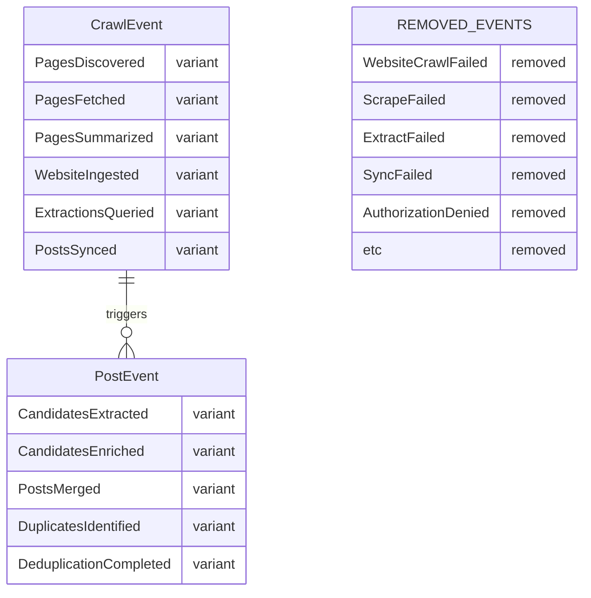

# Refactor: Event/Effect Chain Architecture

## Overview

This plan addresses fundamental architectural violations of the Seesaw event-driven pattern throughout the codebase. The core problem is **fat functions doing too much** and **events that aren't facts**. The goal is to restructure the codebase so that functions do ONE thing and emit facts that trigger other parts of the application via proper event chains.

## Problem Statement

### PLATINUM RULE Violations: Events That Are NOT Facts

Per CLAUDE.md: *"Events must represent facts about what happened. Never emit events for failures, errors, or hypotheticals."*

**17 Failed Events** currently violate this rule:

| Domain | Violation Events | Count |
|--------|------------------|-------|
| `posts` | `ScrapeFailed`, `ResourceLinkScrapeFailed`, `ExtractFailed`, `SyncFailed`, `ListingEmbeddingFailed`, `DeduplicationFailed` | 6 |
| `website_approval` | `WebsiteResearchFailed`, `ResearchSearchesFailed`, `AssessmentGenerationFailed` | 3 |
| `chatrooms` | `MessageFailed`, `ReplyGenerationFailed`, `GreetingGenerationFailed` | 3 |
| `crawling` | `WebsiteCrawlFailed` | 1 |
| `member` | `EmbeddingFailed` | 1 |

**3 AuthorizationDenied Events** - Also not facts, these are access control failures:
- `crawling/events/mod.rs:129`
- `website/events/mod.rs:48`
- `posts/events/mod.rs:155`

### Fat Functions Doing Too Much

These functions violate single responsibility by doing multiple operations inline instead of emitting events:

| File | Function | Lines | Violations |
|------|----------|-------|------------|
| `posts/effects/agentic_extraction.rs` | (entire file) | 1786 | Contains types, tools, extraction, enrichment, merging, storage - should be 6+ separate modules |
| `crawling/actions/mod.rs` | `extract_and_sync_posts()` | 75 | Does query, transform, sync without intermediate events |
| `crawling/actions/mod.rs` | `regenerate_posts()` | 82 | Does auth, fetch, reprocess, extract, sync inline |
| `crawling/actions/mod.rs` | `discover_website()` | 73 | Does auth, discover, ingest, extract inline |
| `posts/actions/llm_sync.rs` | `llm_sync_posts()` | 200 | Does load, convert, prompt, LLM call, apply operations inline |
| `website_approval/actions/mod.rs` | `assess_website()` | 158 | Does fetch, check, generate, store inline |
| `posts/actions/scraping.rs` | `scrape_source()` | 130+ | Handler > 50 lines |
| `posts/actions/scraping.rs` | `refresh_page_snapshot()` | 110+ | Handler > 50 lines |
| `crawling/actions/ingest_website.rs` | `ingest_website()` | 170+ | Handler > 50 lines |

### Missing Event Cascades

Operations that should chain via events but happen inline:

1. **Website Ingestion** - Only emits `WebsiteIngested` at end. Missing: `PagesDiscovered`, `PagesFetched`, `PagesSummarized`
2. **Post Deduplication** - Runs as monolithic operation. Missing: `DuplicatesIdentified`, each merge emits its own event
3. **Post Transformation** - Happens inline without events
4. **LLM Sync** - No intermediate events for load, analyze, apply phases

## Technical Approach

### Architecture Principles

```
┌─────────────────────────────────────────────────────────────────┐
│                    SEESAW EVENT FLOW                            │
├─────────────────────────────────────────────────────────────────┤
│                                                                 │
│  Action (entry point)                                           │
│     │                                                           │
│     ▼ emits FactEvent                                           │
│  Effect watches facts                                           │
│     │                                                           │
│     ▼ calls handlers                                            │
│  Handler does ONE thing                                         │
│     │                                                           │
│     ▼ emits next event (or terminal)                            │
│                                                                 │
└─────────────────────────────────────────────────────────────────┘

RULES:
1. Events are FACTS - things that happened
2. Errors go in Result::Err - not events
3. Handlers < 50 lines
4. Actions return simple values, not events
5. Each function does ONE thing
```

### Key Decision: Error Propagation Strategy

**Problem**: Removing `*Failed` events raises the question: how do errors propagate through cascades?

**Solution**: Use Seesaw's native error handling with **effect wrappers** for domain-specific error logic. Errors propagate via `Result::Err`, but side effects (job updates, notifications) happen in wrapper functions before returning `Err`.

#### Three-Layer Error Handling Architecture

```
┌─────────────────────────────────────────────────────────────────┐
│ Layer 3: Execution Boundary (GraphQL/API)                       │
│   execute_with_error_handling() - top-level error capture       │
├─────────────────────────────────────────────────────────────────┤
│ Layer 2: Effect Wrappers (per-domain)                           │
│   with_job_error_handling() - job status updates                │
│   with_chat_error_handling() - real-time UI notifications       │
├─────────────────────────────────────────────────────────────────┤
│ Layer 1: Observer Effect                                        │
│   on_any() - metrics, logging, monitoring (non-invasive)        │
└─────────────────────────────────────────────────────────────────┘
```

#### 1. Effect Wrappers (Domain-Specific Error Handling)

```rust
// src/domains/core/effects/error_wrappers.rs

/// Error handler for job-based workflows
pub fn with_job_error_handling<E, F, Fut>(
    handler: F,
) -> impl Fn(Arc<E>, EffectContext<State, Deps>) -> Pin<Box<dyn Future<Output = Result<()>> + Send>>
where
    E: Event + HasJobId,
    F: Fn(Arc<E>, EffectContext<State, Deps>) -> Fut + Send + Sync + 'static,
    Fut: Future<Output = Result<()>> + Send + 'static,
{
    move |event, ctx| {
        let handler = handler.clone();
        Box::pin(async move {
            match handler(event.clone(), ctx.clone()).await {
                Ok(()) => Ok(()),
                Err(e) => {
                    // Update job status on error
                    if let Some(job_id) = event.job_id() {
                        let _ = actions::fail_job(job_id, &e.to_string(), ctx.deps()).await;
                        // JobEvent::Failed IS a fact - the job failed
                        ctx.emit(JobEvent::Failed { job_id, reason: e.to_string() });
                    }
                    Err(e)  // Propagate for Seesaw's error capture
                }
            }
        })
    }
}

/// Error handler for chat (real-time UI)
pub fn with_chat_error_handling<E, F, Fut>(
    handler: F,
) -> impl Fn(Arc<E>, EffectContext<State, Deps>) -> Pin<Box<dyn Future<Output = Result<()>> + Send>>
where
    E: Event + HasContainerId,
    F: Fn(Arc<E>, EffectContext<State, Deps>) -> Fut + Send + Sync + 'static,
    Fut: Future<Output = Result<()>> + Send + 'static,
{
    move |event, ctx| {
        let handler = handler.clone();
        Box::pin(async move {
            match handler(event.clone(), ctx.clone()).await {
                Ok(()) => Ok(()),
                Err(e) => {
                    // Real-time error notification for chat UI
                    if let Some(container_id) = event.container_id() {
                        ctx.deps().notify_chat_error(container_id, &e.to_string()).await;
                    }
                    Err(e)
                }
            }
        })
    }
}
```

#### 2. Trait for Job ID Extraction

```rust
// src/domains/core/traits.rs

/// Extracts job_id from any event type
pub trait HasJobId {
    fn job_id(&self) -> Option<JobId>;
}

impl HasJobId for PostEvent {
    fn job_id(&self) -> Option<JobId> {
        match self {
            PostEvent::ScrapeRequested { job_id, .. } => Some(*job_id),
            PostEvent::SourceScraped { job_id, .. } => Some(*job_id),
            // ... etc
            _ => None,
        }
    }
}

pub trait HasContainerId {
    fn container_id(&self) -> Option<ContainerId>;
}
```

#### 3. Observer Effect (Monitoring)

```rust
// src/domains/core/effects/observer.rs

let observer = effect::on_any().run(|event, ctx| async move {
    let event_type = event.type_name();

    // Log all events
    info!(event_type = event_type, "Event emitted");

    // Track metrics
    ctx.deps().metrics.increment_counter("events_total", &[
        ("type", event_type),
    ]);

    Ok(())
});
```

#### 4. Execution Boundary (Top Level)

```rust
// src/server/execution.rs

pub async fn execute_with_error_handling<F, T>(
    engine: &Engine<State, Deps>,
    initial_state: State,
    operation: F,
) -> Result<T>
where
    F: FnOnce(&EffectContext<State, Deps>) -> Result<T>,
{
    let handle = engine.activate(initial_state);
    let result = handle.run(operation)?;

    match handle.settled().await {
        Ok(()) => Ok(result),
        Err(e) => {
            error!(error = %e, "Effect chain failed");
            Err(e)
        }
    }
}
```

#### Usage Pattern

```rust
// Effects are wrapped with appropriate error handling:
.with_effect(effect::on::<PostEvent::ScrapeRequested>()
    .run(with_job_error_handling(handle_scrape_requested)))
.with_effect(effect::on::<ChatEvent::MessageReceived>()
    .run(with_chat_error_handling(handle_message_received)))
```

**Key insight**: Errors propagate via `Result`, but side effects (job updates, notifications) happen in wrapper functions before returning `Err`.

### JobEvent::Failed is IN SCOPE

`JobEvent::Failed` is NOT a violation - it IS a fact ("the job failed"). However, it should be emitted by the job system, not by domain effects. Domain code should:
1. Return `Result::Err` to signal failure
2. The job runner catches this and emits `JobEvent::Failed`

---

## Implementation Phases

### Phase 1: Remove Failed Events & Authorization Events

**Goal**: Eliminate all 20 PLATINUM RULE violations.

#### 1.1 Remove Failed Events from `posts` Domain

**File**: `src/domains/posts/events/mod.rs`

Remove these variants:
```rust
// DELETE these (lines 74-95, 151, 194):
ScrapeFailed { source_id, job_id, reason }
ResourceLinkScrapeFailed { job_id, reason }
ExtractFailed { source_id, job_id, reason }
SyncFailed { source_id, job_id, reason }
ListingEmbeddingFailed { post_id, reason }
DeduplicationFailed { job_id, reason }
```

**File**: `src/domains/posts/effects/*.rs`

Update handlers that currently emit these events:

```rust
// BEFORE:
if let Err(e) = scrape_operation() {
    ctx.emit(PostEvent::ScrapeFailed { reason: e.to_string() });
    return Ok(());
}

// AFTER:
scrape_operation().map_err(|e| {
    error!(error = %e, "Scrape operation failed");
    actions::fail_job(job_id, &e.to_string(), ctx.deps());
    e
})?;
```

#### 1.2 Remove Failed Events from `website_approval` Domain

**File**: `src/domains/website_approval/events/mod.rs`

Remove these variants (lines 35-80):
```rust
WebsiteResearchFailed { website_id, job_id, reason }
ResearchSearchesFailed { research_id, website_id, job_id, reason }
AssessmentGenerationFailed { website_id, job_id, reason }
```

**File**: `src/domains/website_approval/effects/assessment.rs`

Update handlers to use `Result::Err` pattern.

#### 1.3 Remove Failed Events from `chatrooms` Domain

**File**: `src/domains/chatrooms/events/mod.rs`

Remove these variants (lines 29-45):
```rust
MessageFailed { container_id, reason }
ReplyGenerationFailed { message_id, container_id, reason }
GreetingGenerationFailed { container_id, reason }
```

**CRITICAL**: These events are published to NATS for real-time UI updates. Create replacement mechanism:

```rust
// NEW: Error notification helper
impl ServerDeps {
    pub async fn notify_chat_error(&self, container_id: ContainerId, error: &str) {
        let payload = ChatErrorPayload { container_id, error: error.to_string() };
        let _ = self.nats.publish("chat.error", payload).await;
    }
}

// Usage in handler:
if let Err(e) = generate_greeting(&ctx).await {
    ctx.deps().notify_chat_error(container_id, &e.to_string()).await;
    return Err(e);
}
```

#### 1.4 Remove Failed Event from `crawling` Domain

**File**: `src/domains/crawling/events/mod.rs`

Remove (line 65):
```rust
WebsiteCrawlFailed { website_id, job_id, reason }
```

#### 1.5 Remove Failed Event from `member` Domain

**File**: `src/domains/member/events/mod.rs`

Remove (line 28):
```rust
EmbeddingFailed { member_id, reason }
```

#### 1.6 Remove AuthorizationDenied Events

**Files**:
- `src/domains/crawling/events/mod.rs:129`
- `src/domains/website/events/mod.rs:48`
- `src/domains/posts/events/mod.rs:155`

**Pattern**:
```rust
// BEFORE:
if let Err(e) = check_authorization(...) {
    return Ok(CrawlEvent::AuthorizationDenied { user_id, action, reason });
}

// AFTER:
check_authorization(...).map_err(|e| {
    warn!(user_id = ?user_id, action = %action, "Authorization denied");
    AuthorizationError::Denied { user_id, action, reason: e.to_string() }
})?;
```

---

### Phase 2: Decompose Fat Functions

**Goal**: Break monolithic functions into focused, event-driven components.

#### 2.1 Split `agentic_extraction.rs` into Modules

**Current**: 1786-line file in `effects/` containing action-style functions.

**Target Structure**:
```
src/domains/posts/
├── actions/
│   ├── agentic/
│   │   ├── mod.rs           # Re-exports
│   │   ├── types.rs         # AgenticPost, AgenticPosts, etc. (~120 lines)
│   │   ├── tools.rs         # Tool definitions & prompts (~200 lines)
│   │   ├── extraction.rs    # extract_candidates_from_page() (~150 lines)
│   │   ├── enrichment.rs    # enrich_post_with_tools() (~250 lines)
│   │   ├── merging.rs       # merge_duplicate_posts() (~160 lines)
│   │   ├── pipeline.rs      # extract_from_website() - orchestrator (~100 lines)
│   │   └── storage.rs       # sync_agentic_posts() (~100 lines)
│   └── mod.rs               # Export agentic module
└── effects/
    └── agentic_extraction.rs  # DELETED - moved to actions/
```

**Event Chain for Agentic Extraction**:
```
ExtractFromWebsiteRequested
    ↓ calls actions::agentic::extract_from_website()
    ↓ emits CandidatesExtracted
CandidatesExtracted
    ↓ calls actions::agentic::enrich_candidates()
    ↓ emits CandidatesEnriched
CandidatesEnriched
    ↓ calls actions::agentic::merge_duplicates()
    ↓ emits PostsMerged
PostsMerged
    ↓ calls actions::agentic::sync_to_database()
    ↓ emits PostsSynced (TERMINAL)
```

#### 2.2 Refactor `extract_and_sync_posts()`

**File**: `src/domains/crawling/actions/mod.rs:69-143`

**Current**: Does query, transform, sync inline.

**Target**:
```rust
// BEFORE (75 lines doing 3 things):
pub async fn extract_and_sync_posts(...) -> Result<PostsSyncResult> {
    let extractions = index.extract(...).await?;
    let posts = transform_extraction_to_posts(&extractions);
    let result = sync_and_deduplicate_posts(...).await?;
    ctx.emit(CrawlEvent::PostsSynced { ... });
    Ok(result)
}

// AFTER (each function does ONE thing):
pub async fn query_extractions(...) -> Result<Vec<Extraction>> {
    let extractions = index.extract(...).await?;
    ctx.emit(CrawlEvent::ExtractionsQueried { ... });
    Ok(extractions)
}

pub async fn transform_to_posts(extractions: &[Extraction]) -> Vec<Post> {
    // Pure transformation, no events needed
    transform_extraction_to_posts(extractions)
}

pub async fn sync_posts_to_database(...) -> Result<PostsSyncResult> {
    let result = sync_and_deduplicate_posts(...).await?;
    ctx.emit(CrawlEvent::PostsSynced { ... });
    Ok(result)
}
```

**Event Chain**:
```
WebsiteIngested
    ↓ calls query_extractions()
    ↓ emits ExtractionsQueried
ExtractionsQueried
    ↓ calls transform_and_sync_posts() [combines transform + sync]
    ↓ emits PostsSynced (TERMINAL)
```

#### 2.3 Refactor `regenerate_posts()`

**File**: `src/domains/crawling/actions/mod.rs:153-235`

**Current**: Does auth, fetch, reprocess, extract, sync inline.

**Target Event Chain**:
```
RegeneratePostsRequested
    ↓ auth check (Result::Err if denied)
    ↓ calls fetch_website_for_regeneration()
    ↓ emits WebsiteFetchedForRegeneration
WebsiteFetchedForRegeneration
    ↓ calls reprocess_cached_pages()
    ↓ emits PagesReprocessed
PagesReprocessed
    ↓ calls extract_and_sync_posts() [existing]
    ↓ emits PostsSynced (TERMINAL)
```

#### 2.4 Refactor `llm_sync_posts()`

**File**: `src/domains/posts/actions/llm_sync.rs:130-331`

**Current**: 200 lines doing load, convert, prompt, LLM call, apply operations.

**Target Structure**:
```
src/domains/posts/actions/llm_sync/
├── mod.rs              # Re-exports
├── loader.rs           # load_posts_for_sync() (~50 lines)
├── prompt_builder.rs   # build_sync_prompt() (~100 lines)
├── analyzer.rs         # call_llm_for_analysis() (~50 lines)
└── applier.rs          # apply_sync_operations() (~100 lines)
```

**Event Chain**:
```
LlmSyncRequested
    ↓ calls load_posts_for_sync()
    ↓ emits PostsLoadedForSync
PostsLoadedForSync
    ↓ calls analyze_with_llm()
    ↓ emits SyncOperationsGenerated
SyncOperationsGenerated
    ↓ calls apply_sync_operations()
    ↓ emits PostsSynced (TERMINAL)
```

---

### Phase 3: Add Missing Event Cascades

**Goal**: Create proper event chains where operations currently happen inline.

#### 3.1 Website Ingestion Event Chain

**Current**: Only emits `WebsiteIngested` at end.

**Target Chain**:
```
IngestWebsiteRequested
    ↓ calls discover_urls()
    ↓ emits PagesDiscovered { urls: Vec<String>, count: usize }
PagesDiscovered
    ↓ calls fetch_pages()
    ↓ emits PagesFetched { pages: Vec<PageId>, count: usize }
PagesFetched
    ↓ calls summarize_pages()
    ↓ emits PagesSummarized { summaries: Vec<SummaryId>, count: usize }
PagesSummarized
    ↓ calls store_in_index()
    ↓ emits WebsiteIngested (TERMINAL - existing event)
```

**New Events** to add to `crawling/events/mod.rs`:
```rust
/// Pages discovered during website crawl
PagesDiscovered {
    website_id: WebsiteId,
    job_id: JobId,
    urls: Vec<String>,
    count: usize,
},

/// Pages fetched and cached
PagesFetched {
    website_id: WebsiteId,
    job_id: JobId,
    page_count: usize,
},

/// Pages summarized by AI
PagesSummarized {
    website_id: WebsiteId,
    job_id: JobId,
    summary_count: usize,
},
```

#### 3.2 Post Deduplication Event Chain

**Current**: Runs as monolithic operation.

**Target Chain**:
```
DeduplicationRequested
    ↓ calls identify_duplicates()
    ↓ emits DuplicatesIdentified { pairs: Vec<(PostId, PostId)> }
DuplicatesIdentified
    ↓ for each pair: calls merge_posts()
    ↓ each emits PostMerged { kept: PostId, removed: PostId }
    ↓ after all: emits DeduplicationCompleted (TERMINAL)
```

---

### Phase 4: Reduce Handler Size

**Goal**: All handlers < 50 lines per CLAUDE.md.

#### 4.1 Split Large Handlers

| Handler | Current Lines | Target Lines | Strategy |
|---------|--------------|--------------|----------|
| `scrape_source()` | 130+ | < 50 | Extract to 3 actions: validate, fetch, store |
| `refresh_page_snapshot()` | 110+ | < 50 | Extract to 3 actions: load, refresh, update |
| `ingest_website()` | 170+ | < 50 | Use new event chain from Phase 3 |

**Pattern**:
```rust
// BEFORE: Fat handler
async fn handle_scrape_source(...) -> Result<PostEvent> {
    // 130+ lines of inline logic
}

// AFTER: Thin handler calling actions
async fn handle_scrape_source(...) -> Result<PostEvent> {
    // 1. Auth check
    actions::check_authorization(..., ctx.deps()).await?;

    // 2. Call action
    let result = actions::scrape_source_action(..., ctx.deps()).await?;

    // 3. Return event
    Ok(PostEvent::SourceScraped { ... })
}
```

---

## Event Flow Diagrams

### After Refactor: Website Ingestion

```
┌─────────────────────────────────────────────────────────────────────┐
│                     WEBSITE INGESTION FLOW                          │
├─────────────────────────────────────────────────────────────────────┤
│                                                                     │
│  GraphQL: ingestWebsite(url)                                        │
│      │                                                              │
│      ▼                                                              │
│  actions::ingest_website()                                          │
│      │ auth check (Result::Err if denied)                           │
│      │ discover URLs                                                │
│      ▼                                                              │
│  emit PagesDiscovered { urls, count }                               │
│      │                                                              │
│      ▼ effect watches                                               │
│  actions::fetch_pages()                                             │
│      │                                                              │
│      ▼                                                              │
│  emit PagesFetched { page_count }                                   │
│      │                                                              │
│      ▼ effect watches                                               │
│  actions::summarize_pages()                                         │
│      │                                                              │
│      ▼                                                              │
│  emit PagesSummarized { summary_count }                             │
│      │                                                              │
│      ▼ effect watches                                               │
│  actions::store_in_index()                                          │
│      │                                                              │
│      ▼                                                              │
│  emit WebsiteIngested { website_id, job_id, pages_count }           │
│      │                                                              │
│      ▼ TERMINAL                                                     │
│                                                                     │
└─────────────────────────────────────────────────────────────────────┘
```

### After Refactor: Error Handling (Three-Layer Architecture)

```
┌─────────────────────────────────────────────────────────────────────┐
│                    ERROR HANDLING FLOW                              │
├─────────────────────────────────────────────────────────────────────┤
│                                                                     │
│  Handler returns Err(e)                                             │
│      │                                                              │
│      ▼                                                              │
│  Layer 2: Effect Wrapper catches error                              │
│      │                                                              │
│      ├─► with_job_error_handling:                                   │
│      │     ├─► actions::fail_job(job_id, reason)  [job status]      │
│      │     └─► ctx.emit(JobEvent::Failed { ... }) [fact event]      │
│      │                                                              │
│      ├─► with_chat_error_handling:                                  │
│      │     └─► deps.notify_chat_error(...)  [real-time UI]          │
│      │                                                              │
│      ▼                                                              │
│  Wrapper returns Err(e) (propagates to Seesaw)                      │
│      │                                                              │
│      ▼                                                              │
│  Layer 1: Seesaw TaskGroup.capture_error(e)  [automatic]            │
│      │                                                              │
│      ▼                                                              │
│  Layer 3: Execution boundary catches via settled()                  │
│      │                                                              │
│      └─► error!(error = %e, "Effect chain failed")                  │
│                                                                     │
│  Meanwhile: Observer effect tracks all events for metrics           │
│                                                                     │
└─────────────────────────────────────────────────────────────────────┘

KEY: Errors propagate via Result, side effects happen in wrappers.
     JobEvent::Failed IS a fact (the job failed) - not a violation.
```

### After Refactor: Agentic Extraction

```
┌─────────────────────────────────────────────────────────────────────┐
│                   AGENTIC EXTRACTION FLOW                           │
├─────────────────────────────────────────────────────────────────────┤
│                                                                     │
│  WebsiteIngested                                                    │
│      │                                                              │
│      ▼ effect watches                                               │
│  actions::agentic::extract_candidates()                             │
│      │ for each page: extract candidates                            │
│      ▼                                                              │
│  emit CandidatesExtracted { candidates_count }                      │
│      │                                                              │
│      ▼ effect watches                                               │
│  actions::agentic::enrich_candidates()                              │
│      │ for each candidate: call tools, add metadata                 │
│      ▼                                                              │
│  emit CandidatesEnriched { enriched_count }                         │
│      │                                                              │
│      ▼ effect watches                                               │
│  actions::agentic::merge_duplicates()                               │
│      │ identify and merge duplicate posts                           │
│      ▼                                                              │
│  emit PostsMerged { merged_count, final_count }                     │
│      │                                                              │
│      ▼ effect watches                                               │
│  actions::agentic::sync_to_database()                               │
│      │                                                              │
│      ▼                                                              │
│  emit PostsSynced { created, updated, deleted }                     │
│      │                                                              │
│      ▼ TERMINAL                                                     │
│                                                                     │
└─────────────────────────────────────────────────────────────────────┘
```

---

## ERD: New Event Types



---

## Acceptance Criteria

### Functional Requirements

- [ ] All 17 `*Failed` events removed
- [ ] All 3 `AuthorizationDenied` events removed
- [ ] Error handling uses `Result::Err` pattern with effect wrappers
- [ ] `with_job_error_handling` wrapper implemented and used for job-based effects
- [ ] `with_chat_error_handling` wrapper implemented and used for chat effects
- [ ] `HasJobId` trait implemented for all job-related events
- [ ] `HasContainerId` trait implemented for all chat-related events
- [ ] Observer effect tracks all events for metrics/logging
- [ ] Job status updates work correctly on errors (via effect wrapper)
- [ ] NATS error notifications work for chat domain (via effect wrapper)
- [ ] Website ingestion uses new event chain
- [ ] Agentic extraction uses new event chain

### Non-Functional Requirements

- [ ] All effect handlers < 50 lines
- [ ] `agentic_extraction.rs` split into focused modules (each < 250 lines)
- [ ] Business logic lives in `actions/`, not `effects/`
- [ ] Each function does ONE thing

### Quality Gates

- [ ] `cargo check` passes
- [ ] `cargo test` passes
- [ ] No orphaned event handlers
- [ ] All events are FACTS (past tense, represent completed actions)

---

## Success Metrics

| Metric | Before | After |
|--------|--------|-------|
| PLATINUM RULE violations | 20 | 0 |
| Handlers > 50 lines | 6+ | 0 |
| Largest file in effects/ | 1786 lines | < 100 lines |
| Functions doing > 1 thing | 6+ identified | 0 |
| Event types that are facts | ~80% | 100% |

---

## Dependencies & Prerequisites

- Seesaw 0.6.3 (currently in use) - provides native error handling via `Result<()>` and `TaskGroup.capture_error()`
- Effect wrappers (`with_job_error_handling`, `with_chat_error_handling`) for domain-specific error logic
- `HasJobId` and `HasContainerId` traits implemented on event types
- Job system supports external status updates via `actions::fail_job()`
- NATS infrastructure for real-time UI error notifications (chat domain only)

---

## Risk Analysis & Mitigation

| Risk | Likelihood | Impact | Mitigation |
|------|------------|--------|------------|
| Breaking existing error handling | High | Critical | Comprehensive integration tests for error paths |
| Frontend breaks without `*Failed` events | High | High | Add NATS error notification system FIRST |
| Job status tracking breaks | Medium | Critical | Implement `fail_job()` action before removing events |
| Cascade errors don't propagate | Low | High | Effect wrappers + Seesaw's native Result<()> handling |
| Performance regression from event overhead | Low | Medium | Measure before/after, batch events if needed |

---

## Files to Create

| Path | Purpose | Lines |
|------|---------|-------|
| `src/domains/posts/actions/agentic/mod.rs` | Re-exports for agentic extraction | ~20 |
| `src/domains/posts/actions/agentic/types.rs` | AgenticPost, AgenticPosts types | ~120 |
| `src/domains/posts/actions/agentic/tools.rs` | Tool definitions & prompts | ~200 |
| `src/domains/posts/actions/agentic/extraction.rs` | Candidate extraction | ~150 |
| `src/domains/posts/actions/agentic/enrichment.rs` | Post enrichment with tools | ~250 |
| `src/domains/posts/actions/agentic/merging.rs` | Duplicate merging | ~160 |
| `src/domains/posts/actions/agentic/pipeline.rs` | Orchestrator | ~100 |
| `src/domains/posts/actions/agentic/storage.rs` | Database sync | ~100 |
| `src/domains/posts/actions/llm_sync/mod.rs` | Re-exports for LLM sync | ~10 |
| `src/domains/posts/actions/llm_sync/loader.rs` | Load posts for sync | ~50 |
| `src/domains/posts/actions/llm_sync/prompt_builder.rs` | Build sync prompt | ~100 |
| `src/domains/posts/actions/llm_sync/analyzer.rs` | LLM analysis | ~50 |
| `src/domains/posts/actions/llm_sync/applier.rs` | Apply sync operations | ~100 |
| `src/domains/core/mod.rs` | Core domain re-exports | ~20 |
| `src/domains/core/effects/mod.rs` | Core effects re-exports | ~10 |
| `src/domains/core/effects/error_wrappers.rs` | Effect wrappers for error handling | ~80 |
| `src/domains/core/effects/observer.rs` | Monitoring observer effect | ~40 |
| `src/domains/core/traits.rs` | HasJobId, HasContainerId traits | ~60 |
| `src/server/execution.rs` | Execution boundary with error handling | ~40 |

## Files to Modify

| Path | Change |
|------|--------|
| `src/domains/posts/events/mod.rs` | Remove 6 Failed events, add 4 new events |
| `src/domains/website_approval/events/mod.rs` | Remove 3 Failed events |
| `src/domains/chatrooms/events/mod.rs` | Remove 3 Failed events |
| `src/domains/crawling/events/mod.rs` | Remove 1 Failed event, add 3 new events |
| `src/domains/member/events/mod.rs` | Remove 1 Failed event |
| `src/domains/crawling/events/mod.rs` | Remove AuthorizationDenied |
| `src/domains/website/events/mod.rs` | Remove AuthorizationDenied |
| `src/domains/posts/events/mod.rs` | Remove AuthorizationDenied |
| `src/domains/crawling/actions/mod.rs` | Refactor 3 fat functions |
| `src/domains/posts/actions/scraping.rs` | Split large handlers |
| `src/domains/crawling/actions/ingest_website.rs` | Split into event chain |
| `src/domains/posts/actions/llm_sync.rs` | Move to llm_sync/ module |
| All effect handlers that emit Failed events | Update to use Result::Err |

## Files to Delete

| Path | Reason |
|------|--------|
| `src/domains/posts/effects/agentic_extraction.rs` | Moved to actions/agentic/ |

---

## References & Research

### Internal References

- Seesaw architecture rules: `CLAUDE.md:41-115`
- Domain architecture: `docs/architecture/DOMAIN_ARCHITECTURE.md`
- Seesaw architecture: `docs/architecture/SEESAW_ARCHITECTURE.md`
- Previous event cleanup: `docs/plans/2026-02-02-refactor-event-flow-cleanup-plan.md`

### External References

- Seesaw documentation: internal framework
- Event-driven architecture best practices

### Related Work

- Event flow cleanup (partially complete): `docs/plans/2026-02-02-refactor-event-flow-cleanup-plan.md`
- Seesaw 0.6.0 upgrade plan: `docs/plans/2026-02-02-refactor-upgrade-seesaw-to-0.6.0-plan.md`
