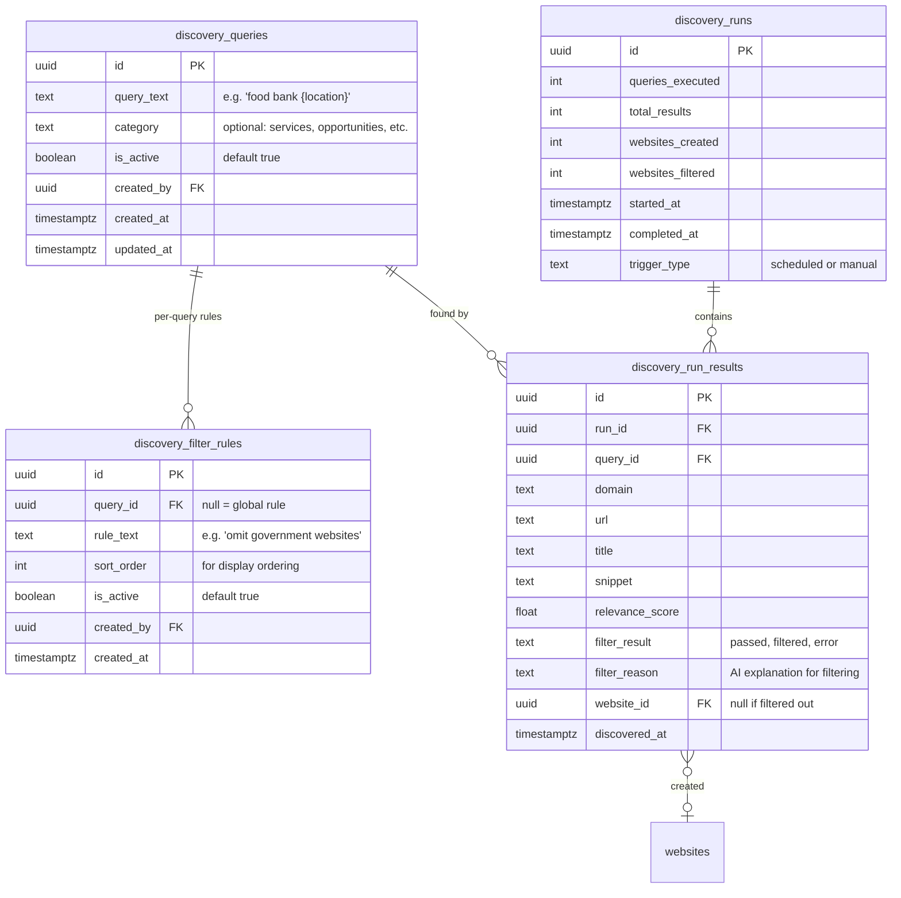

# Admin-Managed Discovery Queries with Website Pre-Filtering

## Overview

Move discovery search queries from hardcoded constants into the database, manageable via the admin UI. Add an AI-powered pre-filter that evaluates discovered websites against plain-text rules before they enter the human approval queue. Provide lineage visibility so admins can see which queries discovered which websites.

## Problem Statement

Discovery queries are hardcoded in two places:
- `posts/effects/discovery.rs:17-51` — 27 broad queries with `{location}` placeholder for finding new websites
- `crawling/effects/discovery.rs:24-33` — 8 site-scoped queries for finding pages within an approved website

The broad discovery queries (the 27) cannot be changed without a code deploy. Additionally, every Tavily result that scores above 0.5 goes directly into the pending review queue with no pre-filtering, meaning admins waste time rejecting obviously irrelevant websites (government sites, spam, unrelated businesses).

**This feature replaces only the broad discovery system** (the 27 queries in `posts/effects/discovery.rs`). The site-scoped per-website queries in `crawling/effects/discovery.rs` serve a different purpose (finding pages within an already-approved website) and remain unchanged.

## Proposed Solution

### Three new capabilities:

1. **Query Management** — CRUD for discovery queries in admin UI, stored in database
2. **AI Pre-Filter** — Plain-text filter rules evaluated by AI against Tavily snippets before websites enter the approval queue
3. **Discovery Lineage** — Track and display which queries discovered which websites

### Pipeline (revised):

```
Admin-defined queries (DB)
  → Tavily search (with {location} substitution)
    → Deduplicate by domain
      → AI pre-filter (evaluate snippets against filter rules)
        → Pass: create website as pending_review
        → Fail: store in discovery_filter_results (not in websites table)
          → Human approval queue (existing flow, unchanged)
```

## Technical Approach

### Data Model



**Key design decisions:**
- Filter rules with `query_id = NULL` are global (apply to all queries)
- Per-query rules override global rules (passed to AI prompt with precedence note)
- Filtered websites go into `discovery_run_results` (NOT the `websites` table) — keeps the websites table clean
- `discovery_runs` tracks each execution for auditability
- `discovery_run_results` provides full lineage: query → result → website (if created)

### AI Pre-Filter Design

**Input per evaluation:** Tavily snippet data only (title, URL, snippet text, domain). No page fetching — keeps it fast and cheap.

**Batching strategy:** Evaluate all results from a single query in one AI call. With ~10 results per query, a prompt like:

```
You are evaluating websites discovered by a search query for community resources.

## Filter Rules (apply all)
### Global Rules
- Omit government websites (.gov domains, city/county/state agencies)
- Skip websites with no clear community services

### Query-Specific Rules
- Focus on direct service providers, not directories

## Websites to Evaluate
1. Domain: example.org | Title: "Food Bank Services" | Snippet: "We provide..."
2. Domain: mn.gov | Title: "State Programs" | Snippet: "Government..."
...

For each website, respond with:
- PASS or FAIL
- One-sentence reason
```

**Cost estimate:** ~30 queries × 1 AI call each = ~30 AI calls per run. Using Claude Haiku, this is roughly $0.03-0.10 per discovery run. Very affordable even hourly.

**When AI is unavailable:** Skip filtering, let all websites through to human queue, flag them as `filter_result: 'error'` in `discovery_run_results`.

### Migrations

**`000103_create_discovery_queries.sql`:**
```sql
CREATE TABLE discovery_queries (
    id UUID PRIMARY KEY DEFAULT gen_random_uuid(),
    query_text TEXT NOT NULL,
    category TEXT,
    is_active BOOLEAN NOT NULL DEFAULT true,
    created_by UUID REFERENCES members(id),
    created_at TIMESTAMPTZ NOT NULL DEFAULT NOW(),
    updated_at TIMESTAMPTZ NOT NULL DEFAULT NOW()
);

CREATE TABLE discovery_filter_rules (
    id UUID PRIMARY KEY DEFAULT gen_random_uuid(),
    query_id UUID REFERENCES discovery_queries(id) ON DELETE CASCADE,
    rule_text TEXT NOT NULL,
    sort_order INT NOT NULL DEFAULT 0,
    is_active BOOLEAN NOT NULL DEFAULT true,
    created_by UUID REFERENCES members(id),
    created_at TIMESTAMPTZ NOT NULL DEFAULT NOW()
);

CREATE INDEX idx_filter_rules_query_id ON discovery_filter_rules(query_id);
CREATE INDEX idx_filter_rules_global ON discovery_filter_rules(query_id) WHERE query_id IS NULL;

CREATE TABLE discovery_runs (
    id UUID PRIMARY KEY DEFAULT gen_random_uuid(),
    queries_executed INT NOT NULL DEFAULT 0,
    total_results INT NOT NULL DEFAULT 0,
    websites_created INT NOT NULL DEFAULT 0,
    websites_filtered INT NOT NULL DEFAULT 0,
    started_at TIMESTAMPTZ NOT NULL DEFAULT NOW(),
    completed_at TIMESTAMPTZ,
    trigger_type TEXT NOT NULL DEFAULT 'manual'
);

CREATE TABLE discovery_run_results (
    id UUID PRIMARY KEY DEFAULT gen_random_uuid(),
    run_id UUID NOT NULL REFERENCES discovery_runs(id) ON DELETE CASCADE,
    query_id UUID NOT NULL REFERENCES discovery_queries(id),
    domain TEXT NOT NULL,
    url TEXT NOT NULL,
    title TEXT,
    snippet TEXT,
    relevance_score FLOAT,
    filter_result TEXT NOT NULL DEFAULT 'pending',
    filter_reason TEXT,
    website_id UUID REFERENCES websites(id),
    discovered_at TIMESTAMPTZ NOT NULL DEFAULT NOW()
);

CREATE INDEX idx_run_results_run_id ON discovery_run_results(run_id);
CREATE INDEX idx_run_results_query_id ON discovery_run_results(query_id);
CREATE INDEX idx_run_results_website_id ON discovery_run_results(website_id);
CREATE INDEX idx_run_results_domain ON discovery_run_results(domain);
```

**`000104_seed_discovery_queries.sql`:**
```sql
-- Migrate existing hardcoded queries into the database
INSERT INTO discovery_queries (query_text, category) VALUES
    ('community resources social services {location}', 'services'),
    ('food assistance food shelf food bank {location}', 'services'),
    ('housing assistance rental help {location}', 'services'),
    ('emergency shelter homeless services {location}', 'services'),
    ('utility assistance bill help {location}', 'services'),
    ('healthcare free clinic sliding scale {location}', 'services'),
    ('mental health services counseling {location}', 'services'),
    ('childcare assistance programs {location}', 'services'),
    ('senior services elderly assistance {location}', 'services'),
    ('disability services support {location}', 'services'),
    ('immigration lawyer attorney {location}', 'professionals'),
    ('pro bono legal services {location}', 'professionals'),
    ('nonprofit legal aid {location}', 'professionals'),
    ('immigration help DACA {location}', 'professionals'),
    ('immigrant owned business {location}', 'businesses'),
    ('refugee owned restaurant {location}', 'businesses'),
    ('minority owned business {location}', 'businesses'),
    ('social enterprise {location}', 'businesses'),
    ('volunteer opportunities nonprofit {location}', 'opportunities'),
    ('community service opportunities {location}', 'opportunities'),
    ('tutoring mentoring volunteer {location}', 'opportunities'),
    ('refugee resettlement volunteer {location}', 'opportunities'),
    ('community fundraising event {location}', 'events'),
    ('nonprofit fundraiser gala {location}', 'events'),
    ('charity event benefit {location}', 'events'),
    ('community benefit dinner {location}', 'events'),
    ('immigrant community event {location}', 'events'),
    ('cultural celebration festival {location}', 'events');

-- Seed a few sensible global filter rules
INSERT INTO discovery_filter_rules (query_id, rule_text, sort_order) VALUES
    (NULL, 'Omit government websites (.gov domains, city/county/state agencies)', 1),
    (NULL, 'Skip generic directory or aggregator websites that list other organizations but do not provide services themselves', 2),
    (NULL, 'Skip social media profiles (facebook.com, twitter.com, instagram.com, linkedin.com)', 3);
```

### Domain Structure

Create a new `domains/discovery/` domain:

```
domains/discovery/
├── mod.rs
├── actions/
│   ├── mod.rs
│   ├── run_discovery.rs        # Main discovery pipeline action
│   ├── evaluate_filter.rs      # AI pre-filter evaluation
│   └── manage_queries.rs       # CRUD for queries and filter rules
├── models/
│   ├── mod.rs
│   ├── discovery_query.rs      # DiscoveryQuery model
│   ├── discovery_filter_rule.rs # DiscoveryFilterRule model
│   ├── discovery_run.rs        # DiscoveryRun model
│   └── discovery_run_result.rs # DiscoveryRunResult model
├── events/
│   └── mod.rs                  # DiscoveryEvent enum
└── effects/
    └── mod.rs                  # Effect handlers
```

### Events

```rust
enum DiscoveryEvent {
    /// A discovery run completed (scheduled or manual)
    DiscoveryRunCompleted {
        run_id: Uuid,
        queries_executed: usize,
        total_results: usize,
        websites_created: usize,
        websites_filtered: usize,
    },
}
```

Single event — the run is the atomic unit. Individual query results are stored in `discovery_run_results` for lineage but don't need their own events.

### Rust Models

```rust
// models/discovery_query.rs
#[derive(Debug, Clone, FromRow)]
pub struct DiscoveryQuery {
    pub id: Uuid,
    pub query_text: String,
    pub category: Option<String>,
    pub is_active: bool,
    pub created_by: Option<Uuid>,
    pub created_at: DateTime<Utc>,
    pub updated_at: DateTime<Utc>,
}

impl DiscoveryQuery {
    pub async fn find_active(pool: &PgPool) -> Result<Vec<Self>> { ... }
    pub async fn find_all(pool: &PgPool) -> Result<Vec<Self>> { ... }
    pub async fn create(query_text: String, category: Option<String>, created_by: Option<Uuid>, pool: &PgPool) -> Result<Self> { ... }
    pub async fn update(id: Uuid, query_text: String, category: Option<String>, pool: &PgPool) -> Result<Self> { ... }
    pub async fn toggle_active(id: Uuid, is_active: bool, pool: &PgPool) -> Result<Self> { ... }
    pub async fn delete(id: Uuid, pool: &PgPool) -> Result<()> { ... }
}

// models/discovery_filter_rule.rs
#[derive(Debug, Clone, FromRow)]
pub struct DiscoveryFilterRule {
    pub id: Uuid,
    pub query_id: Option<Uuid>,  // None = global
    pub rule_text: String,
    pub sort_order: i32,
    pub is_active: bool,
    pub created_by: Option<Uuid>,
    pub created_at: DateTime<Utc>,
}

impl DiscoveryFilterRule {
    pub async fn find_global(pool: &PgPool) -> Result<Vec<Self>> { ... }
    pub async fn find_by_query(query_id: Uuid, pool: &PgPool) -> Result<Vec<Self>> { ... }
    pub async fn find_applicable(query_id: Uuid, pool: &PgPool) -> Result<Vec<Self>> {
        // Returns global rules + per-query rules, ordered by sort_order
    }
    pub async fn create(...) -> Result<Self> { ... }
    pub async fn update(...) -> Result<Self> { ... }
    pub async fn delete(id: Uuid, pool: &PgPool) -> Result<()> { ... }
}
```

### Actions

```rust
// actions/run_discovery.rs

/// Run the full discovery pipeline:
/// 1. Load active queries from DB
/// 2. Execute Tavily searches with {location} substitution
/// 3. Deduplicate by domain (skip existing websites)
/// 4. AI pre-filter against applicable rules
/// 5. Create pending websites for passing results
/// 6. Store all results in discovery_run_results
pub async fn run_discovery(
    trigger_type: &str,  // "scheduled" or "manual"
    deps: &ServerDeps,
) -> Result<DiscoveryRun> { ... }
```

```rust
// actions/evaluate_filter.rs

/// Evaluate a batch of discovered websites against filter rules.
/// Uses a single AI call per batch (all results from one query).
/// Returns pass/fail with reason for each website.
pub async fn evaluate_websites_against_filters(
    websites: &[DiscoveredWebsite],
    global_rules: &[DiscoveryFilterRule],
    query_rules: &[DiscoveryFilterRule],
    ai: &dyn AiClient,
) -> Result<Vec<FilterEvaluation>> { ... }
```

### GraphQL Mutations & Queries

```graphql
# Queries
type Query {
    discoveryQueries(includeInactive: Boolean): [DiscoveryQuery!]!
    discoveryQuery(id: ID!): DiscoveryQuery
    discoveryFilterRules(queryId: ID): [DiscoveryFilterRule!]!  # queryId=null for global
    discoveryRuns(limit: Int): [DiscoveryRun!]!
    discoveryRun(id: ID!): DiscoveryRun
    # Lineage: which queries found a specific website
    websiteDiscoverySources(websiteId: ID!): [DiscoveryRunResult!]!
}

# Mutations
type Mutation {
    createDiscoveryQuery(queryText: String!, category: String): DiscoveryQuery!
    updateDiscoveryQuery(id: ID!, queryText: String, category: String): DiscoveryQuery!
    toggleDiscoveryQuery(id: ID!, isActive: Boolean!): DiscoveryQuery!
    deleteDiscoveryQuery(id: ID!): Boolean!

    createDiscoveryFilterRule(queryId: ID, ruleText: String!): DiscoveryFilterRule!
    updateDiscoveryFilterRule(id: ID!, ruleText: String): DiscoveryFilterRule!
    deleteDiscoveryFilterRule(id: ID!): Boolean!

    runDiscoverySearch: DiscoveryRun!  # replaces existing mutation
}
```

### Admin UI Pages

**1. Discovery Queries list page** — `/admin/discovery`

- Table of all queries with columns: Query Text, Category, Active, Results (count from latest run)
- Toggle active/inactive per query
- Add new query (inline or modal)
- Edit query text
- Delete query (with confirmation)
- "Run Discovery Now" button at top
- Section for Global Filter Rules below the query table (or as a tab)

**2. Discovery Query detail page** — `/admin/discovery/[id]`

- Query text (editable)
- Category (editable)
- Per-query filter rules (add/edit/remove)
- History: list of discovery runs this query participated in
- Results: websites discovered by this query (with filter status)

**3. Discovery Run detail page** — `/admin/discovery/runs/[id]`

- Summary stats: queries run, total results, created, filtered
- Table of all results: domain, query, score, filter result (passed/filtered), reason, link to website if created

**4. Website detail page enhancement** — `/admin/websites/[id]`

- New "Discovery" section/tab showing which queries discovered this website
- Shows: query text, discovery date, Tavily relevance score, filter result

### Existing Code Changes

1. **Delete** the `DISCOVERY_QUERIES` constant and `run_discovery_searches()` from `posts/effects/discovery.rs`
2. **Update** the scheduler in `scheduled_tasks.rs` to call the new `run_discovery()` action via `process()`
3. **Update** the `runDiscoverySearch` GraphQL mutation to call the new action
4. **Keep** the site-scoped `DISCOVERY_QUERIES` in `crawling/effects/discovery.rs` unchanged (different purpose)

## Acceptance Criteria

### Query Management
- [ ] Admin can view all discovery queries in a table
- [ ] Admin can add a new query with optional category
- [ ] Admin can edit existing query text and category
- [ ] Admin can toggle queries active/inactive
- [ ] Admin can delete a query (results are preserved in history)
- [ ] Queries support `{location}` placeholder (substituted at runtime with "Twin Cities, Minnesota")

### Filter Rules
- [ ] Admin can view and manage global filter rules
- [ ] Admin can view and manage per-query filter rules
- [ ] Filter rules are plain text evaluated by AI
- [ ] Per-query rules override global rules when conflicting
- [ ] AI evaluator uses Tavily snippet data only (no page fetching)
- [ ] When AI is unavailable, websites pass through unfiltered (flagged as `filter_result: 'error'`)

### Discovery Pipeline
- [ ] Scheduled discovery runs use queries from database (not hardcoded)
- [ ] Manual "Run Discovery" button triggers the same pipeline
- [ ] Results are deduplicated by domain (skip existing websites)
- [ ] AI pre-filter runs on all new results before creating websites
- [ ] Passing websites enter `pending_review` status (existing flow)
- [ ] All results (pass and fail) stored in `discovery_run_results`

### Lineage & Visibility
- [ ] Admin can see which queries discovered which websites
- [ ] Admin can see filter results (pass/fail with reason) for each discovery
- [ ] Website detail page shows discovery source(s)
- [ ] Discovery run detail page shows all results with stats

### Non-Goals (Explicitly Out of Scope)
- [ ] **NOT** replacing site-scoped queries in `crawling/effects/discovery.rs`
- [ ] **NOT** adding location configurability (stays as "Twin Cities, Minnesota")
- [ ] **NOT** re-discovering previously rejected websites (current skip behavior preserved)
- [ ] **NOT** adding a dry-run mode for filters (v2)

## Implementation Phases

### Phase 1: Database & Models
- Create migrations (`000103`, `000104`)
- Create `domains/discovery/` with models
- Seed existing queries into database
- **Files:** 2 migrations, 5 model files, `mod.rs`

### Phase 2: Discovery Action & AI Filter
- Implement `run_discovery()` action
- Implement `evaluate_websites_against_filters()` action
- Wire up to scheduler and GraphQL mutation
- Remove hardcoded queries from `posts/effects/discovery.rs`
- **Files:** 3 action files, effect handler, GraphQL mutations

### Phase 3: Admin UI
- Discovery queries list page with CRUD
- Global filter rules management
- Per-query filter rules
- Discovery run results view
- Website detail page lineage section
- **Files:** 3-4 new pages, GraphQL queries, types

## References

### Internal
- Hardcoded queries: `packages/server/src/domains/posts/effects/discovery.rs:17-51`
- Site-scoped queries: `packages/server/src/domains/crawling/effects/discovery.rs:24-33`
- Website model: `packages/server/src/domains/website/models/website.rs`
- Admin websites UI: `packages/web-next/app/admin/websites/page.tsx`
- Latest migration: `000102_add_post_revisions.sql`
- Existing Tavily plan: `docs/plans/2026-02-02-tavily-discovery-hybrid-crawl.md`

### Architecture
- Seesaw patterns: `CLAUDE.md` — actions return values, effects emit events
- Events are facts only (Platinum Rule)
- Queries live in models, not effects
- GraphQL mutations use `process()` pattern
