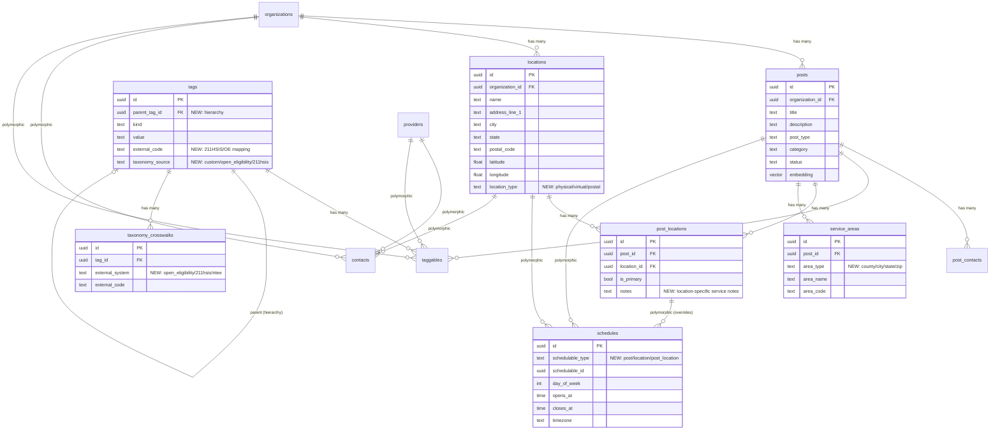

# Refine Data Model: Alignment with findhelp.org, 211.org, and HSDS Standards

## Overview

Deep analysis comparing MN Together's current data model against findhelp.org (formerly Aunt Bertha) and 211.org (powered by HSDS/Open Referral). The goal is to identify gaps, overlaps, and strategic alignment opportunities so MN Together can interoperate with the broader social services ecosystem while maintaining its unique community-first, privacy-preserving design.

## Research Sources

- **findhelp.org**: Crawled main site, provider pages, program listings, taxonomy documentation, API docs
- **211.org / HSDS 3.0**: Analyzed Open Referral HSDS 3.0.1 schema, 211 Human Services Indexing System (211HSIS), Greater Twin Cities 211 search interface
- **MN Together**: Full migration history (57+ migrations), all Rust model structs, domain architecture

---

## Current MN Together Data Model (Summary)

| Entity | Purpose | Key Fields |
|--------|---------|------------|
| `posts` | Services, opportunities, businesses, professionals | title, description, post_type, category, status, embedding, location |
| `organizations` | Service providers | name, description, website, verified, claimed, embedding |
| `providers` | Individual professionals | name, bio, accepting_clients, service_radius, embedding |
| `websites` | Scraped sources | domain, crawl_status, active |
| `tags` + `taggables` | Polymorphic taxonomy | kind, value (audience_role, population, service_offered, etc.) |
| `contacts` | Polymorphic contact info | contactable_type/id, contact_type, contact_value |
| `members` | Anonymous users (privacy-first) | expo_push_token, searchable_text, location |
| `containers` + `messages` | AI chat, comments | container_type, role, content |
| `referral_documents` | AI-generated referral guides | content, slug, translations |

---

## Comparative Analysis: Three Systems Side-by-Side

### Core Entity Mapping

| Concept | MN Together | findhelp.org | HSDS/211 |
|---------|-------------|-------------|----------|
| **Service provider** | `organizations` | `Organization` | `organization` |
| **Service offering** | `posts` (post_type) | `Program` (central entity) | `service` (central entity) |
| **Physical location** | fields on `posts`/`organizations` | `Location` (separate entity) | `location` (separate entity) |
| **Service at location** | Not modeled | Implicit via Program-Location | `service_at_location` (explicit join) |
| **Individual professional** | `providers` | Not modeled | Not modeled |
| **Taxonomy** | `tags` (flat kind+value) | Open Eligibility (2-facet: services + situations) | 211HSIS (6-level hierarchy, 9000+ terms) |
| **Contact info** | `contacts` + `post_contacts` | On Program/Location | `phone`, `contact` (separate entities) |
| **Operating hours** | Not modeled | Per-location schedule | `schedule` (RFC 5545 recurrence) |
| **Service area** | tags with kind=`service_area` | Geographic boundaries | `service_area` (GeoJSON support) |
| **Eligibility** | Not modeled (in description) | Structured (FPL%, age, residency) | `eligibility_description` + min/max age |
| **Cost** | Not modeled | "Free" / "Reduced cost" | `cost_option` (structured) |
| **Languages** | `active_languages` (for translations) | Per-program array | `language` (per service/location) |
| **Capacity/availability** | `capacity_status` on posts | Claimed/unclaimed status | `service_capacity` (available/maximum) |
| **Referral tracking** | `referral_documents` (guides) | `Referral` (closed-loop tracking) | Not in core HSDS |
| **Verification** | `verified_at` on posts/orgs | `review_date` on programs | `assured_date` + `assurer_email` |
| **Search** | Vector embeddings (pgvector) | Keyword + category + eligibility | Keyword + taxonomy + geography |
| **Privacy** | Members have no PII | Seeker profiles with demographics | Not addressed |
| **Audit trail** | Not modeled | Not visible | `metadata` entity (full change history) |

### Taxonomy Comparison

| Dimension | MN Together Tags | findhelp Open Eligibility | 211HSIS |
|-----------|-----------------|--------------------------|---------|
| **Structure** | Flat (kind + value) | 2-level hierarchy (11 categories) | 6-level hierarchy (10 categories) |
| **Term count** | ~50-100 custom terms | ~200 terms | 9,000+ terms |
| **Service types** | `service_offered` kind | Human Services facet (11 top-level) | 10 top-level categories (B-T) |
| **Populations** | `population` kind | Human Situations facet | Target Populations (Y codes) |
| **Community** | `community_served` kind | Not modeled | Not modeled |
| **Org leadership** | `org_leadership` kind | Not modeled | Not modeled |
| **Business model** | `business_model` kind | Not modeled | Not modeled |
| **Licensing** | Open/custom | Creative Commons ShareAlike | Proprietary (licensed) |

---

## Key Gaps in MN Together

### Gap 1: Location as a First-Class Entity

**Current state:** Location data is embedded as fields on `posts` and `organizations` (latitude, longitude, location string).

**What findhelp/211 do:** Location is a separate entity. A single program/service can be delivered at multiple locations, each with its own hours, phone, and service area. The `service_at_location` join entity in HSDS allows per-location overrides.

**Impact:** Cannot model "Organization X offers Service Y at 3 different sites with different hours." Currently would need 3 separate posts.

**Recommendation:** Consider extracting `locations` as a first-class table with a `post_locations` join table. This would enable multi-site services without post duplication.

### Gap 2: Operating Hours / Schedule

**Current state:** Not modeled at all.

**What findhelp does:** Per-location schedule with day-of-week open/close times and timezone.

**What 211/HSDS does:** Full RFC 5545 recurrence rules supporting complex schedules (every other Tuesday, seasonal hours, etc.)

**Impact:** Users can't find services that are "open now" or filter by availability. This is one of the most-requested features in resource directories.

**Recommendation:** Add a `schedules` table. Start with simple day/open/close/timezone (findhelp's approach). RFC 5545 recurrence rules (HSDS approach) are powerful but complex to implement.

### Gap 3: Eligibility & Cost (Description-Only)

**Current state:** Eligibility and cost information lives in post `description` text.

**What findhelp does:** Structured eligibility fields (FPL%, age, residency). Cost as enum (Free/Reduced).

**What 211/HSDS does:** Text-based `eligibility_description` plus min/max age. Even 211 acknowledges structured eligibility is too complex to fully model.

**Decision:** Keep in description text. Adding `eligibility_age_min`, `cost_type`, etc. as columns would couple the schema to social services. MN Together also hosts businesses, events, professionals, and community groups where these fields don't apply. The AI extraction pipeline + vector embeddings handle discoverability for all post types generically.

**If filtering becomes essential later:** Use the tag system (e.g., `kind: 'cost'`, `value: 'free'`) rather than adding columns. Tags are already generic and polymorphic.

### Gap 4: Taxonomy Hierarchy

**Current state:** Flat tags with `kind` and `value`. No parent-child relationships. No standard taxonomy alignment.

**What findhelp does:** Two-facet hierarchy (Services: 11 top-level with subcategories; Situations: population descriptors).

**What 211 does:** Deep 6-level hierarchy with 9,000+ terms, cross-references, and crosswalks to other systems.

**Impact:** Cannot browse services by category tree. Cannot interoperate with findhelp or 211 data feeds. Semantic search via embeddings partially compensates, but structured browse is still valuable.

**Recommendation:** Add `parent_tag_id` to the `tags` table for hierarchy. Create a mapping layer to Open Eligibility and/or 211HSIS codes. Don't adopt the full 9,000-term 211HSIS taxonomy - it's overkill and proprietary. The Open Eligibility taxonomy (11 service categories + situations) is a better fit: open-source, simpler, and compatible.

### Gap 5: Service Area (Geographic Coverage)

**Current state:** `service_area` is a tag kind with values like 'twin-cities', 'statewide'. Location is a lat/lon point on posts.

**What findhelp does:** Per-program service area defined by counties, cities, statewide.

**What HSDS does:** `service_area` entity with GeoJSON boundary support.

**Impact:** Cannot accurately answer "What services cover my ZIP code?" A food shelf in Minneapolis may serve all of Hennepin County, but current model can only say it's "located in Minneapolis."

**Recommendation:** Add a `service_areas` table with geographic boundaries. Start with named areas (county, city) and expand to GeoJSON later if needed.

### Gap 6: Languages Offered by Services

**Current state:** `active_languages` table and translation system exist, but model which languages the *app* supports, not which languages each *service* supports.

**What findhelp does:** Per-program language array (e.g., "This food shelf has Spanish-speaking staff").

**What HSDS does:** Languages linked to services and locations separately.

**Impact:** Cannot filter for "services with Somali-speaking staff" - critical for MN's immigrant communities.

**Recommendation:** Use existing tag system: add tags with `kind: 'service_language'`. Lightweight, no schema change needed.

---

## Strengths Unique to MN Together (Not in findhelp/211)

| Strength | Description |
|----------|-------------|
| **Vector search** | Semantic search via pgvector embeddings - neither findhelp nor 211 have this |
| **Privacy-first members** | No PII stored for users - both findhelp and 211 collect demographic data |
| **AI-powered referral docs** | Generated, translated, shareable referral guides - unique to MN Together |
| **Community-served taxonomy** | Tags for Somali, Hmong, Karen, Latino communities - not modeled by either platform |
| **Org leadership tags** | Immigrant-owned, refugee-owned, woman-owned - not modeled by either platform |
| **Provider model** | Individual professionals (therapists, coaches) - not modeled by findhelp or 211 |
| **AI chat + containers** | Conversational resource discovery - unique approach |
| **Automated web scraping** | AI-powered crawling pipeline - both findhelp and 211 rely on manual data entry |

---

## Design Decision: Description-First, Schema-Generic

**Key principle:** Structured domain-specific fields (eligibility, cost, fees, hours of operation, required documents) belong in the **description text**, not as columns on `posts`. The AI extraction pipeline + vector embeddings handle discoverability. This keeps the schema generic enough for any type of post (social service, business, event, professional, community group) without domain-specific coupling.

**What DOES belong in the schema:** Structural relationships (locations, schedules, service areas, tag hierarchy) that enable multi-entity modeling and geographic/temporal queries. These are universally applicable regardless of post type.

---

## Proposed Data Model Refinements

### Phase 1: Tag System Enhancements (Low-Effort)

#### 1a. Add hierarchy to tags
```sql
ALTER TABLE tags ADD COLUMN parent_tag_id UUID REFERENCES tags(id);
ALTER TABLE tags ADD COLUMN external_code TEXT; -- e.g., 'BD-1800.2000' for 211HSIS mapping
ALTER TABLE tags ADD COLUMN taxonomy_source TEXT; -- 'custom', 'open_eligibility', '211hsis'
```

#### 1b. Service language tags (no migration needed)
Use existing tag system: insert tags with `kind: 'service_language'`, `value: 'somali'`, etc.

### Phase 2: New Tables for Structural Gaps

#### 2a. Locations (first-class entity)
```sql
CREATE TABLE locations (
    id UUID PRIMARY KEY DEFAULT gen_random_uuid(),
    organization_id UUID REFERENCES organizations(id),
    name TEXT,
    address_line_1 TEXT,
    address_line_2 TEXT,
    city TEXT,
    state TEXT,
    postal_code TEXT,
    latitude DOUBLE PRECISION,
    longitude DOUBLE PRECISION,
    location_type TEXT DEFAULT 'physical', -- 'physical', 'virtual', 'postal'
    accessibility_notes TEXT,
    transportation_notes TEXT,
    created_at TIMESTAMPTZ NOT NULL DEFAULT NOW(),
    updated_at TIMESTAMPTZ NOT NULL DEFAULT NOW()
);

CREATE TABLE post_locations (
    id UUID PRIMARY KEY DEFAULT gen_random_uuid(),
    post_id UUID NOT NULL REFERENCES posts(id) ON DELETE CASCADE,
    location_id UUID NOT NULL REFERENCES locations(id) ON DELETE CASCADE,
    is_primary BOOLEAN DEFAULT false,
    notes TEXT, -- location-specific service notes
    created_at TIMESTAMPTZ NOT NULL DEFAULT NOW(),
    UNIQUE(post_id, location_id)
);
```

#### 2b. Schedules
```sql
CREATE TABLE schedules (
    id UUID PRIMARY KEY DEFAULT gen_random_uuid(),
    schedulable_type TEXT NOT NULL, -- 'post', 'location', 'post_location'
    schedulable_id UUID NOT NULL,
    day_of_week INTEGER NOT NULL, -- 0=Sunday, 6=Saturday
    opens_at TIME,
    closes_at TIME,
    timezone TEXT DEFAULT 'America/Chicago',
    valid_from DATE,
    valid_to DATE,
    notes TEXT, -- 'By appointment only', 'Walk-ins welcome'
    created_at TIMESTAMPTZ NOT NULL DEFAULT NOW()
);
CREATE INDEX idx_schedules_schedulable ON schedules(schedulable_type, schedulable_id);
```

#### 2c. Service Areas (geographic coverage)
```sql
CREATE TABLE service_areas (
    id UUID PRIMARY KEY DEFAULT gen_random_uuid(),
    post_id UUID NOT NULL REFERENCES posts(id) ON DELETE CASCADE,
    area_type TEXT NOT NULL, -- 'county', 'city', 'state', 'zip', 'custom'
    area_name TEXT NOT NULL, -- 'Hennepin County', 'Minneapolis', 'MN'
    area_code TEXT, -- FIPS code, ZIP code, etc.
    created_at TIMESTAMPTZ NOT NULL DEFAULT NOW()
);
CREATE INDEX idx_service_areas_post ON service_areas(post_id);
CREATE INDEX idx_service_areas_type_name ON service_areas(area_type, area_name);
```

### Phase 3: HSDS Interoperability Layer (Future)

#### 3a. Taxonomy crosswalk table
```sql
CREATE TABLE taxonomy_crosswalks (
    id UUID PRIMARY KEY DEFAULT gen_random_uuid(),
    tag_id UUID NOT NULL REFERENCES tags(id),
    external_system TEXT NOT NULL, -- 'open_eligibility', '211hsis', 'ntee'
    external_code TEXT NOT NULL, -- 'BD-1800.2000', '1102', etc.
    external_name TEXT,
    created_at TIMESTAMPTZ NOT NULL DEFAULT NOW(),
    UNIQUE(tag_id, external_system)
);
```

#### 3b. HSDS export view (for data sharing with 211 centers)
This would be a set of database views or API endpoints that map MN Together's data model to HSDS 3.0 format, enabling data exchange with the broader 211 ecosystem.

---

## ERD: Proposed Additions (Mermaid)



---

## Alignment Strategy: Which Standard to Target?

| Option | Pros | Cons | Recommendation |
|--------|------|------|----------------|
| **Open Eligibility (findhelp)** | Open source, simple (200 terms), 2-facet (services + situations), already maps to FHIR | Smaller adoption than 211HSIS, findhelp-centric | **Start here** - closest to MN Together's current tag model |
| **211HSIS** | Industry standard, 9000+ terms, deep hierarchy, used by every 211 center | Proprietary license, overwhelming complexity | **Crosswalk to** - map key terms but don't adopt wholesale |
| **Custom + crosswalks** | Full control, community-specific terms (Somali, Hmong, Karen), business model tags | Not interoperable without crosswalks | **Current approach** - keep as primary, add crosswalks |

**Recommended strategy:** Keep MN Together's custom tag taxonomy as the primary system (it captures community-specific dimensions that neither standard handles). Add `parent_tag_id` for hierarchy. Create crosswalks to Open Eligibility and 211HSIS for the service-type tags. This gives you the best of all worlds: community specificity + ecosystem interoperability.

---

## Acceptance Criteria

### Phase 1 (Immediate)
- [x] Tags support hierarchy via `parent_tag_id`
- [x] Tags have `external_code` and `taxonomy_source` for future crosswalking
- [ ] Service language tags populated for major MN immigrant languages

### Phase 2 (Next Sprint)
- [x] `locations` table exists as first-class entity
- [x] `post_locations` join table enables multi-site services
- [x] `schedules` table supports day-of-week operating hours
- [x] `service_areas` table supports county/city/state/zip coverage
- [ ] Existing post location data migrated to new `locations` table

### Phase 3 (Future)
- [x] `taxonomy_crosswalks` table maps MN Together tags to Open Eligibility codes
- [ ] HSDS 3.0 export endpoint/view for 211 data sharing
- [ ] Open Eligibility top-level categories seeded as parent tags

---

## References & Research

### Internal References
- Current migrations: `migrations/` (57+ files)
- Tag model: `tags` + `taggables` tables
- Post model: `posts` table with `post_type`, `category`, `capacity_status`
- Organization model: `organizations` table
- Provider model: `providers` table

### External References
- [HSDS 3.0.1 Schema Reference](http://docs.openreferral.org/en/latest/hsds/schema_reference.html)
- [Open Eligibility Taxonomy (GitHub)](https://github.com/auntbertha/openeligibility)
- [211 Human Services Indexing System](https://211hsis.org/)
- [findhelp.org](https://findhelp.org)
- [Greater Twin Cities 211 Search](https://search.211unitedway.org/)
- [Open Referral HSDS Overview](https://docs.openreferral.org/en/latest/hsds/overview.html)
- [FHIR IG for Human Services Directories](https://build.fhir.org/ig/HL7/FHIR-IG-Human-Services-Directory/)

### Related Plans
- `2026-01-29-feat-multi-sided-resource-platform-plan.md`
- `2026-01-29-feat-referral-coordination-system-plan.md`
