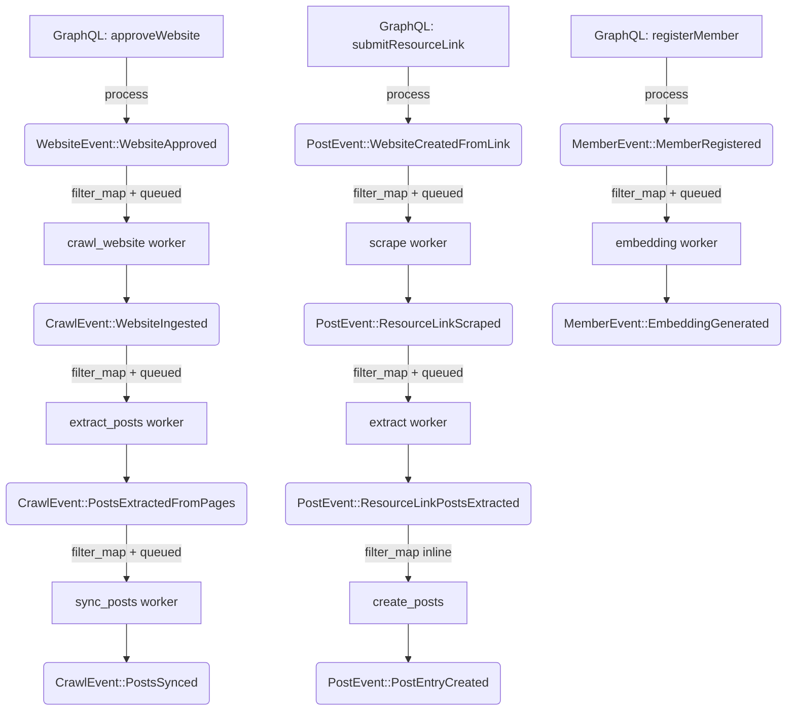

# Upgrade Seesaw Core to 0.8.0 + Migrate Jobs to Delayed Effects

## Overview

Upgrade `seesaw_core` from `0.7.8` to `0.8.0` — the "queue-backed architecture" release — and migrate the existing PostgreSQL job queue system to seesaw's new delayed/queued effect pattern:

```
SomeJobEnqueued { ...data } → effect::on::<Event>().filter_map(variant).queued().then(handler)
```

This replaces the custom `kernel/jobs/` infrastructure (JobRunner, JobQueue, JobRegistry, PostgresJobQueue) with seesaw's built-in queue-backed execution model.

## Motivation

- **Replace custom job infrastructure** with framework-native queued effects
- **Unified event model**: Jobs become events, effects become workers — one system instead of two
- **Built-in retry, timeout, priority**: `.retry(3).timeout(Duration::from_secs(300)).priority(1)`
- **Deterministic idempotency keys**: `ctx.idempotency_key()` for external API calls
- **Observability**: All work (immediate + queued) visible in seesaw visualizer

## Current State

### Custom Job System (to be replaced)

```
kernel/jobs/
├── job.rs           # Job model (35+ column PostgreSQL table)
├── queue.rs         # PostgresJobQueue (SKIP LOCKED polling)
├── runner.rs        # JobRunner (tokio::spawn background loop)
├── registry.rs      # JobRegistry (type → handler mapping)
├── manager.rs       # Scheduling abstraction
├── events.rs        # JobEvent lifecycle events
└── testing.rs       # Test utilities (SpyJobQueue, NoopJobQueue)
```

### Crawling Domain Job Pipeline (currently uses custom jobs)

```
CrawlWebsiteJob    → ingest_website()           → enqueue ExtractPostsJob
ExtractPostsJob    → extract_posts_for_domain()  → enqueue SyncPostsJob
SyncPostsJob       → sync_and_deduplicate_posts() → terminal
RegeneratePostsJob → regenerate_posts()          → enqueue ExtractPostsJob
RegenerateSinglePostJob → regenerate_single_post() → terminal
```

### Effects That Should Become Queued (currently inline, blocking)

| Effect | Trigger Event | Work | Time | Risk |
|--------|--------------|------|------|------|
| `website_effect` | `WebsiteApproved` | Firecrawl web crawl | 30s-5min | **CRITICAL** - blocks admin |
| `website_approval_effect` | `WebsiteResearchCreated` | Tavily search + Claude assessment | 20-60s | **CRITICAL** - blocks admin |
| `member_effect` | `MemberRegistered` | AI embedding generation | 2-5s | **HIGH** - blocks registration |
| `post_composite_effect` | `WebsiteCreatedFromLink` | Scrape → Extract → Create chain | 15-60s | **MEDIUM** - blocks submission |

### Scheduled Tasks (keep as-is for now)

```
scheduled_tasks.rs:
├── Hourly scraping   (cron: 0 0 * * * *)  → calls ingest_website() directly
├── Hourly discovery  (cron: 0 0 * * * *)  → calls run_discovery() directly
└── Weekly reset      (cron: 0 0 0 * * MON) → calls Member::reset_weekly_counts()
```

These can be migrated later. They're simple cron triggers, not job chains.

## Proposed Solution

### The Pattern: filter_map + queued effects

Every effect uses `.filter_map()` to extract data from the specific event variant it handles. The `.then()` handler receives only the destructured data — never the raw enum:

```rust
// Before: Custom job system
#[derive(Serialize, Deserialize)]
struct CrawlWebsiteJob { website_id: Uuid, visitor_id: Uuid }

impl CommandMeta for CrawlWebsiteJob {
    const JOB_TYPE: &'static str = "crawl_website";
}

async fn handle_crawl_website(job: CrawlWebsiteJob, deps: &ServerDeps) -> Result<()> {
    ingest_website(job.website_id, ...).await?;
    deps.jobs.enqueue(ExtractPostsJob::new(job.website_id)).await?;
    Ok(())
}

// After: filter_map + queued effect
effect::on::<CrawlEvent>()
    .filter_map(|event| match event {
        CrawlEvent::CrawlWebsiteEnqueued { website_id, visitor_id, use_firecrawl } => {
            Some((website_id, visitor_id, use_firecrawl))
        }
        _ => None,
    })
    .id("crawl_website")
    .queued()
    .retry(3)
    .timeout(Duration::from_secs(300))
    .then(|(website_id, visitor_id, use_firecrawl), ctx| async move {
        ingest_website(website_id, visitor_id, use_firecrawl, true, ctx.deps()).await?;
        ctx.emit(CrawlEvent::PostsExtractionEnqueued { website_id });
        Ok(())
    })
```

### Key Design Decisions

1. **`.filter_map()` before `.then()`**: Handler receives typed data, not the enum. No `let else` boilerplate.
2. **`*Enqueued` events are facts**: "Work was enqueued" is a fact. The effect picks it up.
3. **Each step is its own effect**: Atomized chain — each step can retry independently.
4. **Effect IDs are required**: `.id("crawl_website")` enables idempotency tracking.
5. **Inline vs queued**: Fast effects (DB cleanup, logging) stay inline. Slow effects (AI, HTTP) use `.queued()`.

## Implementation Phases

### Phase 1: Version Bump + Compile Fix

**packages/server/Cargo.toml**
```toml
seesaw_core = "0.8.0"
```

**Cargo.toml** (workspace root)
```toml
uuid = { version = "1.11", features = ["v4", "v5", "v7", "serde"] }
```

Run `cargo check -p server` and fix any compilation errors. Expected:
- Effect closures may need signature updates (11 closures across 7 files)
- Engine builder in `server/app.rs:218-273` may need updates
- `thiserror` version coexistence (likely transparent)

### Phase 2: Add `.id()` to All Existing Effects

Add human-readable IDs to every effect registration:

```rust
// Example: domains/auth/effects.rs
pub fn auth_effect() -> Effect<AppState, ServerDeps> {
    effect::on::<AuthEvent>()
        .id("auth_terminal")
        .then(|_event, _ctx| async move { Ok(()) })
}
```

Effect IDs for each domain:
- `auth_terminal`
- `member_embedding`
- `chat_greeting`, `chat_reply`
- `website_crawl_on_approval`
- `mark_no_listings`
- `resource_link_scrape`, `resource_link_extract`, `resource_link_create`
- `website_research`
- `provider_cleanup`

### Phase 3: Convert Blocking Effects to filter_map + Queued

Convert all blocking effect chains to use `.filter_map()` + `.queued()`:

#### 3a. Website Approval → Crawl (`domains/website/effects/mod.rs`)

```rust
// Before: Inline match (blocks admin for 30s-5min)
effect::on::<WebsiteEvent>().then(|event, ctx| async move {
    match event.as_ref() {
        WebsiteEvent::WebsiteApproved { website_id, reviewed_by } => {
            crawling_actions::ingest_website(...).await?;
        }
        _ => {}
    }
    Ok(())
})

// After: filter_map + queued
effect::on::<WebsiteEvent>()
    .filter_map(|event| match event {
        WebsiteEvent::WebsiteApproved { website_id, reviewed_by } => {
            Some((website_id, reviewed_by))
        }
        _ => None,
    })
    .id("website_crawl_on_approval")
    .queued()
    .retry(3)
    .timeout(Duration::from_secs(600))
    .then(|(website_id, reviewed_by), ctx| async move {
        crawling_actions::ingest_website(
            website_id.into_uuid(), reviewed_by.into_uuid(),
            true, true, ctx.deps()
        ).await?;
        Ok(())
    })
```

#### 3b. Website Research (`domains/website_approval/effects/mod.rs`)

```rust
// Research creation → conduct searches + generate assessment
effect::on::<WebsiteApprovalEvent>()
    .filter_map(|event| match event {
        WebsiteApprovalEvent::WebsiteResearchCreated {
            research_id, website_id, job_id, requested_by, ..
        } => Some((research_id, website_id, job_id, requested_by)),
        _ => None,
    })
    .id("website_research_conduct")
    .queued()
    .retry(2)
    .timeout(Duration::from_secs(120))
    .then(|(research_id, website_id, job_id, requested_by), ctx| async move {
        actions::conduct_searches(research_id, website_id, ctx.deps()).await?;
        actions::generate_assessment(research_id, website_id, job_id, requested_by, ctx.deps()).await?;
        Ok(())
    })

// Retry path: searches completed → generate assessment
effect::on::<WebsiteApprovalEvent>()
    .filter_map(|event| match event {
        WebsiteApprovalEvent::ResearchSearchesCompleted {
            research_id, website_id, job_id, requested_by, ..
        } => Some((research_id, website_id, job_id, requested_by)),
        _ => None,
    })
    .id("website_research_assessment_retry")
    .queued()
    .retry(2)
    .timeout(Duration::from_secs(60))
    .then(|(research_id, website_id, job_id, requested_by), ctx| async move {
        actions::generate_assessment(research_id, website_id, job_id, requested_by, ctx.deps()).await?;
        Ok(())
    })
```

#### 3c. Member Embedding (`domains/member/effects/mod.rs`)

```rust
effect::on::<MemberEvent>()
    .filter_map(|event| match event {
        MemberEvent::MemberRegistered { member_id, .. } => Some(member_id),
        _ => None,
    })
    .id("member_embedding")
    .queued()
    .retry(3)
    .timeout(Duration::from_secs(30))
    .then(|member_id, ctx| async move {
        actions::generate_embedding(
            member_id,
            ctx.deps().embedding_service.as_ref(),
            &ctx.deps().db_pool,
        ).await?;
        Ok(())
    })
```

#### 3d. Post Composite Chain (`domains/posts/effects/composite.rs`)

```rust
// Step 1: Scrape (5-30s)
fn scrape_resource_link_effect() -> Effect<AppState, ServerDeps> {
    effect::on::<PostEvent>()
        .filter_map(|event| match event {
            PostEvent::WebsiteCreatedFromLink { job_id, url, submitter_contact, .. } => {
                Some((job_id, url, submitter_contact))
            }
            _ => None,
        })
        .id("resource_link_scrape")
        .queued()
        .retry(2)
        .timeout(Duration::from_secs(60))
        .then(|(job_id, url, submitter_contact), ctx| async move {
            handle_scrape_resource_link(job_id, url, None, submitter_contact, ctx.deps()).await
        })
}

// Step 2: Extract (5-15s, AI call)
fn extract_posts_effect() -> Effect<AppState, ServerDeps> {
    effect::on::<PostEvent>()
        .filter_map(|event| match event {
            PostEvent::ResourceLinkScraped { job_id, url, content, context, submitter_contact, .. } => {
                Some((job_id, url, content, context, submitter_contact))
            }
            _ => None,
        })
        .id("resource_link_extract")
        .queued()
        .retry(2)
        .timeout(Duration::from_secs(60))
        .then(|(job_id, url, content, context, submitter_contact), ctx| async move {
            handle_extract_posts_from_resource_link(job_id, url, content, context, submitter_contact, ctx.deps()).await
        })
}

// Step 3: Create posts (1-5s, DB only — stays inline)
fn create_posts_effect() -> Effect<AppState, ServerDeps> {
    effect::on::<PostEvent>()
        .filter_map(|event| match event {
            PostEvent::ResourceLinkPostsExtracted { job_id, url, posts, context, submitter_contact, .. } => {
                Some((job_id, url, posts, context, submitter_contact))
            }
            _ => None,
        })
        .id("resource_link_create")
        // No .queued() — fast DB operation stays inline
        .then(|(job_id, url, posts, context, submitter_contact), ctx| async move {
            handle_create_posts_from_resource_link(job_id, url, posts, context, submitter_contact, ctx.deps()).await
        })
}
```

### Phase 4: Migrate Crawling Job Pipeline to Events

Replace the 5 crawling jobs with event-based queued effects:

#### New Events (add to `domains/crawling/events/mod.rs`)

```rust
pub enum CrawlEvent {
    // ... existing events ...

    // New: Job replacement events
    CrawlWebsiteEnqueued {
        website_id: Uuid,
        visitor_id: Uuid,
        use_firecrawl: bool,
    },
    PostsExtractionEnqueued {
        website_id: Uuid,
    },
    PostsSyncEnqueued {
        website_id: Uuid,
        posts: Vec<ExtractedPost>,
        use_llm_sync: bool,
    },
    PostsRegenerationEnqueued {
        website_id: Uuid,
        visitor_id: Uuid,
    },
    SinglePostRegenerationEnqueued {
        post_id: Uuid,
    },
}
```

#### New Effects (replace `domains/crawling/effects/job_handlers.rs`)

```rust
// Crawl website (30s-5min)
effect::on::<CrawlEvent>()
    .filter_map(|event| match event {
        CrawlEvent::CrawlWebsiteEnqueued { website_id, visitor_id, use_firecrawl } => {
            Some((website_id, visitor_id, use_firecrawl))
        }
        _ => None,
    })
    .id("crawl_website")
    .queued()
    .retry(3)
    .timeout(Duration::from_secs(600))
    .then(|(website_id, visitor_id, use_firecrawl), ctx| async move {
        ingest_website(website_id, visitor_id, use_firecrawl, true, ctx.deps()).await?;
        ctx.emit(CrawlEvent::PostsExtractionEnqueued { website_id });
        Ok(())
    })

// Extract posts (10-30s)
effect::on::<CrawlEvent>()
    .filter_map(|event| match event {
        CrawlEvent::PostsExtractionEnqueued { website_id } => Some(website_id),
        _ => None,
    })
    .id("extract_posts")
    .queued()
    .retry(2)
    .timeout(Duration::from_secs(120))
    .then(|website_id, ctx| async move {
        let website = Website::find_by_id(website_id, &ctx.deps().db_pool).await?;
        let result = extract_posts_for_domain(&website.domain, ctx.deps()).await?;
        if !result.posts.is_empty() {
            ctx.emit(CrawlEvent::PostsSyncEnqueued {
                website_id,
                posts: result.posts,
                use_llm_sync: false,
            });
        }
        Ok(())
    })

// Sync posts (10-60s)
effect::on::<CrawlEvent>()
    .filter_map(|event| match event {
        CrawlEvent::PostsSyncEnqueued { website_id, posts, use_llm_sync } => {
            Some((website_id, posts, use_llm_sync))
        }
        _ => None,
    })
    .id("sync_posts")
    .queued()
    .retry(2)
    .timeout(Duration::from_secs(120))
    .then(|(website_id, posts, use_llm_sync), ctx| async move {
        sync_and_deduplicate_posts(website_id, posts, ctx.deps()).await?;
        Ok(())
    })

// Regenerate posts
effect::on::<CrawlEvent>()
    .filter_map(|event| match event {
        CrawlEvent::PostsRegenerationEnqueued { website_id, visitor_id } => {
            Some((website_id, visitor_id))
        }
        _ => None,
    })
    .id("regenerate_posts")
    .queued()
    .retry(2)
    .timeout(Duration::from_secs(300))
    .then(|(website_id, visitor_id), ctx| async move {
        regenerate_posts(website_id, visitor_id, true, ctx.deps()).await?;
        ctx.emit(CrawlEvent::PostsExtractionEnqueued { website_id });
        Ok(())
    })

// Regenerate single post
effect::on::<CrawlEvent>()
    .filter_map(|event| match event {
        CrawlEvent::SinglePostRegenerationEnqueued { post_id } => Some(post_id),
        _ => None,
    })
    .id("regenerate_single_post")
    .queued()
    .retry(2)
    .timeout(Duration::from_secs(60))
    .then(|post_id, ctx| async move {
        regenerate_single_post(post_id, ctx.deps()).await?;
        Ok(())
    })
```

#### Remove from `app.rs`

```rust
// Remove job runner startup (app.rs:389-404)
// - let mut job_registry = JobRegistry::new();
// - register_crawling_jobs(&mut job_registry);
// - let runner = JobRunner::new(...);
// - tokio::spawn(runner.run());

// Remove job_queue from ServerDeps (or keep for scheduled tasks transition)
```

### Phase 5: QueueEngine + seesaw-postgres Setup

Replace the in-memory `Engine` with `QueueEngine` backed by PostgreSQL:

**packages/server/Cargo.toml**
```toml
seesaw_core = "0.8.0"
seesaw-postgres = "0.1"  # New: PostgreSQL store
```

**server/app.rs**
```rust
use seesaw_core::{QueueEngine, Runtime, RuntimeConfig};
use seesaw_postgres::PostgresStore;

let store = PostgresStore::new(pool.clone());
let engine = QueueEngine::new(server_deps, store)
    .with_effect(auth_effect())
    .with_effect(member_effect())     // .queued()
    .with_effect(chat_effect())
    .with_effect(website_effect())    // .queued()
    // ... etc

let runtime = Runtime::new(RuntimeConfig {
    event_workers: 2,
    effect_workers: 4,
});
runtime.start(engine);
```

**Migration: seesaw-postgres schema**
```sql
-- New migration: 000105_create_seesaw_queue_tables.sql
-- (provided by seesaw-postgres crate, or generated)
```

### Phase 6: Remove Custom Job Infrastructure

Once all jobs are migrated and verified:

1. Delete `kernel/jobs/` directory (job.rs, queue.rs, runner.rs, registry.rs, etc.)
2. Delete `domains/crawling/jobs/` directory (all 5 job files)
3. Remove `job_queue: Arc<dyn JobQueue>` from `ServerDeps`
4. Remove `jobs` migration table (after verifying no pending jobs)
5. Clean up imports across the codebase

## Acceptance Criteria

### Phase 1-2 (Version Bump)
- [x] `seesaw_core = "0.8.0"` compiles
- [x] All effects have `.id()` annotations
- [ ] Server starts without panics

### Phase 3 (Queued Effects)
- [ ] Website approval returns immediately (crawl runs in background)
- [ ] Website research runs in background
- [ ] Member registration doesn't block on embedding
- [ ] Resource link submission returns immediately (scrape + extract in background)

### Phase 4 (Job Migration)
- [ ] Crawl pipeline works end-to-end via events (not custom jobs)
- [ ] `deps.jobs.enqueue(...)` calls replaced with `ctx.emit(CrawlEvent::*Enqueued { ... })`
- [ ] Job chaining via event cascades: CrawlEnqueued → ExtractionEnqueued → SyncEnqueued

### Phase 5 (QueueEngine)
- [ ] PostgreSQL store processes events durably
- [ ] Runtime workers pick up queued effects
- [ ] Retries work on failure
- [ ] Dead-letter queue catches permanently failing effects

### Phase 6 (Cleanup)
- [ ] `kernel/jobs/` directory removed
- [ ] `domains/crawling/jobs/` directory removed
- [ ] No references to `JobRunner`, `JobRegistry`, `JobQueue` in codebase
- [ ] `jobs` database table can be dropped (after drain period)

## Dependencies & Risks

| Risk | Likelihood | Mitigation |
|------|-----------|------------|
| `thiserror 2.0` conflict | Low | Cargo holds both; `anyhow` bridges via `std::error::Error` |
| `seesaw-viz` incompatibility | Medium | Disable temporarily if broken |
| QueueEngine not production-ready (60% complete per docs) | Medium | Stay on in-memory Engine for Phase 1-3; only move to QueueEngine when stable |
| Losing job state during migration | Low | Run both systems in parallel during transition; drain old jobs before removing |
| Scheduled tasks break | None | Scheduled tasks are independent of job system; keep tokio-cron-scheduler |

## Migration Safety

1. **Parallel running**: Keep custom job system alongside new effects during migration
2. **Feature flag**: Gate new behavior behind a config flag if needed
3. **Drain period**: After migration, wait for all existing jobs to complete before removing tables
4. **Rollback**: Git revert + `cargo build` — no database schema changes until Phase 5

## Rollback

**Phase 1-3** (no DB changes):
```bash
git checkout -- packages/server/Cargo.toml Cargo.toml
cargo build
```

**Phase 4+** (with DB changes):
- Keep old `jobs` table intact during migration
- Run both systems in parallel
- Only drop old infrastructure after verification period

## ERD: Event Flow After Migration



## References

- Previous upgrade plans: `docs/plans/2026-02-04-refactor-upgrade-seesaw-to-0.7.2-plan.md`
- Seesaw architecture guide: `docs/architecture/SEESAW_ARCHITECTURE.md`
- [seesaw-rs GitHub](https://github.com/crcn/seesaw-rs)
- [seesaw_core on crates.io](https://crates.io/crates/seesaw_core)
- [API Migration Guide](https://github.com/crcn/seesaw-rs/blob/main/docs/api-migration-guide.md)
