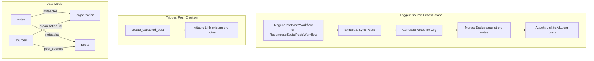

# feat: AI Note Generation Pipeline

## Overview

Implement the 3-step pipeline that generates contextual notes from an organization's sources (websites, Instagram, etc.) and attaches them to the org's posts. This completes Phases 2-3 of the [notes plan](./2026-02-10-feat-notes-model-attachable-alerts-plan.md) with the decisions from the [brainstorm](../brainstorms/2026-02-10-ai-note-generation-pipeline-brainstorm.md).

**Pipeline:**
```
Step 1: Generate (per source crawl)   →   Step 2: Merge (per org)   →   Step 3: Attach (org-wide)
```

**Triggers:**
- Source crawl/scrape → Generate + Merge + Attach
- Post creation → Attach only

## Key Decisions (from brainstorm)

| Decision | Choice | Rationale |
|----------|--------|-----------|
| Source scope | All sources for org | Cross-source contradictions are the core value |
| Deduplication | Content similarity, per-org | Simple; no multi-source provenance tracking (YAGNI) |
| Attachment | Blanket org-wide | Every note applies to all active org posts |
| Expiration | Manual for v1 | Automated expiration deferred — adds complexity without blocking core pipeline |

## Implementation Phases

### Phase 1: Foundation Fixes

Update existing code to work with the unified sources schema (same branch) and fix dedup scope.

**Files to modify:**

- `packages/server/src/domains/notes/activities/extraction.rs`
  - Change `gather_website_content()` to use `Source::find_by_organization` + filter `source_type = 'website'` instead of `Website::find_by_organization`
  - Change `is_duplicate()` scope from per-source to per-org: check `Note::find_active_for_entity("organization", org_id)` instead of `Note::find_by_source()`
  - Fix source attribution: instead of attributing all notes to `all_sources.first()`, ask LLM to tag each note with source URL. Fall back to first source if LLM omits it.

- `packages/server/src/domains/posts/models/post.rs`
  - Update `Post::find_by_organization_id()` to join through `sources` table instead of `websites`:
    ```sql
    SELECT DISTINCT p.* FROM posts p
    JOIN post_sources ps ON ps.post_id = p.id
    JOIN sources s ON ps.source_id = s.id
    WHERE s.organization_id = $1
      AND p.status = 'active'
      AND p.deleted_at IS NULL
      AND p.revision_of_post_id IS NULL
      AND p.translation_of_id IS NULL
    ORDER BY p.created_at DESC
    ```

**Model method changes:**

```rust
// extraction.rs — new signature for is_duplicate
async fn is_duplicate_for_org(
    content: &str,
    org_id: OrganizationId,
    pool: &PgPool,
) -> Result<bool> {
    let existing = Note::find_active_for_entity("organization", org_id.into_uuid(), pool).await?;
    let normalized = content.trim().to_lowercase();
    Ok(existing.iter().any(|n| n.content.trim().to_lowercase() == normalized))
}
```

### Phase 2: Social Content Gathering

Implement `gather_social_content()` to feed Instagram/Facebook content into the note extraction LLM.

**Files to modify:**

- `packages/server/src/domains/notes/activities/extraction.rs`
  - Add `gather_social_content(org_id, deps)` function
  - Loads social sources via `Source::find_by_organization` filtered to social types
  - For each social source, loads recent scraped content (Instagram posts, etc.) from the extraction pages or Apify cache
  - Converts to `SourceContent` format
  - Uncomment the social content block in `generate_notes_for_organization()`

```rust
async fn gather_social_content(
    org_id: OrganizationId,
    deps: &ServerDeps,
) -> Result<Vec<SourceContent>> {
    let sources = Source::find_by_organization(org_id, &deps.db_pool).await?;
    let social_sources: Vec<_> = sources.iter()
        .filter(|s| s.source_type != "website")
        .collect();

    let mut content = Vec::new();
    for source in social_sources {
        // Load scraped pages for this source from extraction_pages
        let pages = ExtractionPage::find_by_source(source.id, &deps.db_pool).await?;
        for (page_id, url, text) in pages {
            if text.trim().is_empty() { continue; }
            content.push(SourceContent {
                source_id: page_id,
                source_type: source.source_type.clone(),
                source_url: url,
                content: text,
            });
        }
    }
    Ok(content)
}
```

**Dependencies:** May need `ExtractionPage::find_by_source(source_id, pool)` if it doesn't exist. Check whether scraped social content lands in `extraction_pages` or elsewhere.

### Phase 3: Attach Activity

New activity that links all active org notes to all active org posts.

**Files to create:**

- `packages/server/src/domains/notes/activities/attachment.rs`

```rust
/// Attach all active notes for an org to all its active posts.
/// Uses ON CONFLICT DO NOTHING for idempotency.
pub async fn attach_notes_to_org_posts(
    org_id: OrganizationId,
    pool: &PgPool,
) -> Result<AttachResult> {
    let notes = Note::find_active_for_entity("organization", org_id.into_uuid(), pool).await?;
    let posts = Post::find_by_organization_id(org_id.into_uuid(), pool).await?;

    let mut attached = 0;
    for note in &notes {
        for post in &posts {
            Noteable::create(note.id, "post", post.id.into_uuid(), pool).await?;
            attached += 1;
        }
    }

    Ok(AttachResult {
        notes_count: notes.len() as i32,
        posts_count: posts.len() as i32,
        noteables_created: attached,
    })
}

/// Attach all active org notes to a single new post.
/// Called during post creation.
pub async fn attach_org_notes_to_post(
    org_id: OrganizationId,
    post_id: PostId,
    pool: &PgPool,
) -> Result<i32> {
    let notes = Note::find_active_for_entity("organization", org_id.into_uuid(), pool).await?;
    let mut attached = 0;
    for note in &notes {
        Noteable::create(note.id, "post", post_id.into_uuid(), pool).await?;
        attached += 1;
    }
    Ok(attached)
}
```

**Files to modify:**

- `packages/server/src/domains/notes/activities/mod.rs` — add `pub mod attachment;`

### Phase 4: Pipeline Integration

Hook the pipeline into the two existing workflows and into post creation.

#### 4a: Workflow Integration

Add note generation + attach as a best-effort final step in both regenerate workflows. Wrapped in warn-on-error so note generation failures don't block the crawl pipeline.

**Files to modify:**

- `packages/server/src/domains/website/restate/workflows/regenerate_posts.rs`

  After the LLM sync phase (after line ~182), add:

  ```rust
  // Phase 4: Generate notes for the organization (best-effort)
  ctx.set("status", "Generating notes...".to_string());
  if let Some(org_id) = website.organization_id {
      let org = Organization::find_by_id(org_id, pool).await
          .map_err(|e| TerminalError::new(e.to_string()))?;
      match generate_notes_for_organization(org_id, &org.name, &self.deps).await {
          Ok(r) => {
              info!(notes_created = r.notes_created, "Note generation complete");
              // Attach all org notes to all org posts
              if let Err(e) = attach_notes_to_org_posts(org_id, pool).await {
                  warn!(error = %e, "Failed to attach notes to posts");
              }
          }
          Err(e) => warn!(error = %e, "Note generation failed (non-blocking)"),
      }
  }
  ```

- `packages/server/src/domains/source/restate/workflows/regenerate_social_posts.rs`

  Same pattern after LLM sync — look up org from source, run generate + attach.

  ```rust
  // Phase 4: Generate notes for the organization (best-effort)
  ctx.set("status", "Generating notes...".to_string());
  if let Some(org_id) = source.organization_id {
      let org_id = OrganizationId::from(org_id);
      let org = Organization::find_by_id(org_id, pool).await
          .map_err(|e| TerminalError::new(e.to_string()))?;
      match generate_notes_for_organization(org_id, &org.name, &self.deps).await {
          Ok(r) => {
              info!(notes_created = r.notes_created, "Note generation complete");
              if let Err(e) = attach_notes_to_org_posts(org_id, &pool).await {
                  warn!(error = %e, "Failed to attach notes to posts");
              }
          }
          Err(e) => warn!(error = %e, "Note generation failed (non-blocking)"),
      }
  }
  ```

#### 4b: Post Creation Hook

Attach existing org notes when a new post is created.

**Files to modify:**

- `packages/server/src/domains/posts/activities/create_post.rs`

  After the post is fully created (after `link_to_page_source`, around line 103), add:

  ```rust
  // Attach any existing org-level notes to this new post
  if let (Some(st), Some(sid)) = (source_type, source_id) {
      // Look up the org for this source
      if let Ok(source) = Source::find_by_id(SourceId::from_uuid(sid), pool).await {
          if let Some(org_id) = source.organization_id {
              if let Err(e) = attach_org_notes_to_post(
                  OrganizationId::from(org_id),
                  created.id,
                  pool,
              ).await {
                  warn!(post_id = %created.id, error = %e, "Failed to attach org notes to new post");
              }
          }
      }
  }
  ```

## Acceptance Criteria

### Phase 1 — Foundation
- [x] `gather_website_content()` uses `Source::find_by_organization` instead of `Website::find_by_organization`
- [x] `is_duplicate()` checks against all active org notes, not just per-source
- [x] `Post::find_by_organization_id()` joins through `sources` table (works with unified sources)
- [x] Source attribution no longer hardcodes first source

### Phase 2 — Social Content
- [x] `gather_social_content()` loads content from social sources for an org
- [x] Social content flows into the same LLM extraction as website content
- [x] `generate_notes_for_organization()` processes both website and social content

### Phase 3 — Attach
- [x] `attach_notes_to_org_posts()` links all active org notes to all active org posts
- [x] `attach_org_notes_to_post()` links all active org notes to a single new post
- [x] Uses `ON CONFLICT DO NOTHING` for idempotency

### Phase 4 — Pipeline Integration
- [x] `RegeneratePostsWorkflow` runs note generation + attach after LLM sync
- [x] `RegenerateSocialPostsWorkflow` runs note generation + attach after LLM sync
- [x] Note generation failures don't block the crawl pipeline (warn only)
- [x] `create_extracted_post()` attaches existing org notes to new posts
- [x] New posts created after notes exist have those notes linked

## ERD (updated flow)



## Future Enhancements (not in scope)

- **Automated expiration**: On re-crawl, detect when previously extracted information is no longer present and expire stale notes
- **Semantic dedup**: Use embedding distance instead of exact string matching for smarter deduplication
- **Selective attachment**: Use embedding similarity to only attach notes to relevant posts (Phase 3 of original plan)
- **Admin notifications**: Alert admins when new system notes are generated for review
- **Bulk operations**: "Approve all" / "Expire all" for admin note management

## References

- Brainstorm: `docs/brainstorms/2026-02-10-ai-note-generation-pipeline-brainstorm.md`
- Parent plan: `docs/plans/2026-02-10-feat-notes-model-attachable-alerts-plan.md`
- Notes model: `packages/server/src/domains/notes/models/note.rs`
- Note extraction: `packages/server/src/domains/notes/activities/extraction.rs`
- Post creation: `packages/server/src/domains/posts/activities/create_post.rs`
- Website regen workflow: `packages/server/src/domains/website/restate/workflows/regenerate_posts.rs`
- Social regen workflow: `packages/server/src/domains/source/restate/workflows/regenerate_social_posts.rs`
- Unified source model: `packages/server/src/domains/source/models/source.rs`
- Post model (find_by_org): `packages/server/src/domains/posts/models/post.rs:576`
