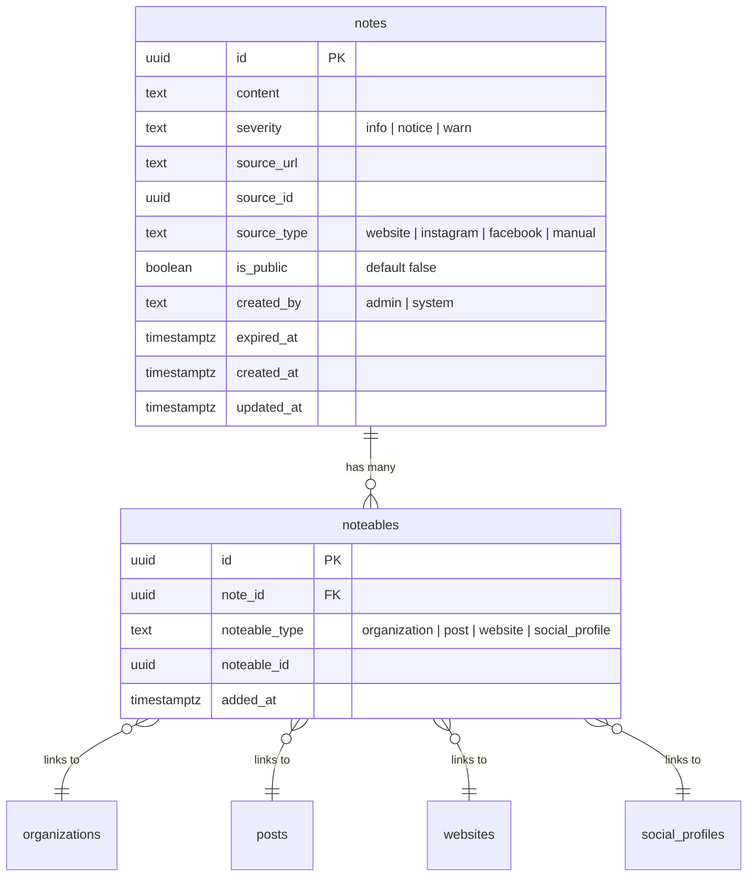

# feat: Add Notes Model for Attachable Alerts & Context

## Overview

Add a standalone "notes" model that provides graph-linked annotations across entities (organizations, posts, websites, social profiles). Notes carry severity levels (info/notice/warn), source tracking for refreshability, and public visibility toggles. They are created by admins manually or by the AI pipeline automatically, and linked to entities via a polymorphic `noteables` join table — following the existing `taggables` pattern.

## Problem Statement / Motivation

When monitoring organizations, critical context like "org is pausing all donations" or "org asking people to stop volunteering" gets discovered across multiple sources (website pages, Instagram posts) but has no place to live in the data model. This information needs to:

1. Be attached to the organization itself
2. Propagate to any related posts/listings on mntogether.org (e.g., "volunteer at Some Nonprofit" should surface the warning)
3. Track where the information came from so it can be refreshed
4. Expire when the source content changes

## Design Decisions

From the [brainstorm](../brainstorms/2026-02-10-notes-model-brainstorm.md):

- **Notes are standalone entities** — not owned by any single model
- **Polymorphic many-to-many via `noteables`** — follows `taggables` pattern
- **Source tracking** — `source_id`, `source_type`, `source_url` for refresh
- **`expired_at`** — set when source no longer matches, not deleted
- **`is_public` defaults to `false`** — system-generated notes require admin review before public display
- **Hard delete** — notes are deleted outright, `ON DELETE CASCADE` on noteables
- **Plain text content** — no markdown for now
- **Notes can exist with zero linked entities** — create first, link later

## Schema

### `notes` table

```sql
-- Migration: 000147_create_notes.sql

CREATE TABLE notes (
    id UUID PRIMARY KEY DEFAULT gen_random_uuid(),
    content TEXT NOT NULL,
    severity TEXT NOT NULL DEFAULT 'info',
    source_url TEXT,
    source_id UUID,
    source_type TEXT,
    is_public BOOLEAN NOT NULL DEFAULT false,
    created_by TEXT NOT NULL DEFAULT 'system',
    expired_at TIMESTAMPTZ,
    created_at TIMESTAMPTZ NOT NULL DEFAULT now(),
    updated_at TIMESTAMPTZ NOT NULL DEFAULT now()
);

CREATE INDEX idx_notes_severity ON notes(severity);
CREATE INDEX idx_notes_expired_at ON notes(expired_at) WHERE expired_at IS NULL;
CREATE INDEX idx_notes_source ON notes(source_type, source_id) WHERE source_id IS NOT NULL;
CREATE INDEX idx_notes_is_public ON notes(is_public) WHERE is_public = true;

CREATE TABLE noteables (
    id UUID PRIMARY KEY DEFAULT gen_random_uuid(),
    note_id UUID NOT NULL REFERENCES notes(id) ON DELETE CASCADE,
    noteable_type TEXT NOT NULL,
    noteable_id UUID NOT NULL,
    added_at TIMESTAMPTZ NOT NULL DEFAULT now(),
    UNIQUE(note_id, noteable_type, noteable_id)
);

CREATE INDEX idx_noteables_entity ON noteables(noteable_type, noteable_id);
CREATE INDEX idx_noteables_note ON noteables(note_id);
```

### ERD



## Implementation Phases

### Phase 1: Core Model + Admin CRUD

Database migration, Rust model, Restate service, admin UI for manual note management.

**Files to create:**

- `packages/server/migrations/000147_create_notes.sql` — schema above
- `packages/server/src/domains/notes/mod.rs` — domain module
- `packages/server/src/domains/notes/models/mod.rs` — model exports
- `packages/server/src/domains/notes/models/note.rs` — Note + Noteable structs, CRUD methods
- `packages/server/src/domains/notes/data/mod.rs` — data exports
- `packages/server/src/domains/notes/data/note.rs` — API response types
- `packages/server/src/domains/notes/restate/mod.rs` — restate module
- `packages/server/src/domains/notes/restate/services/mod.rs` — service exports
- `packages/server/src/domains/notes/restate/services/notes.rs` — NotesService trait + impl

**Files to modify:**

- `packages/server/src/domains/mod.rs` — add `pub mod notes;`
- `packages/server/src/common/entity_ids.rs` — add `NoteId`, `NoteableId`
- `packages/server/src/bin/server.rs` — bind `NotesServiceImpl`
- `packages/web/lib/restate/types.ts` — add `NoteResult`, `NoteListResult` types
- `packages/web/app/admin/(app)/organizations/[id]/page.tsx` — add Notes section
- `packages/web/app/admin/(app)/posts/page.tsx` — surface warn note indicators (stretch)

**Rust model methods** (`note.rs`):

```rust
// Note struct
pub struct Note { id, content, severity, source_url, source_id, source_type, is_public, created_by, expired_at, created_at, updated_at }

// Note CRUD
Note::create(content, severity, source_url, source_id, source_type, is_public, created_by, pool) -> Result<Self>
Note::find_by_id(id, pool) -> Result<Self>
Note::update(id, content, severity, is_public, pool) -> Result<Self>
Note::delete(id, pool) -> Result<()>
Note::expire(id, pool) -> Result<Self>  // sets expired_at = now()
Note::unexpire(id, pool) -> Result<Self>  // clears expired_at

// Noteable struct
pub struct Noteable { id, note_id, noteable_type, noteable_id, added_at }

// Querying notes for an entity
Note::find_for_entity(noteable_type, noteable_id, pool) -> Result<Vec<Self>>  // JOIN through noteables
Note::find_active_for_entity(noteable_type, noteable_id, pool) -> Result<Vec<Self>>  // WHERE expired_at IS NULL
Note::find_public_for_entity(noteable_type, noteable_id, pool) -> Result<Vec<Self>>  // WHERE is_public = true AND expired_at IS NULL

// Linking
Noteable::create(note_id, noteable_type, noteable_id, pool) -> Result<Self>  // ON CONFLICT DO NOTHING
Noteable::delete(note_id, noteable_type, noteable_id, pool) -> Result<()>  // unlink
Noteable::find_for_note(note_id, pool) -> Result<Vec<Self>>  // all entities linked to a note
```

**Restate service handlers:**

```
NotesService:
  create(CreateNoteRequest) -> NoteResult
  get(GetNoteRequest) -> NoteResult
  update(UpdateNoteRequest) -> NoteResult
  delete(DeleteNoteRequest) -> ()
  list_for_entity(ListNotesForEntityRequest) -> NoteListResult
  link(LinkNoteRequest) -> NoteResult  // add noteable
  unlink(UnlinkNoteRequest) -> ()      // remove noteable
```

**Admin UI — Notes section on org detail page:**

- Card with heading "Notes" showing all linked notes
- Each note shows: severity badge (colored), content, source_type label, created_by, created_at
- Expired notes shown grayed out with "Expired" badge
- Inline "Add Note" form: content textarea, severity dropdown, is_public toggle
- Delete button per note, unlink button per note

### Phase 2: AI Note Extraction from Crawled Content

Integrate note creation into the crawling pipeline. When a website or social profile is crawled, the AI identifies noteworthy information and creates notes.

**Files to create:**

- `packages/server/src/domains/notes/activities/mod.rs` — activities module
- `packages/server/src/domains/notes/activities/extraction.rs` — AI note extraction logic

**Files to modify:**

- `packages/server/src/domains/crawling/activities/crawl_full.rs` — add note extraction step after org extraction
- `packages/server/src/domains/notes/mod.rs` — add `pub mod activities;`

**Key logic:**

- After org extraction, run note extraction on crawled pages
- LLM prompt identifies operational status changes, closures, capacity changes, safety warnings, temporary announcements
- Deduplication: hash `(source_id, source_type, normalized_content)` — skip creation if matching active note exists
- Auto-link to organization via the website's `organization_id`
- All system notes created with `is_public = false`, `created_by = "system"`

**Noteworthy criteria for the LLM prompt:**

| Category | Severity | Example |
|----------|----------|---------|
| Full closure / shutdown | `warn` | "We are permanently closing" |
| Service pause / capacity change | `warn` | "Pausing all physical donations" |
| Temporary closure | `notice` | "Closed for the holiday week" |
| Schedule / hours change | `notice` | "New hours: Mon-Fri 9-5" |
| Location change | `info` | "We've moved to 123 Main St" |
| General announcement | `info` | "New programs starting in March" |

### Phase 3: Cross-Referencing Notes with Posts

When posts are processed for an organization, cross-reference existing notes and auto-link relevant ones.

**Files to modify:**

- `packages/server/src/domains/notes/activities/extraction.rs` — add cross-referencing function
- `packages/server/src/domains/posts/activities/core.rs` or crawl pipeline — call cross-referencing after post extraction

**Key logic:**

- Load all active (non-expired) notes for the post's organization
- Use embedding similarity (existing pgvector infrastructure) to match notes against post content
- Above a threshold, create `noteables` link between note and post
- Runs during post creation/sync, not as a separate batch job

### Phase 4: Public Display

Surface `is_public` notes on public-facing post pages.

**Files to modify:**

- `packages/web/app/(public)/posts/[id]/page.tsx` — add note display
- Potentially `packages/web/lib/restate/types.ts` — add public note types if different

**Key logic:**

- Query `Note::find_public_for_entity("post", post_id)` — only `is_public = true AND expired_at IS NULL`
- `warn` notes displayed as prominent banner/alert at top of post detail
- `notice` notes shown as info callout
- `info` notes shown inline in a secondary section

## Acceptance Criteria

### Phase 1
- [x] Migration creates `notes` and `noteables` tables with correct schema, indexes, and constraints
- [x] Rust `Note` and `Noteable` models with full CRUD + linking methods
- [x] `NoteId` and `NoteableId` typed IDs registered in `entity_ids.rs`
- [x] `NotesService` Restate service with create/get/update/delete/list/link/unlink handlers
- [x] TypeScript types for `NoteResult`, `NoteListResult`
- [x] Organization detail page shows Notes section with add/delete/unlink functionality
- [x] Notes display severity badges, source info, and expired status

### Phase 2
- [ ] Note extraction activity runs after org extraction in crawl pipeline
- [ ] LLM prompt identifies noteworthy information with correct severity assignment
- [ ] Deduplication prevents identical notes on re-crawl
- [ ] System notes created with `is_public = false`, `created_by = "system"`
- [ ] Notes auto-linked to organization

### Phase 3
- [ ] Cross-referencing runs during post processing
- [ ] Embedding similarity matches notes to relevant posts
- [ ] Auto-linked noteables created above confidence threshold

### Phase 4
- [ ] Public post detail page shows only `is_public = true AND expired_at IS NULL` notes
- [ ] Warn notes displayed prominently as banner/alert
- [ ] No non-public notes leak to public queries

## Technical Considerations

- **No FK on `noteable_id`** — polymorphic column, same as `taggables`. Application-level cleanup needed when entities are deleted.
- **Deduplication** — hash-based dedup prevents noise from re-crawls. Consider storing a content hash column if dedup logic becomes complex.
- **Embedding for cross-referencing** — reuse existing pgvector infrastructure from `Post::search_by_similarity`. Notes may need their own `embedding` column in Phase 3.
- **Public query safety** — all public-facing note queries MUST filter `is_public = true AND expired_at IS NULL`. This is a security boundary.

## References

- Brainstorm: `docs/brainstorms/2026-02-10-notes-model-brainstorm.md`
- Taggables pattern: `packages/server/src/domains/tag/models/tag.rs`
- Contacts pattern: `packages/server/src/domains/contacts/models/contact.rs`
- Organization model: `packages/server/src/domains/organization/models/organization.rs`
- Crawl pipeline: `packages/server/src/domains/crawling/activities/crawl_full.rs`
- Entity IDs: `packages/server/src/common/entity_ids.rs`
- Restate service pattern: `packages/server/src/domains/organization/restate/services/organizations.rs`
- Admin UI pattern: `packages/web/app/admin/(app)/organizations/[id]/page.tsx`
