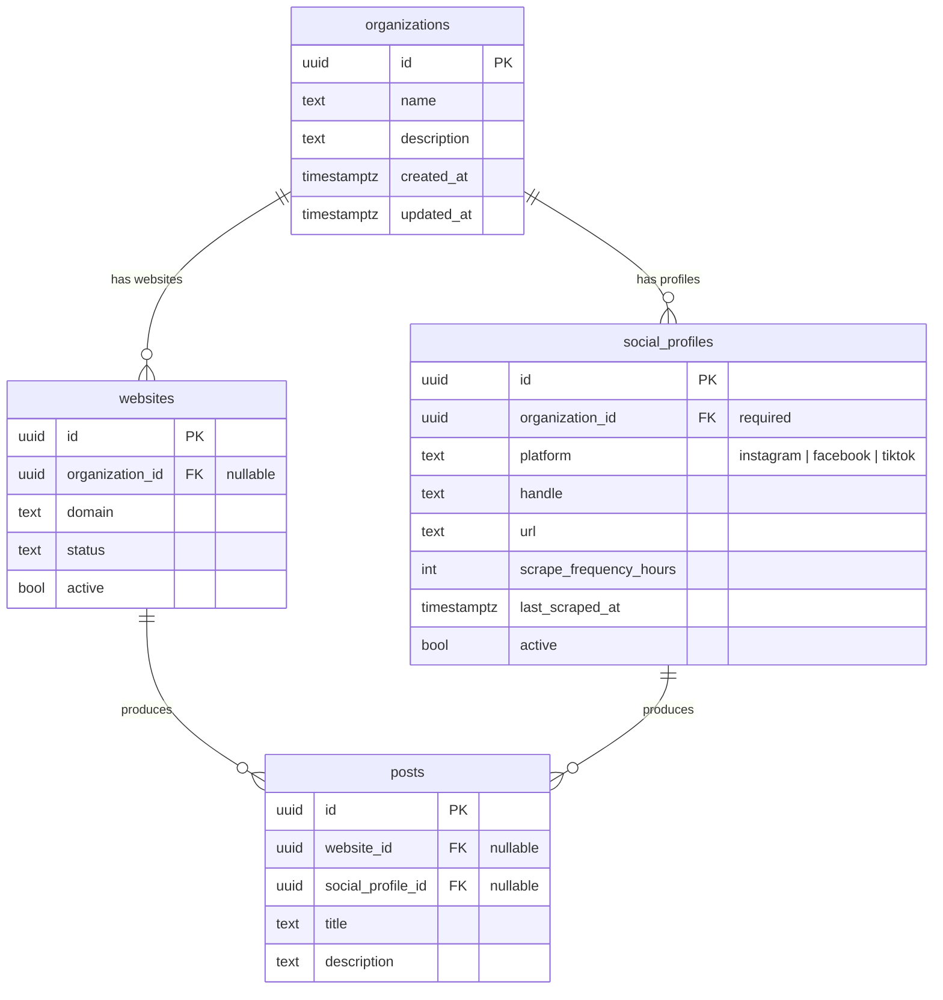

# Organizations + Social Media Sources

## Overview

Group multiple crawl sources (websites, social media profiles) under a single organization so posts from all sources can be cross-referenced. This enables:

1. **Invalidation** — social media contradicts a website-sourced listing (e.g., "we have enough volunteers"), so the listing gets flagged for review
2. **Discovery** — social media surfaces new asks/offerings not on the website

## Problem Statement

Currently, each website is an isolated crawl source. An organization like "Community Food Shelf" may have a website *and* an Instagram feed, both containing actionable listings. The system has no way to:

- Know that `communityfoodshelf.org` and `@communityfoodshelf` on Instagram belong to the same entity
- Scrape Instagram feeds for new listings
- Cross-reference content across sources to detect stale or contradictory listings

## Proposed Solution

1. **Create `organizations` table** — lean entity (name, description) grouping sources
2. **Add `organization_id` to `websites`** — link websites to their parent org
3. **Create `social_profiles` table** — separate table for Instagram/Facebook/TikTok profiles with own crawl scheduling
4. **Add `social_profile_id` to `posts`** — nullable FK alongside `website_id` for social-sourced posts
5. **Create `apify-client` crate** — standalone workspace crate for the Apify REST API
6. **Integrate Apify** for Instagram profile scraping with a direct-mapping extraction path (not LLM)
7. **Clean up** dead TypeScript types from the old organization removal



## Technical Approach

### Phase 1: Schema Migrations

**Migration 000141: Create organizations table**

```sql
-- packages/server/migrations/000141_create_organizations.sql
CREATE TABLE organizations (
    id UUID PRIMARY KEY DEFAULT gen_random_uuid(),
    name TEXT NOT NULL,
    description TEXT,
    created_at TIMESTAMPTZ NOT NULL DEFAULT now(),
    updated_at TIMESTAMPTZ NOT NULL DEFAULT now()
);

CREATE INDEX idx_organizations_name ON organizations(name);
```

**Migration 000142: Add organization_id to websites**

```sql
-- packages/server/migrations/000142_add_organization_id_to_websites.sql
ALTER TABLE websites
    ADD COLUMN organization_id UUID REFERENCES organizations(id);

CREATE INDEX idx_websites_organization_id ON websites(organization_id);
```

**Migration 000143: Create social_profiles table**

```sql
-- packages/server/migrations/000143_create_social_profiles.sql
CREATE TABLE social_profiles (
    id UUID PRIMARY KEY DEFAULT gen_random_uuid(),
    organization_id UUID NOT NULL REFERENCES organizations(id),
    platform TEXT NOT NULL,
    handle TEXT NOT NULL,
    url TEXT,
    scrape_frequency_hours INT NOT NULL DEFAULT 24,
    last_scraped_at TIMESTAMPTZ,
    active BOOLEAN NOT NULL DEFAULT true,
    created_at TIMESTAMPTZ NOT NULL DEFAULT now(),
    updated_at TIMESTAMPTZ NOT NULL DEFAULT now(),
    UNIQUE (platform, handle)
);

CREATE INDEX idx_social_profiles_organization_id ON social_profiles(organization_id);
CREATE INDEX idx_social_profiles_platform ON social_profiles(platform);
```

**Migration 000144: Add social_profile_id to posts**

```sql
-- packages/server/migrations/000144_add_social_profile_id_to_posts.sql
ALTER TABLE posts
    ADD COLUMN social_profile_id UUID REFERENCES social_profiles(id);

CREATE INDEX idx_posts_social_profile_id ON posts(social_profile_id);
```

### Phase 2: Apify Client Crate

Create `packages/apify-client/` as a standalone workspace crate following the `openai-client` pattern.

**Structure:**

```
packages/apify-client/
  Cargo.toml
  src/
    lib.rs            # ApifyClient struct + public API
    types.rs          # Request/response types
    error.rs          # ApifyError enum
```

**`Cargo.toml`:**

```toml
[package]
name = "apify-client"
version = "0.1.0"
edition = "2021"
description = "Pure Apify REST API client"
license = "MIT"

[dependencies]
reqwest = { version = "0.12", features = ["json"] }
serde = { version = "1.0", features = ["derive"] }
serde_json = "1.0"
thiserror = "2.0"
chrono = { version = "0.4", features = ["serde"] }
tracing = "0.1"
```

Add to workspace `Cargo.toml`:

```toml
members = [
    # ... existing
    "packages/apify-client",
]
```

Add as dependency in `packages/server/Cargo.toml`:

```toml
apify-client = { path = "../apify-client" }
```

**`src/types.rs`** — API types:

```rust
/// Input for apify/instagram-post-scraper
#[derive(Debug, Serialize)]
pub struct InstagramScraperInput {
    pub username: Vec<String>,
    #[serde(rename = "resultsLimit")]
    pub results_limit: u32,
}

/// A single post from the Apify dataset
#[derive(Debug, Clone, Deserialize)]
pub struct InstagramPost {
    pub caption: Option<String>,
    #[serde(rename = "ownerUsername")]
    pub owner_username: Option<String>,
    pub url: String,
    #[serde(rename = "shortCode")]
    pub short_code: Option<String>,
    #[serde(rename = "displayUrl")]
    pub display_url: Option<String>,
    #[serde(rename = "likesCount")]
    pub likes_count: Option<i64>,
    #[serde(rename = "commentsCount")]
    pub comments_count: Option<i64>,
    pub timestamp: Option<DateTime<Utc>>,
    #[serde(rename = "type")]
    pub post_type: Option<String>,
    #[serde(rename = "locationName")]
    pub location_name: Option<String>,
}

/// Apify run metadata
#[derive(Debug, Clone, Deserialize)]
pub struct RunData {
    pub id: String,
    pub status: String,
    #[serde(rename = "defaultDatasetId")]
    pub default_dataset_id: String,
}
```

**`src/lib.rs`** — Client:

```rust
pub struct ApifyClient {
    client: reqwest::Client,
    token: String,
}

impl ApifyClient {
    pub fn new(token: String) -> Self { ... }

    /// Start an Instagram profile scrape run (async — returns immediately)
    pub async fn start_instagram_scrape(&self, username: &str, limit: u32) -> Result<RunData, ApifyError> { ... }

    /// Poll until run completes (uses waitForFinish=60 for efficiency)
    pub async fn wait_for_run(&self, run_id: &str) -> Result<RunData, ApifyError> { ... }

    /// Fetch dataset items from a completed run
    pub async fn get_dataset_items<T: DeserializeOwned>(&self, dataset_id: &str) -> Result<Vec<T>, ApifyError> { ... }

    /// Convenience: scrape profile posts end-to-end (start → poll → fetch)
    pub async fn scrape_instagram_posts(&self, username: &str, limit: u32) -> Result<Vec<InstagramPost>, ApifyError> { ... }
}
```

**Actor**: `apify/instagram-post-scraper` (ID: `nH2AHrwxeTRJoN5hX`)

**API pattern**: POST to start run → GET with `waitForFinish=60` to poll → GET dataset items. Bearer token auth via `APIFY_API_TOKEN`.

### Phase 3: Organization Domain (Backend)

Create a new `domains/organization/` following existing patterns.

**Files to create:**

| File | Purpose |
|------|---------|
| `domains/organization/mod.rs` | Module exports |
| `domains/organization/models/mod.rs` | Model exports |
| `domains/organization/models/organization.rs` | All SQL queries (CRUD, list) |
| `domains/organization/data/mod.rs` | Data exports |
| `domains/organization/data/organization.rs` | Serializable DTOs |
| `domains/organization/restate/mod.rs` | Restate exports |
| `domains/organization/restate/services/mod.rs` | Service exports |
| `domains/organization/restate/services/organizations.rs` | Stateless Restate service |

**Organization model** (`models/organization.rs`):

```rust
#[derive(Debug, Clone, Serialize, Deserialize, FromRow)]
pub struct Organization {
    pub id: OrganizationId,
    pub name: String,
    pub description: Option<String>,
    pub created_at: DateTime<Utc>,
    pub updated_at: DateTime<Utc>,
}

impl Organization {
    pub async fn create(name: &str, description: Option<&str>, pool: &PgPool) -> Result<Self> { ... }
    pub async fn find_by_id(id: OrganizationId, pool: &PgPool) -> Result<Self> { ... }
    pub async fn list(pool: &PgPool) -> Result<Vec<Self>> { ... }
    pub async fn update(id: OrganizationId, name: &str, description: Option<&str>, pool: &PgPool) -> Result<Self> { ... }
    pub async fn delete(id: OrganizationId, pool: &PgPool) -> Result<()> { ... }
}
```

**Restate service** (`restate/services/organizations.rs`):

- `list()` — list all organizations with source counts
- `create(name, description)` — create organization
- `get(id)` — get organization with its websites + social profiles
- `update(id, name, description)` — update organization
- `delete(id)` — delete organization

**New entity ID**: Add `OrganizationId` to `common/entity_ids.rs`.

**Register in `server.rs`** alongside existing services.

### Phase 4: Social Profile Domain (Backend)

Create a new `domains/social_profile/`.

**Files to create:**

| File | Purpose |
|------|---------|
| `domains/social_profile/mod.rs` | Module exports |
| `domains/social_profile/models/mod.rs` | Model exports |
| `domains/social_profile/models/social_profile.rs` | All SQL queries |
| `domains/social_profile/data/mod.rs` | Data exports |
| `domains/social_profile/data/social_profile.rs` | Serializable DTOs |
| `domains/social_profile/activities/mod.rs` | Activity exports |
| `domains/social_profile/activities/ingest_instagram.rs` | Instagram ingestion logic |
| `domains/social_profile/restate/mod.rs` | Restate exports |
| `domains/social_profile/restate/services/mod.rs` | Service exports |
| `domains/social_profile/restate/services/social_profiles.rs` | Stateless Restate service |

**SocialProfile model** (`models/social_profile.rs`):

```rust
#[derive(Debug, Clone, Serialize, Deserialize, FromRow)]
pub struct SocialProfile {
    pub id: SocialProfileId,
    pub organization_id: OrganizationId,
    pub platform: String,
    pub handle: String,
    pub url: Option<String>,
    pub scrape_frequency_hours: i32,
    pub last_scraped_at: Option<DateTime<Utc>>,
    pub active: bool,
    pub created_at: DateTime<Utc>,
    pub updated_at: DateTime<Utc>,
}

impl SocialProfile {
    pub async fn create(org_id: OrganizationId, platform: &str, handle: &str, pool: &PgPool) -> Result<Self> { ... }
    pub async fn find_by_id(id: SocialProfileId, pool: &PgPool) -> Result<Self> { ... }
    pub async fn find_by_organization(org_id: OrganizationId, pool: &PgPool) -> Result<Vec<Self>> { ... }
    pub async fn find_due_for_scraping(pool: &PgPool) -> Result<Vec<Self>> { ... }
    pub async fn update_last_scraped(id: SocialProfileId, pool: &PgPool) -> Result<()> { ... }
    pub async fn delete(id: SocialProfileId, pool: &PgPool) -> Result<()> { ... }
}
```

**Restate service** (`restate/services/social_profiles.rs`):

- `create(organization_id, platform, handle)` — create social profile
- `list_by_organization(organization_id)` — list profiles for an org
- `delete(id)` — delete social profile
- `run_scheduled_scrape()` — find due profiles and scrape them

**New entity ID**: Add `SocialProfileId` to `common/entity_ids.rs`.

### Phase 5: Instagram Ingestion Pipeline

**Key decision**: Instagram data from Apify is already structured. It does NOT go through the LLM extraction pipeline. A direct mapping path converts `apify_client::InstagramPost` → `CreatePost`.

**Activity** (`domains/social_profile/activities/ingest_instagram.rs`):

```rust
pub async fn ingest_instagram_profile(
    profile: &SocialProfile,
    deps: &ServerDeps,
) -> Result<Vec<PostId>> {
    // 1. Call ApifyClient to scrape the profile (profile.handle)
    // 2. Filter posts: only last 30 days, skip non-actionable content
    // 3. For each actionable post, create via direct mapping:
    //    - title: first sentence of caption (truncated to 100 chars)
    //    - description: full caption text
    //    - source_url: Instagram post permalink
    //    - submission_type: "scraped"
    //    - social_profile_id: profile.id
    //    - website_id: NULL
    // 4. Update profile.last_scraped_at
}
```

**Scheduled scraping**: `SocialProfilesService::run_scheduled_scrape()` queries `find_due_for_scraping()` and branches by `platform`:

- `"instagram"` → `ingest_instagram_profile` (via `apify-client`)
- Other platforms → log unsupported, skip (until v2)

**Apify calls wrapped in Restate `ctx.run()` blocks** for durability — if process restarts mid-scrape, resumes from last completed step.

**Filtering heuristic for Instagram posts** (v1 — keyword-based):

- Include: posts with keywords like "volunteer", "donate", "join", "register", "sign up", "help needed", "seeking", "looking for", "free", "open to"
- Exclude: purely celebratory/promotional posts with no call-to-action
- Can be refined with LLM classification in v2

### Phase 6: Website + Post Model Updates

**Website model** (`domains/website/models/website.rs`):

- Add `organization_id: Option<OrganizationId>` field to `Website` struct
- Add `find_by_organization(org_id)` query method
- Add `set_organization(website_id, org_id)` update method
- Update `WebsiteResult`/`WebsiteDetail` data types to include `organization_id`

**Post model** (`domains/posts/models/post.rs`):

- Add `social_profile_id: Option<SocialProfileId>` field to `Post` struct
- Add `find_by_social_profile(social_profile_id)` query method
- Add `find_by_organization(org_id)` query (joins through both `websites` and `social_profiles`)

### Phase 7: Admin UI — Organizations

**New admin pages:**

| File | Purpose |
|------|---------|
| `app/admin/(app)/organizations/page.tsx` | Organization list + create form |
| `app/admin/(app)/organizations/[id]/page.tsx` | Organization detail page |

**Organization list page**:

- Table: name, description, source count (websites + profiles), post count, created_at
- "Create Organization" form (name, description)
- Click through to detail

**Organization detail page**:

- Edit name/description
- "Websites" section: linked websites with status badges
- "Social Profiles" section: linked profiles with platform icons and last_scraped_at
- "Add Social Profile" form: platform selector + handle input
- "Link Website" dropdown to attach existing websites
- "Posts" section: aggregated posts across all sources

### Phase 8: Admin UI — Website Updates

**Website list page** (`websites/page.tsx`):

- Add `organization` column (linked org name, or "—")

**Website detail page** (`websites/[id]/page.tsx`):

- Show linked organization (with link to org detail page)
- "Link to Organization" dropdown/autocomplete

### Phase 9: Dead Code Cleanup

| File | What to remove |
|------|---------------|
| `packages/web/lib/restate/types.ts` | `OrganizationResult`, `OrganizationMatch` interfaces (~lines 306-321) |
| `packages/web/lib/types.ts` | `Organization`, `BusinessInfo`, `OrganizationMatch`, `GetOrganizationsResult`, `GetOrganizationResult`, `SearchOrganizationsResult` |
| `packages/web/app/(public)/search/page.tsx` | Entire file is broken — references dead org endpoints. Remove or replace with stub |

## Acceptance Criteria

- [x] `apify-client` crate compiles independently with no server dependencies
- [x] Admin can create, edit, delete organizations
- [ ] Admin can link/unlink websites to organizations
- [x] Admin can add Instagram profiles to organizations
- [x] System scrapes Instagram profiles via Apify on schedule (default 24hr)
- [x] Actionable Instagram posts become `Post` records with `social_profile_id` set
- [ ] Admin can view all posts for an organization across websites + social profiles
- [x] Existing websites and posts are unaffected (nullable new columns)
- [x] Website list/detail shows organization linkage
- [x] Dead organization TypeScript code is removed
- [ ] `APIFY_API_TOKEN` env var configured in deployment
- [ ] Apify calls wrapped in Restate `ctx.run()` for durability
- [x] All DB queries in `models/`, not in activities or handlers

## Out of Scope (v2)

1. **Automated cross-source invalidation** — auto-flagging when Instagram contradicts a website listing. v1: admin reviews manually.
2. **Cross-source deduplication** — dedup is per-source. Org-level dedup deferred.
3. **Facebook / TikTok scraping** — schema supports it, but only Instagram is implemented in v1.
4. **LLM-based Instagram post filtering** — v1 uses keyword heuristics.
5. **Instagram image persistence** — Apify CDN URLs expire. v1 stores URL but doesn't download.
6. **Public-facing organization pages** — v1 is admin-only.

## Dependencies & Risks

| Risk | Mitigation |
|------|-----------|
| Apify rate limits / cost | Default 24hr scrape frequency; limit to 50 posts per scrape |
| Instagram profile is private | Apify returns empty results; log warning, don't crash |
| Apify actor API changes | Pin to actor ID `nH2AHrwxeTRJoN5hX`; wrap in typed client crate |
| Dual nullable FK on posts | Application enforces exactly one of `website_id` or `social_profile_id` is set |

## References

### Internal

- Website model: `packages/server/src/domains/website/models/website.rs`
- Website Restate service: `packages/server/src/domains/website/restate/services/websites.rs`
- Crawl ingestion: `packages/server/src/domains/crawling/activities/ingest_website.rs`
- Post model: `packages/server/src/domains/posts/models/post.rs`
- Entity IDs: `packages/server/src/common/entity_ids.rs`
- Server binary: `packages/server/src/bin/server.rs`
- OpenAI client crate (pattern reference): `packages/openai-client/`
- TypeScript types: `packages/web/lib/restate/types.ts`
- Admin websites page: `packages/web/app/admin/(app)/websites/page.tsx`

### External

- Apify Instagram Post Scraper: actor ID `nH2AHrwxeTRJoN5hX`
- Apify REST API: `https://api.apify.com/v2`
- Apify pricing: ~$2.70 per 1,000 posts
