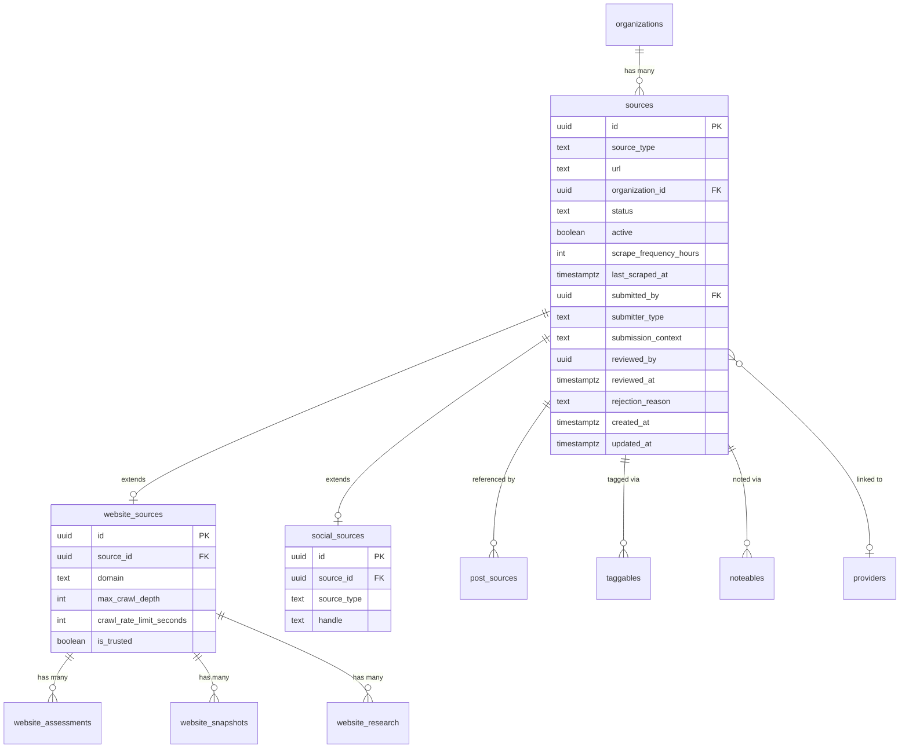

# Unified Sources with Class Table Inheritance

## Overview

Replace separate `websites` and `social_profiles` tables with a unified class table inheritance pattern: `sources` (parent) + `website_sources` + `social_sources`. This gives a single approval workflow, one admin page (`/admin/sources`), and one set of CRUD operations while keeping type-specific fields normalized.

## Problem Statement

Websites and social profiles are parallel systems that share most of their DNA (scheduling, active state, org linkage, post generation) but are managed separately — different tables, models, Restate services, and admin pages. This leads to duplicated code, inconsistent behavior (websites have approval workflow, social profiles don't), and a fragmented admin experience.

## Key Design Decisions

| Decision | Choice | Rationale |
|----------|--------|-----------|
| Schema pattern | Class table inheritance | Normalized type-specific fields, no nullable sprawl |
| ID strategy | Reuse old `websites.id` and `social_profiles.id` as `sources.id` | Avoids migrating `post_sources`, `website_assessments`, etc. |
| `sources.url` | Nullable | Social profiles may not have URLs; websites store `https://{domain}` |
| `sources.organization_id` | Nullable (same as websites) | Social sources can exist without org in new model |
| Initial status for social sources | `'approved'` | Preserves current behavior (social profiles are immediately scrapeable) |
| Website-specific table FKs | Point to `website_sources(source_id)` | Enforces only website sources can have assessments/snapshots |
| `post_sources.source_type` values | Unchanged (`"website"`, `"instagram"`, etc.) | Already matches proposed `sources.source_type` values |
| `taggable_type` values | Keep `"website"` for website sources | No change needed — IDs are reused, type string still valid |
| `noteable_type` values | Keep existing values | Same reasoning as taggables |
| Restate services | Clean rename: `Sources` + `Source` | Single deployment, no backward compat needed |
| `providers.website_id` | Rename to `source_id` | Clean break, FK to `sources(id)` |
| Scheduled scraping | Unified `Sources.run_scheduled_scrape` | Single query dispatches by type |
| `submission_context` | Add to `sources` table | Preserves provenance tracking from websites |

## ERD



## Implementation Phases

---

### Phase 1: Database Migration

Create the migration file at `packages/server/migrations/000149_create_unified_sources.sql`.

**Step-by-step SQL:**

1. **Create `sources` table**
2. **Create `website_sources` table** (1:1 with sources where source_type = 'website')
3. **Create `social_sources` table** (1:1 with sources, UNIQUE(source_type, handle))
4. **Migrate `websites` → `sources` + `website_sources`** (reuse websites.id as sources.id)
5. **Migrate `social_profiles` → `sources` + `social_sources`** (reuse social_profiles.id as sources.id)
6. **Drop `domain_statistics` view** (depends on `websites` table — must drop before altering)
7. **Re-point FKs on dependent tables:**
   - `website_assessments.website_id` → FK to `website_sources(source_id)` ON DELETE CASCADE
   - `website_research.website_id` → FK to `website_sources(source_id)` ON DELETE CASCADE
   - `website_snapshots.website_id` → FK to `website_sources(source_id)` ON DELETE CASCADE
   - `providers.website_id` → rename to `source_id`, FK to `sources(id)` ON DELETE SET NULL
   - `post_sources.source_id` — no change needed (IDs reused, no FK exists — polymorphic)
   - `taggables` — no FK change needed (polymorphic, IDs reused)
   - `noteables` — no FK change needed (polymorphic, IDs reused)
8. **Recreate `domain_statistics` view** with new table joins
9. **Drop old tables:** `DROP TABLE websites`, `DROP TABLE social_profiles`
10. **Add indexes:**
    - `sources(source_type)`
    - `sources(organization_id)`
    - `sources(status)`
    - `sources(active, status, last_scraped_at)` (for due-for-scraping query)

**Key notes:**
- Social profiles currently have no `status`, `submitted_by`, `reviewed_by`, etc. — these migrate as NULL with `status = 'approved'`
- Social profiles have `organization_id NOT NULL` but new `sources.organization_id` is nullable — existing data retains org links
- `submission_context` migrates from `websites.submission_context`

---

### Phase 2: Server — Entity IDs and New Source Domain

#### 2a. Entity IDs

**File: `packages/server/src/common/entity_ids.rs`**

- Add marker types: `Source`, `WebsiteSource`, `SocialSource`
- Add type aliases: `SourceId = Id<Source>`, `WebsiteSourceId = Id<WebsiteSource>`, `SocialSourceId = Id<SocialSource>`
- Keep `WebsiteId` and `SocialProfileId` temporarily (used in crawling domain, can be removed in Phase 5)

#### 2b. Source Models

**Create: `packages/server/src/domains/source/models/source.rs`**

```rust
#[derive(Debug, Clone, FromRow)]
pub struct Source {
    pub id: SourceId,
    pub source_type: String,
    pub url: Option<String>,
    pub organization_id: Option<OrganizationId>,
    pub status: String,
    pub active: bool,
    pub scrape_frequency_hours: Option<i32>,
    pub last_scraped_at: Option<DateTime<Utc>>,
    pub submitted_by: Option<Uuid>,
    pub submitter_type: Option<String>,
    pub submission_context: Option<String>,
    pub reviewed_by: Option<Uuid>,
    pub reviewed_at: Option<DateTime<Utc>>,
    pub rejection_reason: Option<String>,
    pub created_at: DateTime<Utc>,
    pub updated_at: DateTime<Utc>,
}
```

Methods to implement (migrated from `Website` model):
- `find_by_id(id, pool)` — SELECT from sources
- `find_active(pool)` — WHERE active = true AND status = 'approved'
- `find_approved(pool)` — WHERE status = 'approved'
- `find_due_for_scraping(pool)` — WHERE approved AND active AND overdue
- `find_by_organization(org_id, pool)` — WHERE organization_id = $1
- `find_paginated(status, source_type, search, org_id, cursor, limit, pool)` — JOIN website_sources/social_sources for search, COALESCE(domain, handle) for identifier
- `count_with_filters(status, source_type, search, org_id, pool)` — same joins
- `approve(id, reviewed_by, pool)` — UPDATE status
- `reject(id, reviewed_by, reason, pool)` — UPDATE status
- `suspend(id, pool)` — UPDATE status
- `set_organization_id(id, org_id, pool)` — UPDATE organization_id
- `unset_organization_id(id, pool)` — UPDATE organization_id = NULL
- `update_last_scraped(id, pool)` — UPDATE last_scraped_at

**Create: `packages/server/src/domains/source/models/website_source.rs`**

```rust
#[derive(Debug, Clone, FromRow)]
pub struct WebsiteSource {
    pub id: WebsiteSourceId,
    pub source_id: SourceId,
    pub domain: String,
    pub max_crawl_depth: Option<i32>,
    pub crawl_rate_limit_seconds: Option<i32>,
    pub is_trusted: bool,
}
```

Methods:
- `find_by_source_id(source_id, pool)` — SELECT where source_id = $1
- `find_by_domain(domain, pool)` — SELECT where domain = $1
- `create(source_id, domain, pool)` — INSERT
- `normalize_domain(url)` — static, migrated from Website
- `is_domain_trusted(domain, pool)` — check is_trusted flag

**Create: `packages/server/src/domains/source/models/social_source.rs`**

```rust
#[derive(Debug, Clone, FromRow)]
pub struct SocialSource {
    pub id: SocialSourceId,
    pub source_id: SourceId,
    pub source_type: String,
    pub handle: String,
}
```

Methods:
- `find_by_source_id(source_id, pool)` — SELECT where source_id = $1
- `find_by_handle(source_type, handle, pool)` — SELECT where source_type = $1 AND handle = $2
- `create(source_id, source_type, handle, pool)` — INSERT

#### 2c. Composite Creation Functions

**Create: `packages/server/src/domains/source/models/create.rs`**

These wrap multi-table inserts in transactions:

- `create_website_source(domain, org_id, submitted_by, submitter_type, context, pool)` → creates `sources` + `website_sources` rows, returns `SourceId`
- `create_social_source(platform, handle, url, org_id, pool)` → creates `sources` (status='approved') + `social_sources` rows, returns `SourceId`
- `find_or_create_website_source(domain, pool)` — atomic find-or-create with ON CONFLICT
- `find_or_create_social_source(platform, handle, org_id, pool)` — atomic find-or-create

#### 2d. Joined Query Types

**Create: `packages/server/src/domains/source/models/source_with_details.rs`**

```rust
#[derive(Debug, Clone, FromRow)]
pub struct SourceWithDetails {
    // source fields
    pub id: SourceId,
    pub source_type: String,
    pub url: Option<String>,
    pub organization_id: Option<OrganizationId>,
    pub status: String,
    pub active: bool,
    pub scrape_frequency_hours: Option<i32>,
    pub last_scraped_at: Option<DateTime<Utc>>,
    pub created_at: DateTime<Utc>,
    pub updated_at: DateTime<Utc>,
    // joined fields (one will be non-null depending on type)
    pub domain: Option<String>,
    pub handle: Option<String>,
    // computed
    pub post_count: Option<i64>,
    pub organization_name: Option<String>,
}
```

Query pattern:
```sql
SELECT s.*,
       ws.domain,
       ss.handle,
       o.name as organization_name
FROM sources s
LEFT JOIN website_sources ws ON ws.source_id = s.id
LEFT JOIN social_sources ss ON ss.source_id = s.id
LEFT JOIN organizations o ON o.id = s.organization_id
WHERE ...
ORDER BY s.created_at DESC
```

#### 2e. Data Types (API)

**Create: `packages/server/src/domains/source/data/source.rs`**

- `SourceData` — API response type for the flat list
- `SourceEdge`, `SourceConnection` — Relay-style cursor pagination

#### 2f. Module Registration

**Create: `packages/server/src/domains/source/mod.rs`**

Re-exports all public types.

**Update: `packages/server/src/domains/mod.rs`**

- Add `pub mod source;`
- Keep `pub mod website;` temporarily (for assessment/research models that don't move yet)

---

### Phase 3: Server — Restate Services

#### 3a. Sources Service (stateless)

**Create: `packages/server/src/domains/source/restate/services/sources.rs`**

Service name: `"Sources"`

Handlers (migrated from `Websites` + `SocialProfiles` services):
- `list(request: ListSourcesRequest)` → paginated flat list with type/status/search filters
- `list_by_organization(org_id)` → all sources for an org
- `submit_website(url)` → create_website_source + return SourceResult
- `create_social(platform, handle, url, org_id)` → create_social_source + return SourceResult
- `delete(source_id)` → DELETE from sources (cascades)
- `run_scheduled_scrape()` → query find_due_for_scraping, dispatch by source_type
- `run_scheduled_discovery()` → website discovery (migrated from Websites service)

Response types:
```rust
#[derive(Debug, Clone, Serialize, Deserialize)]
pub struct SourceResult {
    pub id: String,
    pub source_type: String,
    pub identifier: String,  // domain or handle
    pub url: Option<String>,
    pub status: String,
    pub active: bool,
    pub organization_id: Option<String>,
    pub organization_name: Option<String>,
    pub scrape_frequency_hours: Option<i32>,
    pub last_scraped_at: Option<String>,
    pub post_count: i64,
    pub created_at: String,
    pub updated_at: String,
}

impl_restate_serde!(SourceResult);
```

#### 3b. Source Virtual Object (keyed by source_id)

**Create: `packages/server/src/domains/source/restate/virtual_objects/source.rs`**

Object name: `"Source"`, keyed by source_id

Handlers (migrated from `Website` virtual object):
- `get()` → returns SourceResult with type-specific details
- `approve(reviewed_by)` → Source::approve
- `reject(reviewed_by, reason)` → Source::reject
- `suspend()` → Source::suspend
- `assign_organization(org_id)` → Source::set_organization_id
- `unassign_organization()` → Source::unset_organization_id
- `start_crawl()` → only for website sources; invokes CrawlWebsiteWorkflow
- `generate_assessment()` → only for website sources; invokes WebsiteResearchWorkflow
- `regenerate_posts()` → only for website sources; invokes RegeneratePostsWorkflow
- `deduplicate_posts()` → invokes DeduplicatePostsWorkflow (works for any source type)
- `extract_organization()` → only for website sources; invokes org extraction
- `start_scrape()` → only for social sources; invokes social scraping activity
- `get_assessment()` → only for website sources; returns assessment if exists

Type-specific handlers should return appropriate errors if called on wrong source type.

#### 3c. Update server.rs

**File: `packages/server/src/bin/server.rs`**

- Replace `WebsitesServiceImpl`, `WebsiteObjectImpl`, `SocialProfilesServiceImpl` bindings with `SourcesServiceImpl`, `SourceObjectImpl`
- Keep `WebsiteResearchWorkflowImpl`, `RegeneratePostsWorkflowImpl`, `CrawlWebsiteWorkflowImpl` — these are website-specific workflows that now receive source_id but internally look up WebsiteSource

---

### Phase 4: Server — Update Dependent Domains

#### 4a. Crawling Domain

The crawling domain remains website-specific but reads from the new tables.

**Files to update:**

| File | Change |
|------|--------|
| `crawling/activities/ingest_website.rs` | `Website::find_by_id` → `Source::find_by_id` + `WebsiteSource::find_by_source_id`. Access domain via `website_source.domain` |
| `crawling/activities/crawl_full.rs` | Same pattern — load Source + WebsiteSource |
| `crawling/activities/website_context.rs` | `fetch_approved_website` → load Source (check status=approved) + WebsiteSource |
| `crawling/activities/regenerate_single_post.rs` | Load source via `Source::find_by_id`, get domain from WebsiteSource |
| `crawling/activities/org_extraction.rs` | `Website::set_organization_id` → `Source::set_organization_id`. `SocialProfile::find_or_create` → `create_social_source` |
| `crawling/restate/workflows/crawl_website.rs` | `CrawlWebsiteRequest.website_id` → `source_id` (rename field) |
| `crawling/types.rs` | `WebsitePagesDiscovered.website_id` → `source_id`, `WebsiteCrawlResult.website_id` → `source_id` |

#### 4b. Posts Domain

Most of the posts domain already uses the generic `source_type`/`source_id` pattern via `post_sources`. Minimal changes needed.

**Files to update:**

| File | Change |
|------|--------|
| `posts/activities/syncing.rs` | `sync_extracted_posts(source_id: WebsiteId)` → `source_id: SourceId`. `Website::find_by_id` → `Source::find_by_id` + `WebsiteSource::find_by_source_id` |
| `posts/activities/sync_operations.rs` | `WebsiteId::from_uuid` → `SourceId::from_uuid`. Load domain from WebsiteSource |
| `posts/activities/llm_sync.rs` | `WebsiteId::from_uuid` → `SourceId::from_uuid`. Load domain from WebsiteSource when `source_type == "website"` |
| `posts/activities/deduplication.rs` | Variable rename `website_id` → `source_id` in log messages |

#### 4c. Social Profile Domain — Instagram Ingestion

**File: `social_profile/activities/ingest_instagram.rs`**

This has a **bug** — it references the dropped `social_profile_id` column. Fix as part of this migration:

- Change function signature to accept `Source` + `SocialSource` instead of `SocialProfile`
- Use `PostSource::upsert` correctly instead of direct INSERT with dropped column
- Use `Source::update_last_scraped` instead of `SocialProfile::update_last_scraped`

#### 4d. Organization Domain

**File: `organization/restate/services/organizations.rs`**

- Replace separate `SELECT COUNT(*) FROM websites` and `SELECT COUNT(*) FROM social_profiles` with single `SELECT COUNT(*) FROM sources WHERE organization_id = $1`
- `OrganizationResult`: replace `website_count` + `social_profile_count` with `source_count` (or keep both as filtered counts: `COUNT(*) FILTER (WHERE source_type = 'website')`, `COUNT(*) FILTER (WHERE source_type != 'website')`)
- `backfill_organizations`: update to use `Source` + `WebsiteSource` instead of `Website`

#### 4e. Notes Domain

**File: `notes/activities/extraction.rs`**

- `NoteSourceInfo.source_type` — keep as `"website"`, no change needed
- `Website::find_by_organization` → `Source::find_by_organization` (filter source_type = 'website')

#### 4f. Tags Domain

**File: `tag/models/tag.rs`**

- `Tag::find_for_website(website_id)` → `Tag::find_for_source(source_id)` with `taggable_type = 'website'`
- `Taggable::create_for_website` → `Taggable::create_for_source` with `taggable_type = 'website'`
- `Taggable::delete_for_website` → `Taggable::delete_for_source`
- Import `SourceId` instead of `WebsiteId`

#### 4g. Sync Domain

**File: `sync/restate/services/sync.rs`**

- `Website::find_by_id(WebsiteId::from_uuid(source_id))` → `Source::find_by_id(SourceId::from_uuid(source_id))` + join for display name
- Get display name: for websites use domain, for social use handle

#### 4h. Providers Domain

**File: `providers/models/provider.rs`**

- `website_id: Option<Uuid>` → `source_id: Option<Uuid>`
- `CreateProviderInput.website_id: Option<WebsiteId>` → `source_id: Option<SourceId>`
- Update all queries referencing `website_id` column

**File: `providers/data/provider.rs`**

- `ProviderData.website_id` → `source_id`

#### 4i. Website Domain (Models That Stay)

Keep `website_assessment.rs` and related models — they reference `website_id` which now FKs to `website_sources(source_id)`. The column values don't change, just the FK target. These models can stay in `domains/website/` or move to `domains/source/` — decide based on preference.

#### 4j. Data Migrations

**File: `data_migrations/normalize_website_urls.rs`**

- Update to use `sources` + `website_sources` tables instead of `websites`
- `merge_websites` function: update `website_snapshots`, `website_assessments`, `website_research` queries (column name `website_id` unchanged, table references stay)

---

### Phase 5: Admin UI

#### 5a. TypeScript Types

**File: `packages/web/lib/restate/types.ts`**

Replace `WebsiteResult`, `WebsiteList`, `WebsiteDetail`, `SocialProfileResult`, `SocialProfileListResult` with:

```typescript
interface SourceResult {
  id: string;
  source_type: string;  // 'website' | 'instagram' | 'facebook' | 'tiktok'
  identifier: string;    // domain or handle
  url: string | null;
  status: string;
  active: boolean;
  organization_id: string | null;
  organization_name: string | null;
  scrape_frequency_hours: number | null;
  last_scraped_at: string | null;
  post_count: number;
  created_at: string;
  updated_at: string;
}

interface SourceList {
  sources: SourceResult[];
  total_count: number;
  has_next_page: boolean;
  next_cursor: string | null;
}

interface SourceDetail extends SourceResult {
  // website-specific (null for social)
  domain: string | null;
  max_crawl_depth: number | null;
  crawl_rate_limit_seconds: number | null;
  is_trusted: boolean | null;
  crawl_count: number | null;
  // social-specific (null for website)
  handle: string | null;
  // common
  submitted_by: string | null;
  submitter_type: string | null;
  submission_context: string | null;
  reviewed_by: string | null;
  reviewed_at: string | null;
  rejection_reason: string | null;
}
```

Keep `AssessmentResult` as-is (still references `website_id` which is now a source_id value).

Update `OrganizationResult`:
- Replace `website_count` + `social_profile_count` with `source_count` (or keep both as computed fields)

Update `JobResult`:
- Replace `website_domain` + `website_id` with `source_identifier` + `source_id`

#### 5b. Sources List Page

**Create: `packages/web/app/admin/(app)/sources/page.tsx`**

Replaces `/admin/websites/page.tsx`.

Features:
- Flat list with columns: Type (icon), Identifier (domain/handle), Organization, Status, Posts, Last Scraped
- Type filter dropdown: All, Website, Instagram, Facebook, TikTok
- Status filter: All, Pending Review, Approved, Rejected
- Search: searches across domains and handles
- "Add Source" button → type picker (Website / Social) → type-specific form
  - Website form: URL input, auto-normalize
  - Social form: platform dropdown + handle input + optional URL
- Click row → navigates to `/admin/sources/[id]`

#### 5c. Source Detail Page

**Create: `packages/web/app/admin/(app)/sources/[id]/page.tsx`**

Replaces `/admin/websites/[id]/page.tsx`.

Common elements (all source types):
- Header: identifier, type badge, status badge, org link
- Approval actions (if pending): Approve / Reject buttons
- More Actions menu: Assign Org, Unassign Org, Delete
- Stats: Organization, Posts count, Last Scraped
- Posts tab: list of posts from this source

Website-specific elements:
- More Actions: Start Crawl, Generate Assessment, Regenerate Posts, Deduplicate Posts, Extract Organization
- Stats: Pages Crawled
- Snapshots tab
- Assessment tab

Social-specific elements:
- More Actions: Start Scrape
- Platform icon + handle display

#### 5d. Source Snapshots Page

**Move: `packages/web/app/admin/(app)/sources/[id]/snapshots/page.tsx`**

Migrated from `/admin/websites/[id]/snapshots/page.tsx`. Only shown for website sources.

#### 5e. Organization Detail Page

**Update: `packages/web/app/admin/(app)/organizations/[id]/page.tsx`**

- Replace separate "Linked Websites" and "Social Profiles" sections with unified "Sources" section
- Query: `callService("Sources", "list_by_organization", { organization_id })`
- Display: grouped by type with type headers, or flat list with type icons
- "Add Source" form: same type picker pattern as sources list page
- Update stats: `source_count` (or keep website_count + social_profile_count as filtered counts)

#### 5f. Jobs Page

**Update: `packages/web/app/admin/(app)/jobs/page.tsx`**

- Replace `website_domain` / `website_id` references with `source_identifier` / `source_id`

#### 5g. Remove Old Pages

- Delete `packages/web/app/admin/(app)/websites/` directory (all files)

---

### Phase 6: Cleanup

#### 6a. Remove Old Server Domains

- Delete `packages/server/src/domains/social_profile/` directory
- Slim down `packages/server/src/domains/website/` — keep only models that still live there (assessment, research) or move them to `domains/source/models/`

#### 6b. Remove Old Entity IDs

**File: `packages/server/src/common/entity_ids.rs`**

- Remove `Website` marker + `WebsiteId` alias (replaced by `Source`/`SourceId`)
- Remove `SocialProfile` marker + `SocialProfileId` alias (replaced by `Source`/`SourceId`)

#### 6c. Update domains/mod.rs

- Remove `pub mod social_profile;`
- Keep or remove `pub mod website;` depending on whether assessment models moved

#### 6d. Update server.rs imports

- Remove old service imports
- Clean up any dead code

---

## Files Changed Summary

### New Files (~12)

| File | Purpose |
|------|---------|
| `packages/server/migrations/000149_create_unified_sources.sql` | Schema migration |
| `packages/server/src/domains/source/mod.rs` | Domain module |
| `packages/server/src/domains/source/models/mod.rs` | Models module |
| `packages/server/src/domains/source/models/source.rs` | Source model |
| `packages/server/src/domains/source/models/website_source.rs` | WebsiteSource model |
| `packages/server/src/domains/source/models/social_source.rs` | SocialSource model |
| `packages/server/src/domains/source/models/create.rs` | Composite creation functions |
| `packages/server/src/domains/source/models/source_with_details.rs` | Joined query type |
| `packages/server/src/domains/source/data/source.rs` | API data types |
| `packages/server/src/domains/source/restate/services/sources.rs` | Sources Restate service |
| `packages/server/src/domains/source/restate/virtual_objects/source.rs` | Source virtual object |
| `packages/web/app/admin/(app)/sources/page.tsx` | Sources list page |
| `packages/web/app/admin/(app)/sources/[id]/page.tsx` | Source detail page |
| `packages/web/app/admin/(app)/sources/[id]/snapshots/page.tsx` | Snapshots (website only) |

### Modified Files (~25)

| File | Change |
|------|--------|
| `packages/server/src/common/entity_ids.rs` | Add SourceId, WebsiteSourceId, SocialSourceId |
| `packages/server/src/domains/mod.rs` | Add `pub mod source` |
| `packages/server/src/bin/server.rs` | Replace old service bindings |
| `packages/server/src/domains/crawling/activities/ingest_website.rs` | Use Source + WebsiteSource |
| `packages/server/src/domains/crawling/activities/crawl_full.rs` | Use Source + WebsiteSource |
| `packages/server/src/domains/crawling/activities/website_context.rs` | Use Source + WebsiteSource |
| `packages/server/src/domains/crawling/activities/regenerate_single_post.rs` | Use Source |
| `packages/server/src/domains/crawling/activities/org_extraction.rs` | Use Source + create_social_source |
| `packages/server/src/domains/crawling/restate/workflows/crawl_website.rs` | Rename website_id → source_id |
| `packages/server/src/domains/crawling/types.rs` | Rename website_id → source_id |
| `packages/server/src/domains/posts/activities/syncing.rs` | Use SourceId |
| `packages/server/src/domains/posts/activities/sync_operations.rs` | Use SourceId, load WebsiteSource |
| `packages/server/src/domains/posts/activities/llm_sync.rs` | Use SourceId, load WebsiteSource |
| `packages/server/src/domains/posts/activities/deduplication.rs` | Variable renames |
| `packages/server/src/domains/social_profile/activities/ingest_instagram.rs` | Fix bug + use Source/SocialSource |
| `packages/server/src/domains/organization/restate/services/organizations.rs` | Use sources table for counts |
| `packages/server/src/domains/notes/activities/extraction.rs` | Use Source model |
| `packages/server/src/domains/tag/models/tag.rs` | Use SourceId, rename methods |
| `packages/server/src/domains/sync/restate/services/sync.rs` | Use Source for display name |
| `packages/server/src/domains/providers/models/provider.rs` | Rename website_id → source_id |
| `packages/server/src/domains/providers/data/provider.rs` | Rename website_id → source_id |
| `packages/server/src/data_migrations/normalize_website_urls.rs` | Use new tables |
| `packages/web/lib/restate/types.ts` | New SourceResult types |
| `packages/web/app/admin/(app)/organizations/[id]/page.tsx` | Unified sources section |
| `packages/web/app/admin/(app)/jobs/page.tsx` | Source references |

### Deleted Files (~8+)

| File | Reason |
|------|--------|
| `packages/web/app/admin/(app)/websites/page.tsx` | Replaced by /admin/sources |
| `packages/web/app/admin/(app)/websites/[id]/page.tsx` | Replaced by /admin/sources/[id] |
| `packages/web/app/admin/(app)/websites/[id]/snapshots/page.tsx` | Moved to /admin/sources/[id]/snapshots |
| `packages/server/src/domains/social_profile/` (entire directory) | Merged into source domain |
| Parts of `packages/server/src/domains/website/` | Consolidated |

---

## Risk Analysis

| Risk | Impact | Mitigation |
|------|--------|------------|
| Migration SQL is wrong, corrupts data | High | Write migration as single transaction; test on local DB copy first |
| Missed FK reference to old tables | Medium | The repo research identified all 50+ touchpoints — follow the list |
| Restate in-flight workflows reference old service names | Low | No long-running workflows expected; deploy during quiet period |
| Instagram ingestion broken (pre-existing bug) | Medium | Fix as part of Phase 4c — this is broken regardless |
| `domain_statistics` view not recreated correctly | Low | View is for analytics only; can be fixed in follow-up |

## Testing Strategy

- [ ] Migration: Run on local DB, verify row counts match (sources = websites + social_profiles)
- [ ] Migration: Verify all FK constraints are valid (`SELECT * FROM sources JOIN website_sources ...`)
- [ ] API: Test Sources.list returns both types in flat list
- [ ] API: Test Source virtual object approve/reject/get for both types
- [ ] API: Test type-specific actions return errors on wrong type (e.g., crawl on social source)
- [ ] API: Test scheduled scraping dispatches correctly by type
- [ ] UI: Verify sources list page renders with type column
- [ ] UI: Verify source detail page shows type-specific tabs
- [ ] UI: Verify organization detail page shows unified sources section

## References

- Brainstorm: `docs/brainstorms/2026-02-10-unified-sources-brainstorm.md`
- Gold standard migration pattern: `packages/server/migrations/000057_rename_domains_to_websites.sql`
- Post sources (polymorphic pattern): `packages/server/migrations/000148_create_post_sources.sql`
- Cascade delete precedent: `packages/server/migrations/000146_add_org_name_unique_and_cascade_deletes.sql`
