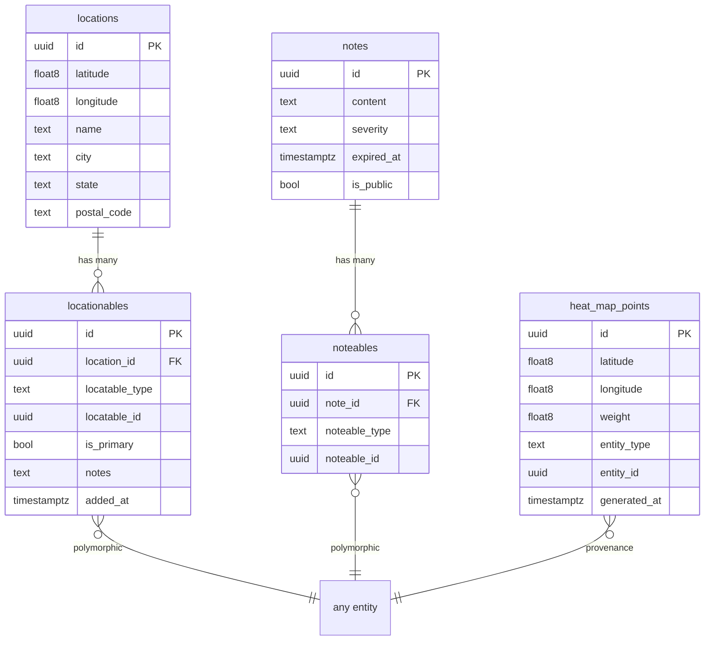

# Heat Map: Location + Urgency Visualization

## Overview

A content-agnostic heat map that pairs location + urgency signals from any entity, computes weighted points via a periodic Restate service, and stores snapshots for consumption by community members and coordinators.

## Problem Statement / Motivation

Posts have locations and notes have urgency signals, but there's no way to visualize *where* help is needed geographically. Community members can't quickly see hot spots, and coordinators can't identify gaps in coverage. The data exists — it just needs to be combined and surfaced.

## Proposed Solution

Three layers:

1. **`locationables`** — polymorphic join table (mirrors `noteables`) making any entity locatable
2. **`heat_map_points`** — snapshot table storing `(lat, lng, weight, entity_type, entity_id)` tuples
3. **Periodic Restate service** — computes snapshots on a schedule using the self-scheduling `send_after` pattern

## Technical Approach

### Phase 1: Database — `locationables` table

**Migration: `000159_create_locationables.sql`**

```sql
CREATE TABLE locationables (
    id UUID PRIMARY KEY DEFAULT gen_random_uuid(),
    location_id UUID NOT NULL REFERENCES locations(id) ON DELETE CASCADE,
    locatable_type TEXT NOT NULL,
    locatable_id UUID NOT NULL,
    is_primary BOOLEAN NOT NULL DEFAULT false,
    notes TEXT,
    added_at TIMESTAMPTZ NOT NULL DEFAULT now(),
    UNIQUE(location_id, locatable_type, locatable_id)
);

CREATE INDEX idx_locationables_entity ON locationables(locatable_type, locatable_id);
CREATE INDEX idx_locationables_location ON locationables(location_id);
```

**Model: `packages/server/src/domains/locations/models/locationable.rs`**

Mirror `Noteable` struct and methods:
- `Locationable::create(location_id, locatable_type, locatable_id, is_primary, notes, pool)` — upsert via `ON CONFLICT DO UPDATE`
- `Locationable::delete(location_id, locatable_type, locatable_id, pool)`
- `Locationable::find_for_entity(locatable_type, locatable_id, pool)` — returns `Vec<Location>` via JOIN
- `Locationable::find_entities_at_location(location_id, pool)`

**Typed ID: `packages/server/src/common/entity_ids.rs`**

Add `Locatable` marker type and `LocatableId` alias.

### Phase 2: Database — `heat_map_points` table

**Migration: `000160_create_heat_map_points.sql`**

```sql
CREATE TABLE heat_map_points (
    id UUID PRIMARY KEY DEFAULT gen_random_uuid(),
    latitude DOUBLE PRECISION NOT NULL,
    longitude DOUBLE PRECISION NOT NULL,
    weight DOUBLE PRECISION NOT NULL,
    entity_type TEXT NOT NULL,
    entity_id UUID NOT NULL,
    generated_at TIMESTAMPTZ NOT NULL DEFAULT now()
);

CREATE INDEX idx_heat_map_points_generated ON heat_map_points(generated_at);
CREATE INDEX idx_heat_map_points_entity_type ON heat_map_points(entity_type);
CREATE INDEX idx_heat_map_points_coords ON heat_map_points(latitude, longitude);
```

**Model: `packages/server/src/domains/heat_map/models/heat_map_point.rs`**

- `HeatMapPoint::find_latest(pool)` — returns all points from the most recent `generated_at`
- `HeatMapPoint::find_latest_by_type(entity_type, pool)` — filtered by entity type
- `HeatMapPoint::truncate_and_insert(points, pool)` — atomic snapshot replacement (DELETE + batch INSERT in a transaction)
- `HeatMapPoint::latest_generated_at(pool)` — when was the last snapshot?

### Phase 3: Data migration — `post_locations` → `locationables`

**Migration: `000161_migrate_post_locations_to_locationables.sql`**

```sql
-- Copy existing post_locations data into locationables
INSERT INTO locationables (location_id, locatable_type, locatable_id, is_primary, notes, added_at)
SELECT location_id, 'post', post_id, is_primary, notes, created_at
FROM post_locations
ON CONFLICT (location_id, locatable_type, locatable_id) DO NOTHING;
```

Do NOT drop `post_locations` yet. Keep for rollback safety. Deprecate in code by updating all queries to use `locationables` instead.

**Files to update** (query migration from `post_locations` → `locationables`):
- `packages/server/src/domains/posts/models/post_location.rs` — redirect methods to use `locationables` or deprecate
- `packages/server/src/domains/posts/models/post.rs` — any direct `post_locations` JOINs
- `packages/server/src/domains/posts/restate/services/posts.rs` — service handlers using post locations
- `packages/server/src/domains/posts/activities/backfill.rs` — backfill activities
- `packages/server/src/domains/schedules/models/schedule.rs` — schedule queries JOINing post_locations

### Phase 4: Heat map domain + Restate service

**New domain: `packages/server/src/domains/heat_map/`**

```
domains/heat_map/
  mod.rs
  models/
    mod.rs
    heat_map_point.rs
  activities/
    mod.rs
    compute_snapshot.rs
  restate/
    mod.rs
    services/
      mod.rs
      heat_map.rs
```

**Activity: `compute_snapshot.rs`**

Pure function that does the actual work:

```rust
pub async fn compute_heat_map_snapshot(deps: &ServerDeps) -> Result<Vec<HeatMapPoint>> {
    // 1. Query: JOIN locationables + noteables, aggregate max severity per entity
    // 2. Fan out to locations
    // 3. Compute weight: urgent=10, notice=5, info=1
    // 4. Filter: only entities with both a location (lat/lng not null) AND active notes
    // 5. Return (lat, lng, weight, entity_type, entity_id) tuples
}
```

Core SQL (conceptual):

```sql
SELECT
    l.latitude,
    l.longitude,
    MAX(CASE n.severity
        WHEN 'urgent' THEN 10
        WHEN 'notice' THEN 5
        ELSE 1
    END) AS weight,
    loc.locatable_type AS entity_type,
    loc.locatable_id AS entity_id
FROM locationables loc
JOIN locations l ON l.id = loc.location_id
JOIN noteables nb
    ON nb.noteable_type = loc.locatable_type
    AND nb.noteable_id = loc.locatable_id
JOIN notes n ON n.id = nb.note_id
WHERE l.latitude IS NOT NULL
    AND l.longitude IS NOT NULL
    AND (n.expired_at IS NULL OR n.expired_at > NOW())
GROUP BY l.latitude, l.longitude, loc.locatable_type, loc.locatable_id
```

**Restate service: `heat_map.rs`**

Uses the self-scheduling `send_after` pattern (mirrors `OrganizationsService::run_scheduled_extraction`):

```rust
#[restate_sdk::service]
#[name = "HeatMap"]
pub trait HeatMapService {
    async fn compute_snapshot(req: EmptyRequest) -> Result<HeatMapSnapshotResult, HandlerError>;
    async fn get_latest(req: EmptyRequest) -> Result<HeatMapResult, HandlerError>;
}
```

- `compute_snapshot` — runs the activity, stores snapshot, self-schedules via `send_after(Duration::from_secs(3600))` (1 hour)
- `get_latest` — reads the most recent snapshot from `heat_map_points` and returns it

**Request/response types: `packages/server/src/domains/heat_map/data/`**

```rust
#[derive(Debug, Clone, Serialize, Deserialize)]
pub struct HeatMapSnapshotResult {
    pub points_generated: usize,
    pub generated_at: String,
}
impl_restate_serde!(HeatMapSnapshotResult);

#[derive(Debug, Clone, Serialize, Deserialize)]
pub struct HeatMapPointData {
    pub latitude: f64,
    pub longitude: f64,
    pub weight: f64,
    pub entity_type: String,
    pub entity_id: String,
}
impl_restate_serde!(HeatMapPointData);

#[derive(Debug, Clone, Serialize, Deserialize)]
pub struct HeatMapResult {
    pub points: Vec<HeatMapPointData>,
    pub generated_at: String,
}
impl_restate_serde!(HeatMapResult);
```

### Phase 5: Registration + wiring

**`packages/server/src/bin/server.rs`**

```rust
.bind(HeatMapServiceImpl::with_deps(server_deps.clone()).serve())
```

**`packages/server/src/domains/mod.rs`**

```rust
pub mod heat_map;
```

**`scripts/register-workflows.sh`**

Add the `HeatMap` service to the registration script.

### Phase 6: Deprecate post-level urgency

After heat map is working:
- Stop writing to `posts.urgency` in creation/update flows
- Remove `urgency` from post API responses
- Eventually: migration to drop the column (future, not this PR)

## ERD



## Acceptance Criteria

### Functional
- [x] `locationables` table exists and mirrors `noteables` pattern
- [x] `heat_map_points` table exists with snapshot data
- [x] Existing `post_locations` data migrated to `locationables`
- [ ] All post location queries updated to use `locationables`
- [x] `Locationable` model with CRUD methods in `locations` domain
- [x] `HeatMapPoint` model with snapshot read/write methods
- [x] `compute_snapshot` activity: JOINs locationables + noteables, aggregates max severity per entity, produces weighted points
- [x] `HeatMapService` Restate service with `compute_snapshot` (self-scheduling) and `get_latest` handlers
- [x] Service registered in `server.rs` and workflow registration script
- [x] Entities with no location are excluded from heat map (documented behavior)
- [x] Entities with no active notes are excluded from heat map
- [x] Locations without lat/lng are excluded

### Non-Functional
- [x] Composite indexes on `(locatable_type, locatable_id)` for query performance
- [x] Snapshot replacement is atomic (transaction: DELETE + INSERT)
- [x] `post_locations` table preserved for rollback safety (not dropped)

## Open Questions (Deferred)

- Snapshot frequency: starting at 1 hour, adjustable later
- Weight values: `info=1, notice=5, urgent=10` as defaults — can tune
- `capacity_status` as a weight signal: deferred to v2
- Client rendering: outside scope of this plan
- When to drop `post_locations`: future cleanup PR after confidence in `locationables`

## Dependencies

- Notes system must be functional (it is — migrations 147, 155, 156)
- Locations system must be functional (it is — migration 106)

## References

### Internal
- Brainstorm: `docs/brainstorms/2026-02-11-heat-map-brainstorm.md`
- Noteables pattern: `packages/server/src/domains/notes/models/note.rs`
- Self-scheduling pattern: `packages/server/src/domains/organization/restate/services/organizations.rs` (run_scheduled_extraction)
- Entity IDs: `packages/server/src/common/entity_ids.rs`
- Post locations: `packages/server/src/domains/posts/models/post_location.rs`
- Locations model: `packages/server/src/domains/locations/models/location.rs`
