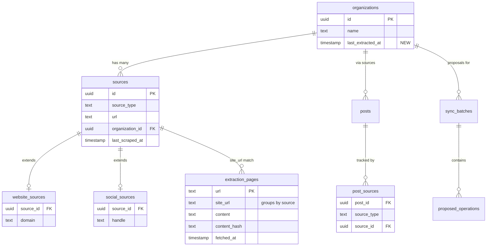

# Organization-Level Post Extraction Pipeline

## Overview

Elevate post extraction from per-source to per-organization. Sources become pure content fetchers that store raw content in `extraction_pages`. A new org-level workflow pools all raw content from all sources for an organization and runs the 3-pass extraction pipeline once, eliminating cross-source duplicates naturally.

**Core insight:** An org like "Meals on Wheels" with a website, Instagram, and Facebook page currently generates 3 separate sets of posts about the same meal distribution event. By pooling all content before extraction, the pipeline sees everything at once and produces one canonical post.

## Problem Statement

Currently, each source extracts posts independently:

```
Website  → CrawlWebsite → RegeneratePostsWorkflow → 3-pass extract → llm_sync per source
Instagram → Apify scrape → RegenerateSocialPostsWorkflow → 1-pass extract → llm_sync per source
Facebook  → Apify scrape → RegenerateSocialPostsWorkflow → 1-pass extract → llm_sync per source
```

Problems:
1. **Cross-source duplicates** — same event posted on website + Instagram = 2 posts
2. **Inconsistent extraction quality** — websites get 3-pass with agentic investigation, social gets 1-pass metadata-only
3. **Source-coupled extraction** — extraction logic is tangled with crawling, making each source responsible for too much
4. **Dedup is afterthought** — `DeduplicatePostsWorkflow` runs per-source, can't see cross-source duplicates

## Proposed Solution

```
WebsiteCrawler   → extraction_pages (site_url = domain)      ─┐
InstagramIngestor → extraction_pages (site_url = profile_url) ─┤
FacebookIngestor  → extraction_pages (site_url = profile_url) ─┤→ Pool by org → Extract (3-pass) → LLM Sync → Proposals
XIngestor         → extraction_pages (site_url = profile_url) ─┘
```

**Three architectural changes:**

1. **Social platform Ingestors** — `InstagramIngestor`, `FacebookIngestor`, `XIngestor` implement the extraction library's `Ingestor` trait, storing content as `CachedPage` in `extraction_pages`
2. **Org-level extraction workflow** — `ExtractOrgPostsWorkflow` pools all `extraction_pages` for an org's sources, runs 3-pass extraction, LLM syncs at org level
3. **Source workflows simplified** — per-source workflows only crawl/scrape + store raw content + signal completion

## Technical Approach

### Architecture

```
┌─────────────────────────────────────────────────────────────────┐
│                    PER-SOURCE (content fetching only)            │
├─────────────────────────────────────────────────────────────────┤
│                                                                 │
│  CrawlWebsiteWorkflow         (existing, already stores to     │
│   └→ FirecrawlIngestor          extraction_pages via PageCache) │
│                                                                 │
│  CrawlSocialSourceWorkflow    (NEW, replaces social regen)     │
│   └→ InstagramIngestor   ─┐                                    │
│   └→ FacebookIngestor    ─┤→ store to extraction_pages          │
│   └→ XIngestor           ─┘                                    │
│                                                                 │
│  Each signals: "org {id} has new content"                       │
└──────────────────────┬──────────────────────────────────────────┘
                       │
              scheduled check
                       │
┌──────────────────────▼──────────────────────────────────────────┐
│                    PER-ORG (extraction + sync)                   │
├─────────────────────────────────────────────────────────────────┤
│                                                                 │
│  ExtractOrgPostsWorkflow      (NEW)                             │
│   1. Get all sources for org                                    │
│   2. Collect site_urls from each source                         │
│   3. Query extraction_pages for all site_urls                   │
│   4. Run 3-pass extraction (narrative → dedupe → investigate)   │
│   5. LLM sync at org level (compare to org's existing posts)   │
│   6. Generate notes (best-effort)                               │
│                                                                 │
└─────────────────────────────────────────────────────────────────┘
```

### How extraction_pages Links to Organizations

No schema changes to `extraction_pages`. The linkage is:

```
Organization
  └→ sources (via source.organization_id)
      └→ each source has a site_url:
          - website: source.url = "https://mealsonwheels.org"
          - instagram: "https://www.instagram.com/{handle}/"
          - facebook: source.url (page URL)
          - x: "https://x.com/{handle}"
      └→ extraction_pages (via extraction_pages.site_url = source's site_url)
```

**Query pattern for org-level pooling:**

```sql
-- Step 1: Get all source URLs for the org
SELECT s.url, s.source_type, ss.handle
FROM sources s
LEFT JOIN social_sources ss ON ss.source_id = s.id
WHERE s.organization_id = $1 AND s.status = 'approved' AND s.active = true;

-- Step 2: For each source URL, get pages
SELECT * FROM extraction_pages WHERE site_url = $source_url;
```

### How Batched Triggering Works

Use the existing self-scheduling Restate service pattern (same as `run_scheduled_scrape`):

1. Source crawl completes → updates `sources.last_scraped_at`
2. Periodic Restate service (every 15 min) queries for orgs needing extraction:
   ```sql
   SELECT DISTINCT o.id FROM organizations o
   JOIN sources s ON s.organization_id = o.id
   WHERE s.status = 'approved' AND s.active = true
     AND s.last_scraped_at > COALESCE(o.last_extracted_at, '1970-01-01')
   ORDER BY o.last_extracted_at NULLS FIRST
   LIMIT 10;
   ```
3. For each org, invoke `ExtractOrgPostsWorkflow` with org_id as workflow key
4. Restate prevents concurrent runs for the same org (workflow key dedup)
5. After extraction, update `organizations.last_extracted_at`

### How Deduplication Works (Implicitly)

The 3-pass extraction pipeline already handles this naturally:

- **Pass 1 (Narrative):** Batches all pages by size, extracts narratives. Instagram caption about "weekly meal distribution" and website page about the same program both produce narratives.
- **Pass 2 (Dedupe/Merge):** Single LLM call sees ALL narratives from all sources, identifies that the Instagram narrative and website narrative describe the same service, merges them into one canonical narrative.
- **Pass 3 (Investigation):** For each unique narrative, agentic investigation browses source URLs for contact info, schedule details.

No separate dedup step needed. The extraction pipeline is the dedup.

### How Concurrency Is Handled

- **Restate workflow key** = org_id. Same org can only have one `ExtractOrgPostsWorkflow` running at a time.
- **Admin manual trigger** invokes the same workflow with same key — if already running, Restate returns existing execution.
- **Source crawl during extraction** — new content stored in extraction_pages, picked up by next extraction cycle.

### How Token Limits Are Handled

The existing `batch_pages_by_size()` function groups pages into 100K character batches. This already handles large content pools:

- Pass 1 runs in parallel across batches
- Pass 2 sees all narratives (already condensed from pages)
- If narrative count is very large, can apply the same batching to Pass 2

For orgs with 50+ sources, the pipeline may produce many narratives. The existing dedup pass handles this.

### Implementation Phases

#### Phase 1: Social Platform Ingestors

Create social ingestors in the **server** crate (not extraction library) that implement the extraction library's `Ingestor` trait. They wrap existing Apify scraping logic.

**New files:**

```
packages/server/src/domains/source/ingestors/
├── mod.rs
├── instagram.rs    → InstagramIngestor
├── facebook.rs     → FacebookIngestor
└── x.rs            → XIngestor
```

**`instagram.rs` pattern:**

```rust
use async_trait::async_trait;
use extraction::traits::ingestor::{DiscoverConfig, Ingestor, RawPage};
use extraction::error::CrawlResult;

pub struct InstagramIngestor {
    apify: Arc<ApifyClient>,
}

impl InstagramIngestor {
    pub fn new(apify: Arc<ApifyClient>) -> Self {
        Self { apify }
    }
}

#[async_trait]
impl Ingestor for InstagramIngestor {
    async fn discover(&self, config: &DiscoverConfig) -> CrawlResult<Vec<RawPage>> {
        let handle = config.options.get("handle")
            .ok_or_else(|| CrawlError::Config("handle required".into()))?;
        let limit = config.limit.min(50);

        let posts = self.apify.scrape_instagram_posts(handle, limit).await
            .map_err(|e| CrawlError::Http(e.to_string().into()))?;

        let thirty_days_ago = Utc::now() - chrono::Duration::days(30);

        Ok(posts.iter()
            .filter(|p| p.timestamp.map_or(true, |ts| ts >= thirty_days_ago))
            .filter_map(|p| {
                let caption = p.caption.as_ref().filter(|c| !c.trim().is_empty())?;
                let mut content = format!("# Instagram Post\n\n{}\n\n---\n\n", caption);
                if let Some(loc) = &p.location_name {
                    content.push_str(&format!("**Location**: {}\n", loc));
                }
                if let Some(ts) = p.timestamp {
                    content.push_str(&format!("**Posted**: {}\n", ts.format("%B %d, %Y")));
                }
                Some(RawPage::new(&p.url, content)
                    .with_title(handle.to_string())
                    .with_content_type("text/markdown".to_string())
                    .with_fetched_at(p.timestamp.unwrap_or_else(Utc::now))
                    .with_metadata("platform", "instagram")
                    .with_metadata("handle", handle.to_string()))
            })
            .collect())
    }

    async fn fetch_specific(&self, _urls: &[String]) -> CrawlResult<Vec<RawPage>> {
        // Social platforms don't support fetching by URL via Apify
        Ok(vec![])
    }

    fn name(&self) -> &str {
        "instagram"
    }
}
```

Same pattern for `FacebookIngestor` and `XIngestor`, wrapping existing `scrape_facebook` and `scrape_x` logic.

**Changes to existing files:**

- `domains/source/mod.rs` — add `pub mod ingestors;`

**Acceptance criteria:**
- [x] `InstagramIngestor` implements `Ingestor` trait, wraps existing `scrape_instagram` logic
- [x] `FacebookIngestor` implements `Ingestor` trait, wraps existing `scrape_facebook` logic
- [x] `XIngestor` implements `Ingestor` trait, wraps existing `scrape_x` logic
- [x] Each ingestor returns `Vec<RawPage>` with content in markdown format
- [x] All metadata preserved (platform, handle, location, posted_at) in `RawPage.metadata`

---

#### Phase 2: Store Social Content in extraction_pages

After social ingestors produce `RawPage` objects, convert to `CachedPage` and store in `extraction_pages` using the extraction library's `PageCache::store_page()`.

**New file:**

```
packages/server/src/domains/source/activities/ingest_social.rs
```

**Pattern:**

```rust
/// Ingest a social source: scrape via Ingestor → store to extraction_pages.
pub async fn ingest_social_source(source_id: Uuid, deps: &ServerDeps) -> Result<IngestResult> {
    let pool = &deps.db_pool;
    let source = Source::find_by_id(SourceId::from_uuid(source_id), pool).await?;
    let social = SocialSource::find_by_source_id(SourceId::from_uuid(source_id), pool).await?;

    let site_url = source.url.clone()
        .unwrap_or_else(|| build_profile_url(&source.source_type, &social.handle));

    let ingestor = build_ingestor(&source.source_type, deps)?;

    let config = DiscoverConfig::new(&site_url)
        .with_limit(50)
        .with_option("handle", &social.handle);

    let pages = ingestor.discover(&config).await?;

    // Store each page in extraction_pages
    let store = deps.extraction.as_ref()
        .ok_or_else(|| anyhow::anyhow!("Extraction service not configured"))?;

    let mut stored = 0;
    for page in &pages {
        let cached = CachedPage::new(&page.url, &site_url, &page.content)
            .with_title(page.title.clone().unwrap_or_default());
        store.store_page(&cached).await?;
        stored += 1;
    }

    // Update last_scraped_at
    Source::update_last_scraped(SourceId::from_uuid(source_id), pool).await?;

    Ok(IngestResult { pages_stored: stored })
}

fn build_profile_url(source_type: &str, handle: &str) -> String {
    match source_type {
        "instagram" => format!("https://www.instagram.com/{}/", handle),
        "facebook" => format!("https://www.facebook.com/{}/", handle),
        "x" | "twitter" => format!("https://x.com/{}", handle),
        _ => format!("https://{}", handle),
    }
}

fn build_ingestor(source_type: &str, deps: &ServerDeps) -> Result<Box<dyn Ingestor>> {
    let apify = deps.apify_client.as_ref()
        .ok_or_else(|| anyhow::anyhow!("Apify client not configured"))?;
    match source_type {
        "instagram" => Ok(Box::new(InstagramIngestor::new(apify.clone()))),
        "facebook" => Ok(Box::new(FacebookIngestor::new(apify.clone()))),
        "x" | "twitter" => Ok(Box::new(XIngestor::new(apify.clone()))),
        other => anyhow::bail!("Unsupported social source type: {}", other),
    }
}
```

**New workflow** (replaces scrape-only part of `RegenerateSocialPostsWorkflow`):

```
packages/server/src/domains/source/restate/workflows/crawl_social_source.rs
```

```rust
#[restate_sdk::workflow]
#[name = "CrawlSocialSourceWorkflow"]
pub trait CrawlSocialSourceWorkflow {
    async fn run(req: CrawlSocialSourceRequest) -> Result<CrawlSocialSourceResult, HandlerError>;
    #[shared]
    async fn get_status(req: EmptyRequest) -> Result<String, HandlerError>;
}
```

This workflow only does: scrape via ingestor → store to extraction_pages → done. No extraction, no sync.

**Acceptance criteria:**
- [x] `ingest_social_source()` activity scrapes and stores to `extraction_pages`
- [x] `CrawlSocialSourceWorkflow` replaces scrape phase of `RegenerateSocialPostsWorkflow`
- [x] Social content stored with `site_url` = profile URL (consistent key for org pooling)
- [x] `sources.last_scraped_at` updated after successful ingest
- [x] Content stored as markdown with platform metadata headers

---

#### Phase 3: Source Model Helpers

Add helper methods to `Source` for resolving site_urls and finding extraction-ready sources.

**Changes to existing file:**

```
packages/server/src/domains/source/models/source.rs
```

**New methods:**

```rust
impl Source {
    /// Get the site_url used in extraction_pages for this source.
    /// For websites: the domain URL. For social: the profile URL.
    pub async fn site_url(&self, pool: &PgPool) -> Result<String> {
        match self.source_type.as_str() {
            "website" => {
                let ws = WebsiteSource::find_by_source_id(self.id, pool).await?;
                Ok(format!("https://{}", ws.domain))
            }
            "instagram" | "facebook" | "x" | "twitter" | "tiktok" => {
                if let Some(url) = &self.url {
                    return Ok(url.clone());
                }
                let ss = SocialSource::find_by_source_id(self.id, pool).await?;
                Ok(build_profile_url(&self.source_type, &ss.handle))
            }
            other => anyhow::bail!("Unknown source type: {}", other),
        }
    }
}
```

**New migration** (add `last_extracted_at` to organizations):

```
packages/server/migrations/NNNNNN_add_last_extracted_at_to_organizations.sql
```

```sql
ALTER TABLE organizations ADD COLUMN last_extracted_at TIMESTAMP WITH TIME ZONE;
```

**Acceptance criteria:**
- [x] `Source::site_url()` returns the correct `extraction_pages.site_url` for any source type
- [x] Migration adds `last_extracted_at` to `organizations` table
- [x] Organization model updated with new field

---

#### Phase 4: Org-Level Extraction Workflow

The core new workflow that pools content from all sources and extracts posts at the org level.

**New files:**

```
packages/server/src/domains/organization/restate/
├── mod.rs
└── workflows/
    ├── mod.rs
    └── extract_org_posts.rs
```

**Workflow:**

```rust
#[derive(Debug, Clone, Serialize, Deserialize)]
pub struct ExtractOrgPostsRequest {
    pub organization_id: Uuid,
}
impl_restate_serde!(ExtractOrgPostsRequest);

#[derive(Debug, Clone, Serialize, Deserialize)]
pub struct ExtractOrgPostsResult {
    pub proposals_staged: i32,
    pub pages_pooled: usize,
    pub sources_included: usize,
    pub status: String,
}
impl_restate_serde!(ExtractOrgPostsResult);

#[restate_sdk::workflow]
#[name = "ExtractOrgPostsWorkflow"]
pub trait ExtractOrgPostsWorkflow {
    async fn run(req: ExtractOrgPostsRequest) -> Result<ExtractOrgPostsResult, HandlerError>;
    #[shared]
    async fn get_status(req: EmptyRequest) -> Result<String, HandlerError>;
}
```

**Implementation flow:**

All external calls are wrapped in `ctx.run()` for Restate durability — if the process restarts
mid-workflow, completed phases replay from the journal instead of re-executing.

> **Note:** The existing `RegeneratePostsWorkflow` and `RegenerateSocialPostsWorkflow` don't
> currently use `ctx.run()`. This new workflow sets the correct pattern per CLAUDE.md:
> "All external calls must be in durable blocks."

```rust
async fn run(&self, ctx: WorkflowContext<'_>, req: ExtractOrgPostsRequest) -> Result<...> {
    let pool = &self.deps.db_pool;
    let org_id = OrganizationId::from(req.organization_id);

    // 1. Load org + active sources (durable)
    ctx.set("status", "Gathering sources...".to_string());
    let (org, active_sources) = ctx.run(|| async {
        let org = Organization::find_by_id(org_id, pool).await?;
        let sources = Source::find_by_organization(org_id, pool).await?;
        let active: Vec<_> = sources.into_iter()
            .filter(|s| s.status == "approved" && s.active)
            .collect();
        Ok((org, active))
    }).await?;

    if active_sources.is_empty() {
        return Ok(ExtractOrgPostsResult { status: "no_sources".into(), .. });
    }

    // 2. Pool all pages from extraction_pages for all sources (durable)
    ctx.set("status", format!("Pooling content from {} sources...", active_sources.len()));
    let all_pages: Vec<CachedPage> = ctx.run(|| async {
        let extraction = self.deps.extraction.as_ref()
            .ok_or_else(|| anyhow::anyhow!("Extraction service not configured"))?;
        let mut pages = Vec::new();
        for source in &active_sources {
            let site_url = source.site_url(pool).await?;
            pages.extend(extraction.get_pages_for_site(&site_url).await.unwrap_or_default());
        }
        Ok(pages)
    }).await?;

    if all_pages.is_empty() {
        return Ok(ExtractOrgPostsResult { status: "no_pages".into(), .. });
    }

    // 3. Build tag instructions (durable)
    let tag_instructions = ctx.run(|| async {
        build_tag_instructions(pool).await.map_err(Into::into)
    }).await.unwrap_or_default();

    // 4. Run 3-pass extraction pipeline (durable — this is the expensive step)
    ctx.set("status", format!("Extracting posts from {} pages...", all_pages.len()));
    let posts = ctx.run(|| async {
        extract_posts_from_pages_with_tags(
            &all_pages, &org.name, &tag_instructions, &self.deps
        ).await.map_err(Into::into)
    }).await?;

    if posts.is_empty() {
        return Ok(ExtractOrgPostsResult { status: "no_posts".into(), .. });
    }

    // 5. LLM sync at org level (durable)
    ctx.set("status", format!("Analyzing {} posts...", posts.len()));
    let sync_result = ctx.run(|| async {
        llm_sync_posts_for_org(
            req.organization_id, posts, self.deps.ai.as_ref(), pool
        ).await.map_err(Into::into)
    }).await?;

    // 6. Update last_extracted_at (durable)
    ctx.run(|| async {
        Organization::update_last_extracted(org_id, pool).await.map_err(Into::into)
    }).await?;

    // 7. Generate notes (best-effort, still durable but errors don't fail workflow)
    ctx.set("status", "Generating notes...".to_string());
    let _ = ctx.run(|| async {
        // ... existing note generation pattern ...
        Ok::<_, anyhow::Error>(())
    }).await;

    Ok(ExtractOrgPostsResult {
        proposals_staged: total_proposals,
        pages_pooled: all_pages.len(),
        sources_included: active_sources.len(),
        status: "completed".to_string(),
    })
}
```

**Register in server.rs:**

```rust
.bind(ExtractOrgPostsWorkflowImpl::with_deps(server_deps.clone()).serve())
```

**Acceptance criteria:**
- [x] `ExtractOrgPostsWorkflow` pools content from all sources for an org
- [x] Uses existing `extract_posts_from_pages_with_tags` (3-pass pipeline)
- [x] Cross-source deduplication happens naturally in Pass 2
- [x] Workflow registered in `server.rs` and with Restate
- [x] `organizations.last_extracted_at` updated after completion
- [x] Status tracking via `ctx.set("status", ...)` for UI polling

---

#### Phase 5: Org-Level LLM Sync

New variant of `llm_sync_posts` that compares against all posts for an organization (not just one source).

**Changes to existing file:**

```
packages/server/src/domains/posts/activities/llm_sync.rs
```

**New function:**

```rust
/// LLM sync at org level — compares fresh posts against ALL existing posts for the org.
pub async fn llm_sync_posts_for_org(
    organization_id: Uuid,
    fresh_posts: Vec<ExtractedPost>,
    ai: &OpenAIClient,
    pool: &PgPool,
) -> Result<LlmSyncResult> {
    // Key difference: find existing posts by org, not by source
    let existing_db_posts = Post::find_by_organization_id(organization_id, pool).await?;

    // Rest of the logic is identical to llm_sync_posts
    // ... build fresh/existing lists, call LLM, process operations ...

    // stage_proposals uses organization_id instead of source_id
    let stage_result = stage_proposals(
        "organization",
        organization_id,
        Some(&summary),
        proposals,
        pool,
    ).await?;

    Ok(LlmSyncResult { ... })
}
```

**Acceptance criteria:**
- [x] `llm_sync_posts_for_org()` compares against all org posts via `Post::find_by_organization_id()`
- [x] Proposals staged with `entity_type = "organization"` and `entity_id = org_id`
- [x] Same LLM prompt/logic as source-level sync, just wider comparison scope

---

#### Phase 6: Scheduled Org Extraction Service

Periodic Restate service that finds orgs needing extraction and triggers workflows.

**New file:**

```
packages/server/src/domains/organization/restate/services/extraction_scheduler.rs
```

**Pattern (follows existing `run_scheduled_scrape`):**

```rust
#[restate_sdk::service]
#[name = "OrgExtractionScheduler"]
pub trait OrgExtractionScheduler {
    async fn run_scheduled_extraction(req: EmptyRequest) -> Result<String, HandlerError>;
}

impl OrgExtractionScheduler for OrgExtractionSchedulerImpl {
    async fn run_scheduled_extraction(&self, ctx: Context<'_>, _req: EmptyRequest) -> Result<String, HandlerError> {
        let pool = &self.deps.db_pool;

        // Find orgs that have been crawled more recently than extracted
        let orgs_needing_extraction = Organization::find_needing_extraction(pool).await
            .map_err(|e| TerminalError::new(e.to_string()))?;

        for org_id in &orgs_needing_extraction {
            // Invoke extraction workflow (Restate deduplicates by workflow key)
            ctx.workflow_client::<ExtractOrgPostsWorkflowClient>(org_id.to_string())
                .run(ExtractOrgPostsRequest { organization_id: org_id.into_uuid() })
                .send();
        }

        // Self-schedule for 15 minutes later
        ctx.service_client::<OrgExtractionSchedulerClient>()
            .run_scheduled_extraction(EmptyRequest {})
            .send_after(Duration::from_secs(900));

        Ok(format!("Triggered extraction for {} orgs", orgs_needing_extraction.len()))
    }
}
```

**New model method:**

```rust
impl Organization {
    /// Find orgs where any source was crawled more recently than the last extraction.
    pub async fn find_needing_extraction(pool: &PgPool) -> Result<Vec<OrganizationId>> {
        sqlx::query_as::<_, (OrganizationId,)>(
            r#"
            SELECT DISTINCT o.id
            FROM organizations o
            JOIN sources s ON s.organization_id = o.id
            WHERE s.status = 'approved' AND s.active = true
              AND s.last_scraped_at IS NOT NULL
              AND (o.last_extracted_at IS NULL OR s.last_scraped_at > o.last_extracted_at)
            ORDER BY o.last_extracted_at NULLS FIRST
            LIMIT 10
            "#,
        )
        .fetch_all(pool)
        .await
        .map(|rows| rows.into_iter().map(|(id,)| id).collect())
        .map_err(Into::into)
    }

    pub async fn update_last_extracted(id: OrganizationId, pool: &PgPool) -> Result<()> {
        sqlx::query("UPDATE organizations SET last_extracted_at = NOW() WHERE id = $1")
            .bind(id)
            .execute(pool)
            .await?;
        Ok(())
    }
}
```

**Acceptance criteria:**
- [x] `OrgExtractionScheduler` self-schedules every 15 minutes (added as `run_scheduled_extraction` on OrganizationsService)
- [x] Finds orgs where sources were crawled after last extraction
- [x] Triggers `ExtractOrgPostsWorkflow` for each (Restate deduplicates concurrent runs)
- [x] Limits batch to 10 orgs per cycle to avoid overload
- [x] Registered in `server.rs` and with Restate

---

#### Phase 7: Simplify Per-Source Workflows

Existing source workflows become pure content fetchers. Remove extraction and sync logic.

**`RegenerateSocialPostsWorkflow` → `CrawlSocialSourceWorkflow`:**
- Remove Phase 2 (extract_posts_from_social)
- Remove Phase 3 (llm_sync_posts)
- Keep Phase 1 (scrape) but use new `ingest_social_source` activity
- Remove Phase 4 (note generation) — moved to org-level workflow
- The old workflow can remain for backward compatibility or be replaced

**`RegeneratePostsWorkflow` (website):**
- Remove Phase 2 (extract_posts_from_pages_with_tags)
- Remove Phase 3 (llm_sync_posts)
- Keep Phase 1 (search_and_get_pages) — website content already in extraction_pages
- Remove Phase 4 (note generation) — moved to org-level workflow
- Or: simply let the existing `CrawlWebsiteWorkflow` handle website ingestion (it already stores to extraction_pages)

**GraphQL mutations updated:**
- `regenerate_social_posts` → invokes `CrawlSocialSourceWorkflow` (scrape-only)
- `regenerate_posts` → invokes crawl-only workflow
- New: `extract_org_posts` → invokes `ExtractOrgPostsWorkflow`

**Acceptance criteria:**
- [x] Social source workflows only scrape and store (no extraction/sync)
- [x] Website source workflows only crawl and store (no extraction/sync)
- [x] New GraphQL mutation `extractOrgPosts(organizationId)` for admin trigger
- [x] Old workflows still functional during transition (can be deprecated later)

---

### ERD: Key Model Relationships



## Alternative Approaches Considered

### A: Per-source extraction with org-level dedup pass

Keep source-level extraction, add a cross-source dedup workflow after all sources finish. **Rejected** because: adds complexity without solving the root cause (extraction doesn't see all content), and dedup is harder after posts are already created than preventing duplicates during extraction.

### B: Store social content in separate table

Create `social_content_pages` instead of reusing `extraction_pages`. **Rejected** because: `extraction_pages` already has the right schema (`url`, `site_url`, `content`), and using the same table means the org-level workflow only needs one query path.

### C: Put social ingestors in extraction library

Move Instagram/Facebook/X ingestors into `packages/extraction/`. **Rejected** because: extraction library would need Apify dependency, violating its domain-agnostic design. Ingestors belong in the server crate where the Apify client lives.

## Success Metrics

- **Duplicate reduction**: Posts per org should decrease for orgs with 2+ sources
- **Coverage**: Posts from social-only sources get same quality extraction as websites
- **Pipeline simplicity**: Source workflows have fewer responsibilities (just crawl/store)

## Dependencies & Prerequisites

- Extraction library's `Ingestor` trait and `PageCache` trait (exist)
- `extraction_pages` table (exists)
- `Source::find_by_organization()` (exists)
- `Post::find_by_organization_id()` (exists)
- Apify client for social scraping (exists)
- `extract_posts_from_pages_with_tags()` 3-pass pipeline (exists)

## Risk Analysis & Mitigation

| Risk | Impact | Mitigation |
|------|--------|------------|
| Social captions lose verbatim quality in 3-pass extraction | Medium | Trust the extractor — if caption is good, it'll preserve it. Monitor quality. |
| Large orgs exceed token limits | Medium | `batch_pages_by_size()` already handles this. Add page limit per org if needed (e.g., 200 most recent). |
| Migration breaks existing posts | High | Keep old workflows functional. Org extraction adds to / replaces proposals, doesn't touch existing active posts. |
| Restate workflow key collisions | Low | Workflow key = org_id UUID, globally unique. |
| Apify rate limits hit during parallel org crawls | Medium | Scheduled extraction limits to 10 orgs per cycle. Source crawls already rate-limited by `scrape_frequency_hours`. |

## References

### Internal References

- Extraction library traits: `packages/extraction/src/traits/ingestor.rs`
- Current website extraction: `packages/server/src/domains/crawling/activities/post_extraction.rs`
- Current social scraping: `packages/server/src/domains/source/activities/scrape_social.rs`
- LLM sync: `packages/server/src/domains/posts/activities/llm_sync.rs`
- Website regen workflow: `packages/server/src/domains/website/restate/workflows/regenerate_posts.rs`
- Social regen workflow: `packages/server/src/domains/source/restate/workflows/regenerate_social_posts.rs`
- Scheduled scraping pattern: `packages/server/src/domains/source/restate/services/sources.rs`
- Source model: `packages/server/src/domains/source/models/source.rs`
- Organization model: `packages/server/src/domains/organization/models/organization.rs`

### Institutional Learnings

- Extraction library design: `docs/plans/2026-02-03-design-extraction-library-plan.md`
- Job splitting pattern: `docs/plans/2026-02-04-refactor-split-crawl-pipeline-into-jobs-plan.md`
- Unified sources: `docs/brainstorms/2026-02-10-unified-sources-brainstorm.md`
