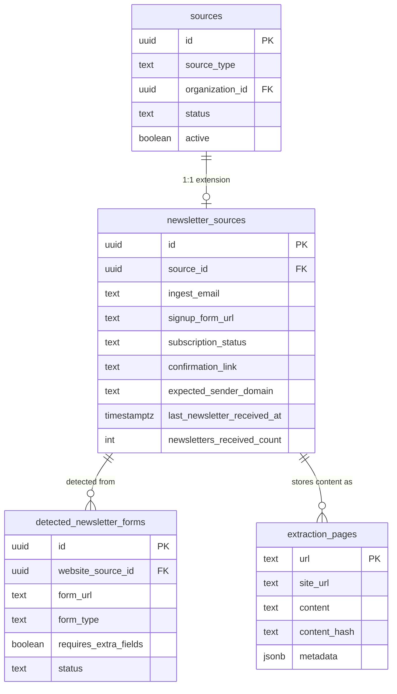

# feat: Add Newsletter Ingestion as Third Source Type

## Overview

Add newsletters as a third content source type for organizations, alongside websites and social media accounts. Newsletters are ingested via Postmark inbound email, stored as `extraction_pages`, and fed through the existing post extraction pipeline — same code path as website scrapes. The system auto-detects newsletter signup forms during website crawling, subscribes via headless Chrome, and manages the full subscription lifecycle through the admin UI.

## Problem Statement

Many organizations communicate opportunities, events, and programs through newsletters that never appear on their website. Currently, we only capture website content and social media. This means we miss a significant source of actionable information about the organizations in our database.

## Proposed Solution

Extend the unified sources architecture (class table inheritance) with a `newsletter` source type. Use Postmark's inbound email processing on a dedicated subdomain (`ingest.mntogether.org`) with per-subscription email addresses for isolation and routing. Store newsletter content as `extraction_pages` so the entire extraction + search pipeline works unchanged.

## Technical Approach

### Architecture

```
Website Crawl → Org Extraction → Detects newsletter signup form
                                         ↓
Admin clicks "Subscribe" → Headless Chrome submits form with {uuid}@ingest.mntogether.org
                                         ↓
Confirmation email → Postmark webhook → Admin panel → Admin confirms → Chrome follows link
                                         ↓
Newsletters arrive → Postmark webhook → Parse email → Store as extraction_page
                                         ↓
                                  Existing post extraction pipeline (3-pass)
```

### ERD



### Key Design Decisions

| Decision | Choice | Rationale |
|----------|--------|-----------|
| Email addresses | Per-subscription `{uuid}@ingest.mntogether.org` | Kill switch, spam isolation, automatic routing |
| Email domain | Subdomain `ingest.mntogether.org` | Protects primary domain reputation |
| Form submission | Headless Chrome (Playwright) | Handles JS forms, honeypots, varied implementations |
| Content storage | `extraction_pages` table | Reuses entire extraction + search pipeline |
| Newsletter detection | LLM during org extraction | Already reading pages, natural extension |
| Confirmation flow | Semi-automated (admin approves) | Avoids auto-clicking unknown links |
| Email classification | State-based: if `pending_confirmation` → confirmation email; if `active` → newsletter | Simple, reliable discriminator |
| Sender validation | Record expected sender domain from confirmation email, filter future emails | Prevents spam from entering extraction pipeline |
| `site_url` format | `newsletter:{source_id}` | Keeps newsletter content separate from website content per source |
| `url` (PK) format | `newsletter:{source_id}:{message_id}` | Globally unique, deterministic |
| Scraping exclusion | Exclude `source_type = 'newsletter'` from `find_due_for_scraping` | Newsletters are push-based, not pull-based |

### Subscription State Machine

```
detected → subscribing → pending_confirmation → active → inactive
              ↓                    ↓                         ↑
           failed          confirmation_failed           reactivate
              ↓                    ↓
           (retry)             (retry from subscribing)
```

- `detected` — LLM found a form, not yet subscribed
- `subscribing` — Chrome is submitting the form
- `failed` — Form submission failed (CAPTCHA, network error, multi-field form)
- `pending_confirmation` — Waiting for confirmation email (auto-expires after 7 days → `confirmation_failed`)
- `confirmation_failed` — Confirmation link expired or returned error
- `active` — Receiving and processing newsletters
- `inactive` — Admin deactivated; emails silently dropped

### Implementation Phases

---

#### Phase 1: Database + Models (Foundation)

**Migration: `000172_create_newsletter_sources.sql`**

```sql
CREATE TABLE detected_newsletter_forms (
    id UUID PRIMARY KEY DEFAULT gen_random_uuid(),
    website_source_id UUID NOT NULL REFERENCES website_sources(id) ON DELETE CASCADE,
    form_url TEXT NOT NULL,
    form_type TEXT NOT NULL DEFAULT 'unknown',
    requires_extra_fields BOOLEAN NOT NULL DEFAULT false,
    extra_fields_detected JSONB NOT NULL DEFAULT '[]',
    status TEXT NOT NULL DEFAULT 'detected',
    created_at TIMESTAMPTZ NOT NULL DEFAULT NOW(),
    updated_at TIMESTAMPTZ NOT NULL DEFAULT NOW(),
    UNIQUE(website_source_id, form_url)
);

CREATE TABLE newsletter_sources (
    id UUID PRIMARY KEY DEFAULT gen_random_uuid(),
    source_id UUID NOT NULL UNIQUE REFERENCES sources(id) ON DELETE CASCADE,
    ingest_email TEXT NOT NULL UNIQUE,
    signup_form_url TEXT NOT NULL,
    subscription_status TEXT NOT NULL DEFAULT 'detected',
    confirmation_link TEXT,
    confirmation_email_received_at TIMESTAMPTZ,
    expected_sender_domain TEXT,
    last_newsletter_received_at TIMESTAMPTZ,
    newsletters_received_count INT NOT NULL DEFAULT 0,
    created_at TIMESTAMPTZ NOT NULL DEFAULT NOW(),
    updated_at TIMESTAMPTZ NOT NULL DEFAULT NOW()
);

CREATE INDEX idx_newsletter_sources_status ON newsletter_sources(subscription_status);
CREATE INDEX idx_newsletter_sources_ingest_email ON newsletter_sources(ingest_email);
CREATE INDEX idx_detected_newsletter_forms_website ON detected_newsletter_forms(website_source_id);
```

**New files:**

- `packages/server/src/domains/source/models/newsletter_source.rs` — NewsletterSource model with CRUD + status transitions
- `packages/server/src/domains/source/models/detected_newsletter_form.rs` — DetectedNewsletterForm model
- `packages/server/src/common/ids.rs` — Add `NewsletterSourceId`

**Modified files:**

- `packages/server/src/domains/source/models/mod.rs` — Add newsletter_source, detected_newsletter_form modules
- `packages/server/src/domains/source/models/source.rs` — Add `"newsletter"` branch to `site_url()` method (line ~89)
- `packages/server/src/domains/source/models/create.rs` — Add `create_newsletter_source`, `find_or_create_newsletter_source`, update `get_source_identifier()` (line ~160)

**Model patterns to follow:**

```rust
// packages/server/src/domains/source/models/newsletter_source.rs
#[derive(Debug, Clone, FromRow)]
pub struct NewsletterSource {
    pub id: Uuid,
    pub source_id: Uuid,
    pub ingest_email: String,
    pub signup_form_url: String,
    pub subscription_status: String,
    pub confirmation_link: Option<String>,
    pub expected_sender_domain: Option<String>,
    pub last_newsletter_received_at: Option<DateTime<Utc>>,
    pub newsletters_received_count: i32,
    pub created_at: DateTime<Utc>,
    pub updated_at: DateTime<Utc>,
}

impl NewsletterSource {
    pub async fn find_by_ingest_email(email: &str, pool: &PgPool) -> Result<Option<Self>> {
        sqlx::query_as::<_, Self>(
            "SELECT * FROM newsletter_sources WHERE ingest_email = $1"
        )
        .bind(email)
        .fetch_optional(pool)
        .await
        .map_err(Into::into)
    }

    pub async fn find_by_source_id(source_id: Uuid, pool: &PgPool) -> Result<Option<Self>> {
        sqlx::query_as::<_, Self>(
            "SELECT * FROM newsletter_sources WHERE source_id = $1"
        )
        .bind(source_id)
        .fetch_optional(pool)
        .await
        .map_err(Into::into)
    }

    pub async fn update_status(id: Uuid, status: &str, pool: &PgPool) -> Result<Self> {
        sqlx::query_as::<_, Self>(
            "UPDATE newsletter_sources SET subscription_status = $2, updated_at = NOW()
             WHERE id = $1 RETURNING *"
        )
        .bind(id)
        .bind(status)
        .fetch_one(pool)
        .await
        .map_err(Into::into)
    }

    pub async fn record_newsletter_received(id: Uuid, pool: &PgPool) -> Result<Self> {
        sqlx::query_as::<_, Self>(
            "UPDATE newsletter_sources
             SET newsletters_received_count = newsletters_received_count + 1,
                 last_newsletter_received_at = NOW(),
                 updated_at = NOW()
             WHERE id = $1 RETURNING *"
        )
        .bind(id)
        .fetch_one(pool)
        .await
        .map_err(Into::into)
    }
}
```

**Acceptance criteria:**
- [ ] Migration creates both tables with correct constraints
- [ ] NewsletterSource model has CRUD operations following `sqlx::query_as::<_, Self>` pattern
- [ ] DetectedNewsletterForm model stores LLM detection results
- [ ] `Source::site_url()` returns `newsletter:{source_id}` for newsletter type
- [ ] `find_due_for_scraping` excludes `source_type = 'newsletter'`
- [ ] `get_source_identifier` handles newsletter sources

---

#### Phase 2: Newsletter Detection (During Org Extraction)

**Modified files:**

- `packages/server/src/domains/crawling/activities/org_extraction.rs` — Extend LLM prompt + add `scan_newsletter_forms()` function

**Approach:**

Add newsletter form detection to the existing org extraction activity. The LLM already reads crawled pages to extract org name, description, and social links. Extend the prompt to also identify newsletter signup forms.

```rust
// New struct alongside ExtractedOrganization
#[derive(Debug, Clone, Serialize, Deserialize)]
pub struct DetectedNewsletterSignup {
    pub form_url: String,          // URL of the page containing the form
    pub form_action: Option<String>, // Form action URL if detectable
    pub form_type: String,         // "email_only", "multi_field", "unknown"
    pub requires_extra_fields: bool,
    pub extra_fields: Vec<String>, // ["first_name", "zip_code", etc.]
}
```

Additionally, scan pages with regex/heuristics for common newsletter patterns (similar to `scan_social_profiles()`):
- Mailchimp form URLs (`list-manage.com/subscribe`)
- Substack subscribe pages
- `input[type=email]` near "subscribe"/"newsletter" text
- Common newsletter platform embed patterns

**Acceptance criteria:**
- [ ] Org extraction prompt extended to detect newsletter signup forms
- [ ] `DetectedNewsletterSignup` struct captures form URL, type, and required fields
- [ ] Heuristic scanner catches common newsletter platform patterns
- [ ] Detected forms persisted in `detected_newsletter_forms` table
- [ ] Re-crawls deduplicate by `(website_source_id, form_url)` unique constraint
- [ ] Forms requiring extra fields marked as `requires_extra_fields = true`

---

#### Phase 3: Postmark Inbound Webhook

**New files:**

- `packages/server/src/domains/newsletter/mod.rs` — Newsletter domain module
- `packages/server/src/domains/newsletter/webhook.rs` — Postmark inbound webhook handler
- `packages/server/src/domains/newsletter/email_parser.rs` — HTML-to-markdown conversion + confirmation link extraction

**Modified files:**

- `packages/server/src/bin/server.rs` — Add webhook HTTP endpoint (alongside SSE server)
- `packages/server/src/domains/mod.rs` — Add newsletter module

**Webhook endpoint design:**

The webhook will be a plain HTTP POST endpoint (not a Restate service) similar to the SSE server. Postmark sends a JSON payload containing the parsed email.

```rust
// POST /webhooks/postmark/inbound
async fn handle_postmark_inbound(
    State(deps): State<Arc<ServerDeps>>,
    Json(payload): Json<PostmarkInboundPayload>,
) -> Result<StatusCode, StatusCode> {
    // 1. Always return 200 to Postmark (prevent retry loops)
    // 2. Validate sender (check expected_sender_domain)
    // 3. Parse "To" address → find newsletter_source by ingest_email
    // 4. Check subscription_status to determine email type:
    //    - pending_confirmation → parse confirmation link, surface in admin
    //    - active → convert HTML to markdown, store as extraction_page
    //    - inactive → silently drop
    // 5. Trigger post extraction workflow if active newsletter

    Ok(StatusCode::OK)
}

#[derive(Debug, Deserialize)]
pub struct PostmarkInboundPayload {
    #[serde(rename = "From")]
    pub from: String,
    #[serde(rename = "To")]
    pub to: String,
    #[serde(rename = "Subject")]
    pub subject: String,
    #[serde(rename = "HtmlBody")]
    pub html_body: Option<String>,
    #[serde(rename = "TextBody")]
    pub text_body: Option<String>,
    #[serde(rename = "MessageID")]
    pub message_id: String,
    #[serde(rename = "Date")]
    pub date: String,
}
```

**Email-to-markdown conversion:**

Strip tracking pixels, template boilerplate, unsubscribe footers, style blocks, and inline CSS. Convert remaining HTML to clean markdown. Use a library like `html2text` or port the approach from the Firecrawl ingestor.

**Confirmation link extraction:**

When `subscription_status = pending_confirmation`, parse the email HTML for confirmation links. Use both heuristic (anchor tags containing "confirm", "verify", "activate") and LLM-based extraction as fallback.

**Security:**
- Validate Postmark webhook signature (or use a shared secret in a custom header)
- Validate sender domain matches `expected_sender_domain` for active subscriptions
- Rate limit: max 10 emails per subscription per day (reject excess)

**Acceptance criteria:**
- [ ] Webhook endpoint receives Postmark inbound payloads
- [ ] Webhook always returns 200 OK (even on processing failure)
- [ ] Emails routed to correct subscription by `To` address
- [ ] Confirmation emails parsed for confirmation links
- [ ] Active newsletters converted to markdown and stored as `extraction_pages`
- [ ] Sender domain validation prevents spam injection
- [ ] Emails to inactive/unknown addresses silently dropped
- [ ] Deduplication by `message_id` prevents duplicate processing

---

#### Phase 4: Subscription Flow (Headless Chrome + Restate Workflow)

**New files:**

- `packages/server/src/domains/newsletter/activities/subscribe.rs` — Headless Chrome form submission activity
- `packages/server/src/domains/newsletter/activities/confirm.rs` — Headless Chrome confirmation link activity
- `packages/server/src/domains/newsletter/restate/workflows/subscribe_newsletter.rs` — Durable subscription workflow

**Approach:**

Use Playwright (via CLI or Rust bindings) for form submission. The Restate workflow manages the subscription lifecycle durably.

```rust
#[restate_sdk::workflow]
pub trait SubscribeNewsletterWorkflow {
    async fn run(request: SubscribeRequest) -> Result<SubscribeResult, HandlerError>;
}

// Workflow steps:
// 1. ctx.run: Generate ingest email, create newsletter_source record (status: subscribing)
// 2. ctx.run: Launch headless Chrome, navigate to form URL, fill email, submit
//    - On failure: mark as "failed", return
// 3. ctx.run: Update status to "pending_confirmation"
// 4. Return — confirmation arrives later via webhook (async, not in this workflow)
```

**Confirmation workflow (separate, triggered by admin):**

```rust
#[restate_sdk::workflow]
pub trait ConfirmNewsletterWorkflow {
    async fn run(request: ConfirmRequest) -> Result<ConfirmResult, HandlerError>;
}

// Workflow steps:
// 1. ctx.run: Navigate to confirmation_link with headless Chrome
// 2. ctx.run: Record expected_sender_domain from the confirmation email's From field
// 3. ctx.run: Update status to "active"
```

**Headless Chrome considerations:**
- Run Playwright in a Docker sidecar or use a managed service (Browserless)
- 30-second timeout per form submission
- Screenshot on failure for debugging
- Idempotency: if Restate retries, check if form was already submitted (look for "already subscribed" response)

**Acceptance criteria:**
- [ ] Subscribe workflow: generates email, submits form via headless Chrome, handles failures
- [ ] Confirm workflow: follows confirmation link, activates subscription
- [ ] Both workflows registered in server.rs endpoint builder
- [ ] Request/response types have `impl_restate_serde!()` macro
- [ ] Failures produce actionable error messages for admin
- [ ] Forms requiring extra fields detected and marked as `failed` with `requires_manual_subscription` message

---

#### Phase 5: Post Extraction Integration

**Modified files:**

- `packages/server/src/domains/crawling/models/extraction_page.rs` — Add `find_by_newsletter_source()` method
- `packages/server/src/domains/crawling/activities/post_extraction.rs` — Newsletter-aware extraction (optional prompt tweaks)
- `packages/server/src/domains/source/restate/workflows/ingest_source.rs` — Add `"newsletter"` branch

**Approach:**

When the webhook stores a newsletter as an `extraction_page`, trigger post extraction. The extraction pipeline already works on arbitrary text content — newsletters are just "pages" to the extractor.

```rust
// In extraction_page.rs — new query method
pub async fn find_by_newsletter_source(source_id: Uuid, pool: &PgPool) -> Result<Vec<(Uuid, String, String)>> {
    let site_url = format!("newsletter:{}", source_id);
    sqlx::query_as::<_, (String, String)>(
        "SELECT url, content FROM extraction_pages WHERE site_url = $1"
    )
    .bind(&site_url)
    .fetch_all(pool)
    .await
    // ... map to (generated_uuid, url, content) tuples
}
```

**Post extraction for newsletters:**
- Single newsletter = single page → narrative extraction still works (one "page" per batch)
- Dedup pass runs across all newsletter pages for the source (catches recurring content like headers/footers)
- Investigation pass (Pass 3) should skip `fetch_page` for `newsletter://` URLs (content is already stored, not fetchable)

**Acceptance criteria:**
- [ ] `find_by_newsletter_source()` queries extraction_pages by `newsletter:{source_id}` site_url
- [ ] Post extraction triggered after newsletter email is stored
- [ ] Investigation pass gracefully handles non-fetchable `newsletter://` URLs
- [ ] Posts produced from newsletters have `submission_type = 'scraped'` and correct `source_url`

---

#### Phase 6: GraphQL + Admin UI

**Modified files:**

- `packages/shared/graphql/schema.ts` — Add `newsletter` to `SourceType` enum, add newsletter types and mutations
- `packages/shared/graphql/resolvers/source.ts` — Add newsletter resolver methods
- `packages/admin-app/lib/graphql/sources.ts` — Add newsletter queries/mutations
- `packages/admin-app/app/admin/(app)/sources/page.tsx` — Add `newsletter` type filter and label
- `packages/admin-app/app/admin/(app)/sources/[id]/page.tsx` — Newsletter-specific detail section

**GraphQL schema additions:**

```graphql
extend enum SourceType {
  newsletter
}

type NewsletterSource {
  id: ID!
  sourceId: ID!
  ingestEmail: String!
  signupFormUrl: String!
  subscriptionStatus: String!
  confirmationLink: String
  expectedSenderDomain: String
  lastNewsletterReceivedAt: DateTime
  newslettersReceivedCount: Int!
}

type DetectedNewsletterForm {
  id: ID!
  websiteSourceId: ID!
  formUrl: String!
  formType: String!
  requiresExtraFields: Boolean!
  extraFieldsDetected: [String!]!
  status: String!
}

extend type Source {
  newsletterSource: NewsletterSource
  detectedNewsletterForms: [DetectedNewsletterForm!]!
}

extend type Mutation {
  subscribeNewsletter(formId: ID!): WorkflowResponse!
  confirmNewsletter(sourceId: ID!): WorkflowResponse!
  deactivateNewsletter(sourceId: ID!): Source!
  reactivateNewsletter(sourceId: ID!): Source!
}
```

**Admin UI additions:**

1. **Sources list page** — Add `newsletter: "Newsletter"` to `SOURCE_TYPE_LABELS`, add filter button
2. **Website source detail** — Show detected newsletter forms with "Subscribe" button (for forms that are `email_only`)
3. **Newsletter source detail** — Show subscription status, ingest email, received count, last received date
4. **Pending confirmations** — Section showing subscriptions in `pending_confirmation` with "Confirm" button
5. **Newsletter content viewer** — List of received newsletter extraction_pages (similar to website pages tab)

**Acceptance criteria:**
- [x] `SourceType` enum includes `newsletter`
- [x] Newsletter-specific fields accessible via GraphQL
- [x] Subscribe/Confirm/Deactivate/Reactivate mutations work
- [x] Sources list shows newsletter type with correct label and filter
- [ ] Website detail shows detected forms with Subscribe action
- [x] Newsletter detail shows subscription status and management actions
- [ ] Pending confirmations surfaced with Confirm action

---

## Alternative Approaches Considered

| Approach | Why Rejected |
|----------|-------------|
| Shared inbox (`ingest@mntogether.org`) | No per-subscription isolation, can't disable individual subscriptions, routing is complex |
| Simple HTTP POST for form submission | Too many JS-only forms in the wild; would fail on a large percentage of real newsletters |
| Separate `newsletter_emails` table instead of `extraction_pages` | Would require adapting the entire extraction pipeline to read from a second source |
| Fully automated confirmation (auto-click links) | Security risk — auto-clicking unknown links from unknown senders |
| RSS feed ingestion instead of email | Many org newsletters don't have RSS; email is the universal format |

## Risk Analysis & Mitigation

| Risk | Likelihood | Impact | Mitigation |
|------|-----------|--------|------------|
| Form submission fails (CAPTCHA, multi-field) | High | Medium | Detect during form analysis; mark as `requires_manual_subscription`; admin subscribes manually using the generated email |
| Spam arrives at ingest addresses | Medium | Medium | Sender domain validation; rate limiting; silently drop unrecognized senders |
| Confirmation link expires before admin acts | Medium | Low | Alert after 48 hours; allow retry (re-subscribe from scratch) |
| Newsletter HTML produces poor markdown | Medium | Medium | Newsletter-specific HTML preprocessing; test with real samples from target orgs |
| Postmark webhook downtime | Low | High | Postmark retries for 72 hours; idempotent processing via message_id dedup |
| Headless Chrome operational overhead | Medium | Medium | Consider managed service (Browserless) to avoid self-hosting Chrome |

## Infrastructure Requirements

### DNS Setup (manual, one-time)
- MX record for `ingest.mntogether.org` → Postmark inbound servers
- SPF record for `ingest.mntogether.org`

### Postmark Configuration (manual, one-time)
- Configure inbound domain: `ingest.mntogether.org`
- Set webhook URL: `https://api.mntogether.org/webhooks/postmark/inbound`
- Enable catch-all processing (all addresses on the domain)

### Headless Chrome
- Playwright installation in server Docker image, OR
- Managed browser service (Browserless/Browserbase) as external dependency

## Open Questions (Deferred)

- **Rate limiting** — Throttle newsletter processing per org per day? (Defer until we see volume)
- **Retention** — How long to keep raw newsletter extraction_pages? (Defer; same policy as website pages)
- **Multiple newsletters per org** — Handle as separate sources (one newsletter_source each). Natural fit with per-subscription email model.
- **Unsubscribe** — Deactivating the ingest address is sufficient for v1. Newsletter sender may keep sending to a dead address; Postmark silently accepts and we silently drop.

## References & Research

### Internal References
- Source architecture: `packages/server/migrations/000149_create_unified_sources.sql`
- Source model: `packages/server/src/domains/source/models/source.rs:88-104` (`site_url()` method)
- Source creation: `packages/server/src/domains/source/models/create.rs:160-173` (`get_source_identifier()`)
- Extraction page model: `packages/server/src/domains/crawling/models/extraction_page.rs`
- Org extraction: `packages/server/src/domains/crawling/activities/org_extraction.rs`
- Post extraction: `packages/server/src/domains/crawling/activities/post_extraction.rs`
- Ingestor trait: `packages/extraction/src/traits/ingestor.rs`
- CachedPage: `packages/extraction/src/types/page.rs:13-110`
- IngestSource workflow: `packages/server/src/domains/source/restate/workflows/ingest_source.rs`
- Instagram ingestor (pattern): `packages/server/src/domains/source/ingestors/instagram.rs`
- Server registration: `packages/server/src/bin/server.rs:282-333`
- GraphQL schema: `packages/shared/graphql/schema.ts`
- Sources list UI: `packages/admin-app/app/admin/(app)/sources/page.tsx`
- Brainstorm: `docs/brainstorms/2026-02-13-newsletter-ingestion-brainstorm.md`

### External References
- Postmark Inbound Processing: https://postmarkapp.com/developer/webhooks/inbound-webhook
- Playwright Rust bindings: https://github.com/nickvdyck/playwright-rust (or CLI invocation)
